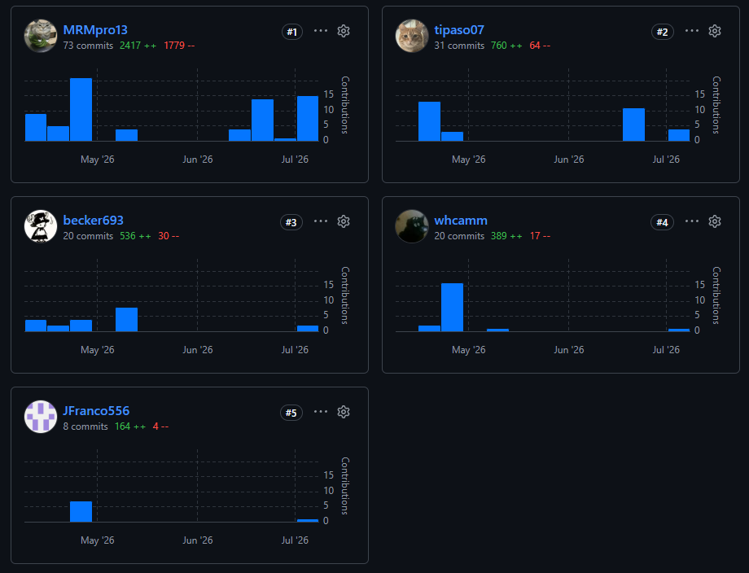

# Universidad Peruana de Ciencias Aplicadas

### Carrera de Ingeniería de Software

### 1ASI0730

### Aplicaciones Web

### NRC 20177

## Informe del Trabajo Final

### Docente

Flores Ingaruca, José Miguel

### Equipo

CogniTech

### Proyecto

MindFlow

### Integrantes

|   Código   |            Apellidos y Nombres             |
|:----------:|:------------------------------------------:|
| U202412462 |   Cabrera Sotelo, Camila Celeste           |
| U202419462 |   Caisahuana Osores, Becker Junior         |
| U202410421 |   Díaz De la cruz, Sebastián Gabriel       |
| U202410024 |   Jáuregui Cerna, Jean Franco              |
| U20231E515 |   Rocca Mariaca, Angel Mathias             |

### Período 202610

### Junio 2026

# Registro de Versiones del Informe

---

| Versión | Fecha      | Autor                        | Descripción de modificación |
|---------|------------|------------------------------|-----------------------------|
| 1.0 | 10/04/2026 | Rocca Mariaca, Angel Mathias | Creación del reporte en formato Markdown. |
| 2.0 | 10/05/2026 | Cabrera Sotelo, Camila Celeste | Actualización del reporte en formato Markdown. |
| 3.0 | 11/06/2026 | Díaz De la Cruz, Sebastián Gabriel | Actualización del reporte en formato Markdown. |

## Desarrollo del reporte

---

TF:

---

| Enlace del repositorio del informe del proyecto |
|-------------------------------------------------|
| https://github.com/1ASI0730-2610-20177-CogniTech-MindFlow/MindFlow-Project-Report.git                                                |

# Student Outcome

---

El curso contribuye al cumplimiento del Student Outcome ABET:

**ABET – EAC - Student Outcome 5**
Criterio: Trabaja efectivamente en un equipo cuyos miembros juntos proporcionan liderazgo; crea un entorno colaborativo e inclusivo y establece metas, planifica tareas y cumple objetivos.

En el siguiente cuadro se describe las acciones realizadas y enunciados de conclusiones por parte del grupo, que permiten sustentar el haber alcanzado el logro del ABET – EAC - Student Outcome 5.

| Criterio específico | Acciones realizadas | Conclusiones |
| --- | --- | --- |
| **5.c.1 Trabaja en equipo para proporcionar liderazgo en forma conjunta** | AV1:   **Cabrera Sotelo, Camila Celeste**   Lideró el diseño de interfaces y la experiencia visual mediante la creación de Style Guidelines, Information Architecture y Landing Page UI Design.    **Caisahuana Osores, Becker Junior**   Asumió el liderazgo en la definición del producto, ejecutando el Lean UX Process, estructurando los requerimientos funcionales (User Stories, Product Backlog) y el diseño de la base de datos (Database Diagrams).    **Díaz De la Cruz, Sebastián Gabriel**   Lideró la investigación gestionando el diseño, registro y análisis de entrevistas (Interviews), además de definir la arquitectura (Context, Container, Component Diagrams).    **Jáuregui Cerna, Jean Franco**   Dirigió el modelado de dominio colaborativo estructurando el Big Picture EventStorming y el Ubiquitous Language.    **Rocca Mariaca, Angel Mathias**   Proporcionó liderazgo técnico en la configuración del entorno (Software Configuration Management), prototipado web y la implementación integral del Sprint 1.   TP1:   **Cabrera Sotelo, Camila Celeste**   Lideró de forma autónoma la maquetación e implementación interactiva del Bounded Context Journal, asegurando la correcta integración de la vista del diario personal con el sistema de filtrado avanzado por etiquetas contextuales y fechas.    **Caisahuana Osores, Becker Junior**   Asumió el rol de Frontend Architecture Leader del Sprint 2, guiando al equipo en la estructuración modular bajo Domain-Driven Design (DDD) y liderando el desarrollo técnico de las vistas principales del Bounded Context Dashboard y Bounded Context Analytics.    **Díaz De la Cruz, Sebastián Gabriel**   Lideró el desarrollo e implementación del Bounded Context Habits, responsabilizándose del flujo de lógica para el checklist interactivo de rutinas diarias y coordinando la persistencia de datos local desde su rol de Database Management Collaborator.    **Jáuregui Cerna, Jean Franco**   Dirigió el aseguramiento de la calidad actuando como QA and Testing Collaborator, liderando el andamiaje (scaffolding) de los componentes base de presentación en Vue.js y validando que las interfaces no tuvieran conflictos de visualización.    **Rocca Mariaca, Angel Mathias**   Ejerció el liderazgo técnico en la integración de servicios y el manejo del estado global, además de desarrollar de manera íntegra las vistas de configuración de perfil y planes del Bounded Context Settings y Bounded Context Subscriptions.   AV2:   **Cabrera Sotelo, Camila Celeste**   Asumió el liderazgo técnico del desarrollo backend del Bounded Context Journal, implementando los servicios REST encargados de la gestión de entradas del diario emocional, etiquetas contextuales y recursos multimedia. Asimismo, lideró la elaboración del material de presentación (PPT), consolidando las evidencias del Sprint y facilitando la comunicación estructurada de los avances del proyecto.    **Díaz De la Cruz, Sebastián Gabriel**   Lideró el desarrollo backend del Bounded Context Analytics, implementando los servicios responsables del cálculo y almacenamiento de métricas y tendencias derivadas de la actividad de los usuarios. Adicionalmente, gestionó la sección 5.3 Validation Interviews, elaborando el diseño de entrevistas y el registro de entrevistas para recopilar retroalimentación y validar las funcionalidades desarrolladas.    **Caisahuana Osores, Becker Junior**   Lideró el desarrollo del Bounded Context IAM, implementando los endpoints de registro, la configuración de MySQL con Entity Framework Core y documentando las evidencias de ejecución y servicios del Sprint.    **Jáuregui Cerna, Jean Franco**   Lideró la integración del Bounded Context About the Product y los componentes compartidos del Backend. Además, elaboró las evidencias de despliegue y colaboración del equipo durante el Sprint.    **Rocca Mariaca, Angel Mathias**   Lideró el desarrollo de los servicios backend de Habits, AIFeedback, AIIntegration, Chat, Notifications, Reporting, Support, WellnessEngine y Subscriptions, así como las evidencias del Sprint Backlog 3, desarrollo y evaluaciones heurísticas.   TB2:   **Cabrera Sotelo, Camila Celeste**   Lideró la consolidación y demostración de las funcionalidades finales del sistema, asumiendo la responsabilidad sobre el Execution Evidence for Sprint Review.    **Caisahuana Osores, Becker Junior**   Asumió el liderazgo en la organización y dirección del cierre del proyecto, encargándose del Sprint Planning y definiendo la matriz de Aspect Leaders and Collaborators para el Sprint final.    **Díaz De la Cruz, Sebastián Gabriel**   Dirigió el proceso de despliegue final del software y el análisis del desempeño del equipo, gestionando las secciones de Software Deployment Evidence for Sprint Review y Team Collaboration Insights during Sprint.    **Jáuregui Cerna, Jean Franco**   Lideró la estandarización y entrega de los artefactos técnicos del proyecto mediante la elaboración exhaustiva de la documentación de servicios (Services Documentation Evidence for Sprint Review).    **Rocca Mariaca, Angel Mathias**   Proporcionó liderazgo técnico en la validación final del código y la gestión de tareas, responsabilizándose de la estructuración del Sprint Backlog y del Development Evidence for Sprint Review. | AV1:   El equipo evidenció un nivel sobresaliente al liderar equipos multidisciplinarios y demostrar sus habilidades en todas las actividades, superando así los logros planteados. Cada miembro asumió el liderazgo de áreas críticas. Adicionalmente, el equipo demostró capacidad para trabajar de manera coordinada a través de evidencias claras como el diseño y registro de entrevistas (gestionadas por S. Díaz), garantizando la continuidad en la gestión de comunicaciones.   TP1:   El equipo evidenció un nivel sobresaliente al liderar de manera conjunta el desarrollo técnico del Trabajo Parcial (TP1). Cada miembro asumió el control autónomo de áreas críticas de la aplicación frontend distribuidas por Bounded Contexts, coordinando la arquitectura modular de forma que los componentes individuales se acoplaran sin generar cuellos de botella técnicos. Adicionalmente, el equipo demostró capacidad para mitigar los problemas de integración previos mediante un flujo de trabajo síncrono y transparente.   AV2:   El equipo evidenció un liderazgo conjunto durante el Sprint 3, distribuyendo responsabilidades técnicas y de documentación entre sus integrantes. Cada miembro asumió el liderazgo de componentes específicos del backend y de las evidencias del proyecto, permitiendo cumplir los objetivos establecidos y garantizar la integración de los diferentes módulos del sistema.   TB2:   El equipo demostró un liderazgo maduro y consolidado en la etapa final de Release del proyecto. La distribución equitativa de responsabilidades administrativas, de auditoría técnica y de despliegue sobre los entregables críticos del Sprint final aseguró una entrega exitosa y la presentación de un producto completamente operativo. |
| **5.c.2 Crea un entorno colaborativo e inclusivo, establece metas, planifica tareas y cumple objetivos** | AV1:   **Cabrera Sotelo, Camila Celeste**   Integró proactivamente las necesidades del equipo estandarizando la arquitectura de información para facilitar la navegación y etiquetado a sus compañeros.    **Caisahuana Osores, Becker Junior**   Planificó las metas del producto estableciendo el Impact Mapping y el Product Backlog, escuchando las necesidades del equipo para priorizar el alcance.    **Díaz De la Cruz, Sebastián Gabriel**   Fomentó la inclusión mediante herramientas de empatía (Empathy Mapping) y basó la arquitectura en las opiniones extraídas de la investigación.    **Jáuregui Cerna, Jean Franco**   Consolidó el entorno colaborativo definiendo un Lenguaje Ubicuo y organizando el EventStorming para unificar el entendimiento técnico del grupo.    **Rocca Mariaca, Angel Mathias**   Estableció metas, planificó tareas y definió roles mediante el Sprint Planning 1 y la asignación en el Sprint Backlog 1, supervisando la colaboración durante el sprint.   TP1:   **Cabrera Sotelo, Camila Celeste**   Fomentó la inclusión y consistencia visual en el entorno de desarrollo web colaborando activamente en la adaptación global de los componentes de la interfaz al soporte de modo oscuro y transiciones fluidas de diseño.    **Caisahuana Osores, Becker Junior**   Estableció las metas y planificó los objetivos del hito mediante la moderación de las sesiones de Sprint Planning 2 por Discord, organizando el Sprint Backlog 2 en Trello y unificando las interfaces de los modelos de dominio para todo el equipo.    **Díaz De la Cruz, Sebastián Gabriel**   Promovió la colaboración interfuncional en el equipo al integrar soporte de localización multiidioma (i18n) para inglés y español en el módulo de hábitos, adaptando las cadenas de texto según las opiniones de la investigación de usuarios.    **Jáuregui Cerna, Jean Franco**   Consolidó un entorno inclusivo mediante la realización de pruebas de aceptación y usabilidad en conjunto con los desarrolladores de cada módulo, garantizando la resolución de conflictos de Git en el enrutamiento antes del despliegue final.    **Rocca Mariaca, Angel Mathias**   Facilitó el cumplimiento de objetivos técnicos al estructurar el estado global de la aplicación mediante Pinia, permitiendo que las respuestas empáticas simuladas del asistente de IA se distribuyeran eficientemente a los componentes desarrollados por sus compañeros.   AV2:   **Cabrera Sotelo, Camila Celeste**   Contribuyó al entorno colaborativo coordinando la organización y presentación de las evidencias del Sprint mediante la elaboración del PPT, integrando los aportes de los distintos miembros del equipo y asegurando una exposición coherente de los resultados. Asimismo, mantuvo una comunicación constante durante el desarrollo del Bounded Context Journal para garantizar la compatibilidad con los demás servicios del sistema.    **Díaz De la Cruz, Sebastián Gabriel**   Favoreció la planificación y el cumplimiento de objetivos mediante la ejecución de las actividades de validación con usuarios, elaborando el diseño y registro de entrevistas de la sección 5.3 Validation Interviews. La información obtenida permitió incorporar retroalimentación relevante y fortalecer el proceso colaborativo de toma de decisiones durante el Sprint.    **Caisahuana Osores, Becker Junior**   Contribuyó al trabajo colaborativo mediante la definición de una arquitectura backend común y la configuración compartida de la base de datos, facilitando la integración de los diferentes módulos.    **Jáuregui Cerna, Jean Franco**   Favoreció la coordinación del equipo mediante la integración de componentes compartidos y la documentación del despliegue y las experiencias de colaboración del Sprint.    **Rocca Mariaca, Angel Mathias**   Facilitó el cumplimiento de objetivos desarrollando servicios reutilizables y elaborando las evidencias del Sprint y las evaluaciones heurísticas para asegurar la calidad del producto.   TB2:   **Cabrera Sotelo, Camila Celeste**   Facilitó la comprensión integral del producto final al equipo y a los stakeholders preparando las evidencias de ejecución y demostración (Execution Evidence) del Sprint Review.    **Caisahuana Osores, Becker Junior**   Estableció las metas finales y organizó la dinámica de cierre estructurando el Sprint Planning y realizando la designación clara de líderes y colaboradores para garantizar la cobertura de todas las tareas.    **Díaz De la Cruz, Sebastián Gabriel**   Fomentó un entorno transparente al consolidar las analíticas de colaboración (Team Collaboration Insights) y aseguró el cumplimiento del objetivo macro del curso evidenciando el despliegue final en la nube (Software Deployment Evidence).    **Jáuregui Cerna, Jean Franco**   Contribuyó a la calidad colaborativa garantizando que todos los miembros del equipo tuvieran acceso a la especificación y documentación OpenAPI de los servicios implementados (Services Documentation Evidence).    **Rocca Mariaca, Angel Mathias**   Permitió el seguimiento efectivo del progreso en la recta final al gestionar el Sprint Backlog y consolidó el cumplimiento de los objetivos al compilar y revisar las evidencias de desarrollo (Development Evidence). | AV1:   El grupo operó de manera proactiva, estando siempre dispuesto a escuchar las opiniones de sus compañeros. A través de sesiones conjuntas como el EventStorming y el Sprint Planning, el equipo demostró capacidad para analizar las críticas de los miembros del equipo y proponer soluciones. De esta forma, se garantizó la cooperación, participación e integración efectiva entre los miembros del grupo para el cumplimiento de las metas del proyecto.   TP1:   El grupo operó de manera proactiva, inclusiva y altamente coordinada durante todo el Sprint 2. A través de revisiones conjuntas de código (Pull Requests) y reuniones de sincronización, el equipo resolvió desafíos complejos de acoplamiento de librerías (como Chart.js para analíticas). La asignación clara de tareas en el Sprint Backlog permitió cumplir con el 100% de los objetivos planteados, culminando con el despliegue exitoso de la Single Page Application (SPA) responsiva en la plataforma de producción Vercel.   AV2:   El grupo mantuvo un entorno colaborativo e inclusivo durante el Sprint 3, coordinando tareas y compartiendo responsabilidades para asegurar la integración y calidad del producto. La planificación conjunta y la elaboración de evidencias permitieron cumplir satisfactoriamente los objetivos planteados y fortalecer el trabajo en equipo.   TB2:   El equipo consolidó un entorno altamente estructurado y sincronizado, logrando cerrar el ciclo de vida del software de forma impecable. La planificación meticulosa y la elaboración colaborativa de los reportes y evidencias finales permitieron cumplir con el 100% de los objetivos de la entrega (TB2), asegurando un despliegue exitoso y validado. |
# Contenido

---

## Tabla de Contenidos

---

- [Registro de Versiones del Informe](#registro-de-versiones-del-informe)
- [Desarrollo del Reporte](#desarrollo-del-reporte)
- [Student Outcome](#student-outcome)
- [Capítulo I: Introducción](docs/chapter-01.md#capítulo-i-introducción)
    - [1.1. Startup Profile](docs/chapter-01.md#11-startup-profile)
        - [1.1.1. Descripción de la Startup](docs/chapter-01.md#111-descripción-de-la-startup)
        - [1.1.2. Perfiles de integrantes del equipo](docs/chapter-01.md#112-perfiles-de-integrantes-del-equipo)
    - [1.2. Solution Profile](docs/chapter-01.md#12-solution-profile)
        - [1.2.1. Antecedentes y problemática](docs/chapter-01.md#121-antecedentes-y-problemática)
        - [1.2.2. Lean UX Process](docs/chapter-01.md#122-lean-ux-process)
            - [1.2.2.1. Lean UX Problem Statements](docs/chapter-01.md#1221-lean-ux-problem-statements)
            - [1.2.2.2. Lean UX Assumptions](docs/chapter-01.md#1222-lean-ux-assumptions)
            - [1.2.2.3. Lean UX Hypothesis Statements](docs/chapter-01.md#1223-lean-ux-hypothesis-statements)
            - [1.2.2.4. Lean UX Canvas](docs/chapter-01.md#1224-lean-ux-canvas)
    - [1.3. Segmentos objetivo](docs/chapter-01.md#13-segmentos-objetivo)
- [Capítulo II: Requirements Elicitation & Analysis](docs/chapter-02.md#capítulo-ii-requirements-elicitation--analysis)
    - [2.1. Competidores](docs/chapter-02.md#21-competidores)
        - [2.1.1. Análisis competitivo](docs/chapter-02.md#211-análisis-competitivo)
        - [2.1.2. Estrategias y tácticas frente a competidores](docs/chapter-02.md#212-estrategias-y-tácticas-frente-a-competidores)
    - [2.2. Entrevistas](docs/chapter-02.md#22-entrevistas)
        - [2.2.1. Diseño de entrevistas](docs/chapter-02.md#221-diseño-de-entrevistas)
        - [2.2.2. Registro de entrevistas](docs/chapter-02.md#222-registro-de-entrevistas)
        - [2.2.3. Análisis de entrevistas](docs/chapter-02.md#223-análisis-de-entrevistas)
    - [2.3. Needfinding](docs/chapter-02.md#23-needfinding)
        - [2.3.1. User Personas](docs/chapter-02.md#231-user-personas)
        - [2.3.2. User Task Matrix](docs/chapter-02.md#232-user-task-matrix)
        - [2.3.3. User Journey Mapping](docs/chapter-02.md#233-user-journey-mapping)
        - [2.3.4. Empathy Mapping](docs/chapter-02.md#234-empathy-mapping)
    - [2.4. Big Picture EventStorming](docs/chapter-02.md#24-big-picture-eventstorming)
    - [2.5. Ubiquitous Language](docs/chapter-02.md#25-ubiquitous-language)
- [Capítulo III: Requirements Specification](docs/chapter-03.md#capítulo-iii-requirements-specification)
    - [3.1. User Stories](docs/chapter-03.md#31-user-stories)
    - [3.2. Impact Mapping](docs/chapter-03.md#32-impact-mapping)
    - [3.3. Product Backlog](docs/chapter-03.md#33-product-backlog)
- [Capítulo IV: Product Design](docs/chapter-04.md#capítulo-iv-product-design)
    - [4.1. Style Guidelines](docs/chapter-04.md#41-style-guidelines)
        - [4.1.1. General Style Guidelines](docs/chapter-04.md#411-general-style-guidelines)
        - [4.1.2. Web Style Guidelines](docs/chapter-04.md#412-web-style-guidelines)
    - [4.2. Information Architecture](docs/chapter-04.md#42-information-architecture)
        - [4.2.1. Organization Systems](docs/chapter-04.md#421-organization-systems)
        - [4.2.2. Labeling Systems](docs/chapter-04.md#422-labeling-systems)
        - [4.2.3. SEO Tags and Meta Tags](docs/chapter-04.md#423-seo-tags-and-meta-tags)
        - [4.2.4. Searching Systems](docs/chapter-04.md#424-searching-systems)
        - [4.2.5. Navigation Systems](docs/chapter-04.md#425-navigation-systems)
    - [4.3. Landing Page UI Design](docs/chapter-04.md#43-landing-page-ui-design)
        - [4.3.1. Landing Page Wireframe](docs/chapter-04.md#431-landing-page-wireframe)
        - [4.3.2. Landing Page Mock-up](docs/chapter-04.md#432-landing-page-mock-up)
    - [4.4. Web Applications UX/UI Design](docs/chapter-04.md#44-web-applications-uxui-design)
        - [4.4.1. Web Applications Wireframes](docs/chapter-04.md#441-web-applications-wireframes)
        - [4.4.2. Web Applications Wireflow Diagrams](docs/chapter-04.md#442-web-applications-wireflow-diagrams)
        - [4.4.3. Web Applications Mock-ups](docs/chapter-04.md#443-web-applications-mock-ups)
        - [4.4.4. Web Applications User Flow Diagrams](docs/chapter-04.md#444-web-applications-user-flow-diagrams)
    - [4.5. Web Applications Prototyping](docs/chapter-04.md#45-web-applications-prototyping)
    - [4.6. Domain-Driven Software Architecture](docs/chapter-04.md#46-domain-driven-software-architecture)
        - [4.6.1. Design-Level EventStorming](docs/chapter-04.md#461-design-level-eventstorming)
        - [4.6.2. Software Architecture Context Diagram](docs/chapter-04.md#462-software-architecture-context-diagram)
        - [4.6.3. Software Architecture Container Diagrams](docs/chapter-04.md#463-software-architecture-container-diagrams)
        - [4.6.4. Software Architecture Components Diagrams](docs/chapter-04.md#464-software-architecture-components-diagrams)
    - [4.7. Software Object-Oriented Design](docs/chapter-04.md#47-software-object-oriented-design)
        - [4.7.1. Class Diagrams](docs/chapter-04.md#471-class-diagrams)
    - [4.8. Database Design](docs/chapter-04.md#48-database-design)
        - [4.8.1. Database Diagrams](docs/chapter-04.md#481-database-diagrams)
- [Capítulo V: Product Implementation, Validation & Deployment](docs/chapter-05.md#capítulo-v-product-implementation-validation--deployment)
    - [5.1. Software Configuration Management](docs/chapter-05.md#51-software-configuration-management)
        - [5.1.1. Software Development Environment Configuration](docs/chapter-05.md#511-software-development-environment-configuration)
        - [5.1.2. Source Code Management](docs/chapter-05.md#512-source-code-management)
        - [5.1.3. Source Code Style Guide & Conventions](docs/chapter-05.md#513-source-code-style-guide--conventions)
        - [5.1.4. Software Deployment Configuration](docs/chapter-05.md#514-software-deployment-configuration)
    - [5.2. Landing Page, Services & Applications Implementation](docs/chapter-05.md#52-landing-page-services--applications-implementation)
        - [5.2.1. Sprint 1](docs/chapter-05.md#521-sprint-1)
            - [5.2.1.1. Sprint Planning 1](docs/chapter-05.md#5211-sprint-planning-1)
            - [5.2.1.2. Aspect Leaders and Collaborators](docs/chapter-05.md#5212-aspect-leaders-and-collaborators)
            - [5.2.1.3. Sprint Backlog 1](docs/chapter-05.md#5213-sprint-backlog-1)
            - [5.2.1.4. Development Evidence for Sprint Review](docs/chapter-05.md#5214-development-evidence-for-sprint-review)
            - [5.2.1.5. Execution Evidence for Sprint Review](docs/chapter-05.md#5215-execution-evidence-for-sprint-review)
            - [5.2.1.6. Services Documentation Evidence for Sprint Review](docs/chapter-05.md#5216-services-documentation-evidence-for-sprint-review)
            - [5.2.1.7. Software Deployment Evidence for Sprint Review](docs/chapter-05.md#5217-software-deployment-evidence-for-sprint-review)
            - [5.2.1.8. Team Collaboration Insights during Sprint](docs/chapter-05.md#5218-team-collaboration-insights-during-sprint)
        - [5.2.2. Sprint 2](docs/chapter-05.md#522-sprint-2)
            - [5.2.2.1. Sprint Planning 2](docs/chapter-05.md#5221sprint-planning-2)
            - [5.2.2.2. Aspect Leaders and Collaborators](docs/chapter-05.md#5222-aspect-leaders-and-collaborators)
            - [5.2.2.3. Sprint Backlog 2](docs/chapter-05.md#5223sprint-backlog-2)
            - [5.2.2.4. Development Evidence for Sprint Review](docs/chapter-05.md#5224development-evidence-for-sprint-review)
            - [5.2.2.5. Execution Evidence for Sprint Review](docs/chapter-05.md#5225execution-evidence-for-sprint-review)
            - [5.2.2.6. Services Documentation Evidence for Sprint Review](docs/chapter-05.md#5226services-documentation-evidence-for-sprint-review)
            - [5.2.2.7. Software Deployment Evidence for Sprint Review](docs/chapter-05.md#5227software-deployment-evidence-for-sprint-review)
            - [5.2.2.8. Team Collaboration Insights during Sprint](docs/chapter-05.md#5228team-collaboration-insights-during-sprint)
        - [5.2.3. Sprint 3](docs/chapter-05.md#523-sprint-3)
            - [5.2.3.1. Sprint Planning 3](docs/chapter-05.md#5231-sprint-planning-3)
            - [5.2.3.2. Aspect Leaders and Collaborators](docs/chapter-05.md#5232-aspect-leaders-and-collaborators)
            - [5.2.3.3. Sprint Backlog 3](docs/chapter-05.md#5233-sprint-backlog-3)
            - [5.2.3.4. Development Evidence for Sprint Review](docs/chapter-05.md#5234-development-evidence-for-sprint-review)
            - [5.2.3.5. Execution Evidence for Sprint Review](docs/chapter-05.md#5235-execution-evidence-for-sprint-review)
            - [5.2.3.6. Services Documentation Evidence for Sprint Review](docs/chapter-05.md#5236-services-documentation-evidence-for-sprint-review)
            - [5.2.3.7. Software Deployment Evidence for Sprint Review](docs/chapter-05.md#5237-software-deployment-evidence-for-sprint-review)
            - [5.2.3.8. Team Collaboration Insights during Sprint](docs/chapter-05.md#5238-team-collaboration-insights-during-sprint)
        - [5.2.4. Sprint 4](docs/chapter-05.md#524-sprint-4)
            - [5.2.4.1. Sprint Planning 4](docs/chapter-05.md#5241-sprint-planning-4)
            - [5.2.4.2. Aspect Leaders and Collaborators](docs/chapter-05.md#5242-aspect-leaders-and-collaborators)
            - [5.2.4.3. Sprint Backlog 4](docs/chapter-05.md#5243-sprint-backlog-4)
            - [5.2.4.4. Development Evidence for Sprint Review](docs/chapter-05.md#5244-development-evidence-for-sprint-review)
            - [5.2.4.5. Execution Evidence for Sprint Review](docs/chapter-05.md#5245-execution-evidence-for-sprint-review)
            - [5.2.4.6. Services Documentation Evidence for Sprint Review](docs/chapter-05.md#5246-services-documentation-evidence-for-sprint-review)
            - [5.2.4.7. Software Deployment Evidence for Sprint Review](docs/chapter-05.md#5247-software-deployment-evidence-for-sprint-review)
            - [5.2.4.8. Team Collaboration Insights during Sprint](docs/chapter-05.md#5248-team-collaboration-insights-during-sprint)
    - [5.3. Validation Interviews](docs/chapter-05.md#53-validation-interviews)
        - [5.3.1. Diseño de Entrevistas](docs/chapter-05.md#531-diseño-de-entrevistas)
        - [5.3.2. Registro de Entrevistas](docs/chapter-05.md#532-registro-de-entrevistas)
        - [5.3.3. Evaluaciones según heurísticas](docs/chapter-05.md#533-evaluaciones-según-heurísticas)
    - [5.4. Video About-the-Product](docs/chapter-05.md#54-video-about-the-product)
- [Conclusiones](docs/chapter-05.md#conclusiones)
    - [Conclusiones y recomendaciones](docs/chapter-05.md#conclusiones-y-recomendaciones)
        - [Conclusiones del Proyecto](docs/chapter-05.md#conclusiones-del-proyecto)
        - [Recomendaciones](docs/chapter-05.md#recomendaciones)
    - [Video About-the-Team](docs/chapter-05.md#video-about-the-team)
- [Bibliografía](docs/chapter-05.md#bibliografía)
- [Anexos](docs/chapter-05.md#anexos)
    - [Videos de Exposiciones](docs/chapter-05.md#videos-de-exposiciones)
    - [URLs Desplegadas del Proyecto](docs/chapter-05.md#urls-desplegadas-del-proyecto)
