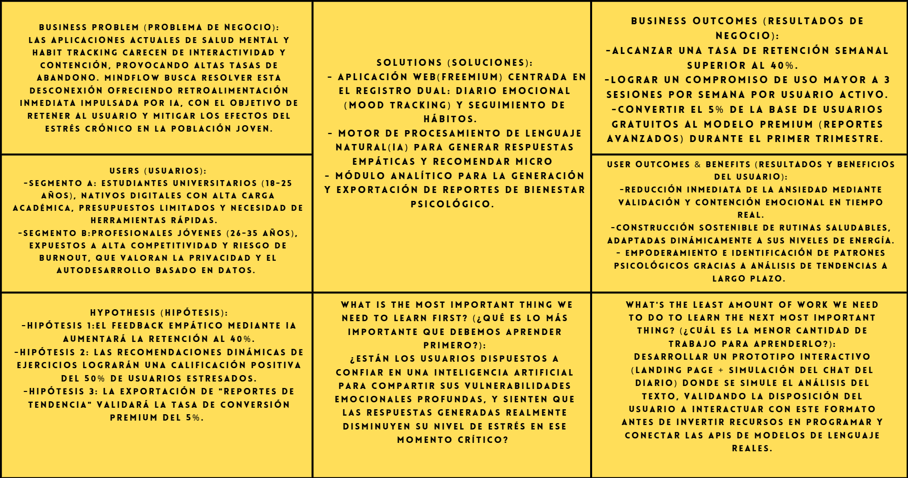

# Capítulo I: Introducción

---

## 1.1. Startup Profile

---

### 1.1.1. Descripción de la Startup
CogniTech es una startup tecnológica emergente enfocada en la intersección entre la salud mental y la inteligencia artificial. Nuestro propósito es democratizar el acceso a herramientas de bienestar emocional a través de soluciones de software innovadoras, escalables y centradas en el usuario.

| Atributo | Declaración Estratégica |
| :--- | :--- |
| **Misión** | Empoderar a las personas en la gestión de su bienestar emocional mediante el desarrollo de aplicaciones inteligentes, accesibles y éticas que faciliten la construcción de hábitos saludables y el autoconocimiento. |
| **Visión** | Ser la *startup* líder en la región en la creación de ecosistemas digitales de salud mental, transformando la manera en que la tecnología asiste al ser humano en su desarrollo personal y equilibrio emocional. |

### 1.1.2. Perfiles de integrantes del equipo

| **Nombre y Apellido** | Cabrera Sotelo, Camila Celeste - U202412462 |                                                                                                                                                                     
|:----------------------|:---------------------------------------------|
| **Descripcion**       | Responsable de conceptualizar y construir la experiencia visual de la plataforma. Su principal objetivo es asegurar que la aplicación sea intuitiva, atractiva y, sobre todo, que cumpla con los estándares de accesibilidad e inclusión necesarios para llegar a todo tipo de usuarios.                                 |
| **Foto**              |

| **Nombre y Apellido**   | Caisahuana Osores, Becker Junior - U202419462 |                                                                                                                                                                     
|:------------------------|:-----------------------------------------|
| **Descripcion**         | Especialista en el modelado, manejo y estructuración de la información. Su labor consiste en diseñar el esquema de persistencia de datos y apoyar en el desarrollo de los servicios internos, garantizando que los registros del sistema se almacenen de forma segura y eficiente.                                   |
| **Foto**                |

| **Nombre y Apellido**  | Díaz De la cruz, Sebastián Gabriel - U202410421 |                                                                                                                                                                     
|:-----------------------|:-----------------------------------------|
| **Descripcion**        | Responsable de velar por la calidad del producto final y la organización del control de versiones. Se encarga de supervisar que el código cumpla con las convenciones establecidas por el equipo y de coordinar la publicación y el despliegue de la aplicación en los entornos correspondientes.                                   |
| **Foto**               |

| **Nombre y Apellido**  | Jáuregui Cerna, Jean Franco - U202410024 |                                                                                                                                                                     
|:-----------------------|:-----------------------------------------|
| **Descripcion**        | Lidera la construcción de la interfaz interactiva con la que operará el usuario final. Su misión es transformar los diseños visuales en componentes completamente funcionales, asegurando un rendimiento fluido y una comunicación estable entre la pantalla del cliente y los servicios del servidor.                                   |
| **Foto**               |

| **Nombre y Apellido** | Rocca Mariaca, Angel Mathias - u20231e515 |                                                                                                                                                                     
|:----------------------|:-----------------------------------------|
| **Descripcion**       | Encargado de diseñar la arquitectura base del sistema y definir las estrategias tecnológicas del proyecto. Su enfoque está en estructurar una solución sólida y escalable, además de gestionar la integración de los servicios de Inteligencia Artificial que potenciarán la lógica central de la plataforma.                                   |
| **Foto**              |
---
## 1.2. Solution Profile

---

### 1.2.1. Antecedentes y problemática
En la actualidad, la salud mental representa uno de los desafíos más críticos para la población joven e interconectada. Las presiones académicas, el entorno laboral competitivo y la constante sobreestimulación digital actúan como detonantes principales del estrés crónico, la ansiedad y el agotamiento (*burnout*). A pesar de la creciente conciencia sobre la importancia del bienestar emocional, el acceso a servicios de atención psicológica tradicionales sigue siendo limitado debido a barreras económicas, falta de tiempo y estigma social.

Si bien existen soluciones de software en el mercado orientadas al bienestar, la mayoría se limitan a ser registros estáticos o listas de tareas básicas que carecen de retroalimentación activa, resultando en altas tasas de abandono. Frente a este escenario, se propone el desarrollo de **MindFlow**, una plataforma inteligente que integra análisis de sentimiento mediante inteligencia artificial para ofrecer apoyo emocional proactivo y seguimiento de hábitos.

Para delimitar y comprender a profundidad el alcance de esta problemática, se emplea el marco de análisis **5W2H**:

* **Who (Quién):** Estudiantes universitarios (18-25 años) y profesionales jóvenes (26-35 años) que enfrentan altos niveles de exigencia académica o laboral, y que son nativos digitales en busca de herramientas de autogestión emocional.
* **What (Qué):** Alta prevalencia de estrés, ansiedad y *burnout*, sumado a la incapacidad de mantener rutinas de bienestar sostenibles y a la alta tasa de abandono de las aplicaciones de salud mental convencionales por su falta de personalización e interactividad.
* **Where (Dónde):** En entornos académicos (universidades, institutos) y espacios laborales (oficinas, esquemas de teletrabajo) a nivel nacional en Perú y la región latinoamericana, donde el ritmo de vida acelerado dificulta la desconexión mental.
* **When (Cuándo):** De manera constante, pero con picos de intensidad durante periodos de evaluaciones universitarias, cierres de proyectos laborales, o momentos de crisis personal donde no se dispone de asistencia psicológica inmediata.
* **Why (Por qué):** Debido a los altos costos económicos de la terapia tradicional, la falta de tiempo para agendar sesiones físicas, el estigma social que aún rodea a la vulnerabilidad emocional, y la carencia de herramientas digitales que ofrezcan empatía y retroalimentación clínica validada en tiempo real.
* **How (Cómo):** El problema se manifiesta a través del agotamiento cognitivo, alteraciones del sueño y baja productividad. Actualmente, los usuarios intentan mitigarlo mediante diarios en papel o aplicaciones genéricas que fallan al no analizar el estado del usuario. Para resolver esto de forma efectiva, la integración de intervenciones digitales impulsadas por Inteligencia Artificial resulta fundamental; según la Organización Mundial de la Salud (OMS), las herramientas de salud digital basadas en algoritmos tienen el potencial de superar barreras históricas de acceso y ofrecer un monitoreo continuo que empodera al paciente en su autocuidado (OMS, 2021, *Global strategy on digital health 2020-2025*).
* **How much (Cuánto):** El costo y el impacto de esta problemática son cuantificables y alarmantes. A nivel global, la depresión y la ansiedad generan la pérdida de 12,000 millones de días de trabajo cada año, costando a la economía mundial cerca de 1 billón de dólares anuales en pérdida de productividad (OMS, 2022, *World mental health report*). En el contexto peruano, el Ministerio de Salud (MINSA) reportó que solo en el año 2023 se atendieron más de 1.3 millones de casos relacionados a trastornos de salud mental, destacando que la ansiedad y la depresión son las principales causas de pérdida de años de vida saludables en la población joven (MINSA, 2023, *Boletín Epidemiológico del Perú*).

### 1.2.2. Lean UX Process

#### 1.2.2.1. Lean UX Problem Statements
El estado actual del mercado de aplicaciones de salud mental y *habit tracking* revela una deficiencia crítica en la interactividad. Las soluciones existentes obligan a los usuarios a realizar el esfuerzo cognitivo de registrar sus emociones en aislamiento, ofreciendo únicamente métricas pasivas sin proporcionar contención ni guía en tiempo real.
A raíz de esta problemática, planteamos los siguiente problem statement:
* **Problem Statement 1 (Enfoque de contención emocional):**
  Hemos observado que los estudiantes universitarios y jóvenes profesionales intentan gestionar su estrés mediante diarios digitales o físicos, pero abandonan estas prácticas rápidamente debido a la falta de retroalimentación inmediata, lo que resulta en frustración y en la persistencia de episodios de ansiedad no tratados. *¿Cómo podríamos proporcionarles una herramienta que procese sus registros emocionales y les ofrezca una respuesta empática y accionable en tiempo real, de modo que perciban un apoyo constante y mejoren su autorregulación?*

* **Problem Statement 2 (Enfoque de adherencia a hábitos):**
  Hemos observado que las aplicaciones tradicionales de seguimiento de hábitos exigen una alta disciplina inicial que los usuarios con altos niveles de estrés (burnout) no logran sostener. *¿Cómo podríamos integrar el análisis del estado de ánimo con el seguimiento de rutinas, de manera que la plataforma ajuste dinámicamente sus recomendaciones diarias para maximizar la retención y la construcción de hábitos a largo plazo?*
#### 1.2.2.2. Lean UX Assumptions
Para fundamentar nuestra experimentación y mitigar riesgos en el desarrollo, hemos completado el **Assumptions Worksheet**, desglosando nuestras suposiciones estratégicas en cuatro dimensiones clave:

**1. Business Outcomes (Resultados de Negocio esperados):**
* Alcanzar una tasa de retención semanal superior al 40% de los usuarios activos durante el primer trimestre de lanzamiento.
* Lograr una tasa de conversión del 5% de usuarios del plan gratuito (*Freemium*) al plan de pago mensual (*Premium*) basado en reportes avanzados.
* Reducir los costos de adquisición de clientes (CAC) apalancándose en la viralidad orgánica dentro de comunidades universitarias y redes profesionales.

**2. User Outcomes (Resultados esperados para el Usuario):**
* **Contención inmediata:** Reducción de la carga mental y el estrés agudo gracias a la validación empática recibida justo en el momento de registrar una emoción negativa.
* **Consistencia:** Mayor adherencia a rutinas de bienestar mediante recomendaciones que se adaptan dinámicamente a la capacidad de energía diaria del usuario, evitando la frustración.
* **Autodescubrimiento:** Empoderamiento del usuario al identificar patrones de comportamiento y detonadores de ansiedad a través de análisis de datos históricos.

**3. Features (Características del Producto a validar):**
* **AI Mood Journal:** Diario interactivo impulsado por Procesamiento de Lenguaje Natural (NLP) que analiza el sentimiento del texto y devuelve respuestas empáticas en tiempo real.
* **Dynamic Habit Tracker:** Gestor de hábitos inteligente que ajusta la dificultad o cantidad de tareas sugeridas basándose en el estado de ánimo detectado por la IA.
* **Smart Interventions:** Sugerencia automatizada de micro-ejercicios (ej. técnica de respiración 4-7-8 o pausas activas) cuando se detectan picos de estrés.
* **Wellness Analytics Dashboard:** Panel de tendencias emocionales con capacidad de exportar reportes clínicos en PDF (Funcionalidad Premium) para ser compartidos con terapeutas.

**4. Business & User Assumptions (Supuestos Críticos):**
* **Supuesto de Valor (Negocio):** Creemos que la ventaja competitiva de MindFlow radica en la analítica de sentimientos, y que los usuarios pagarán por acceder a su historial de datos estructurado.
* **Supuesto de Adopción (Usuario):** Creemos que los jóvenes profesionales y estudiantes preferirán tipear en su móvil antes de dormir, en lugar de usar un cuaderno físico.
* **Supuesto de Confianza (Usuario):** Asumimos que los usuarios están dispuestos a compartir información vulnerable con un motor de IA, siempre y cuando se garantice la encriptación de extremo a extremo y el sistema sea transparente respecto a que no reemplaza a un profesional médico clínico.

#### 1.2.2.3. Lean UX Hypothesis Statements
Para validar nuestros supuestos, planteamos las siguientes hipótesis de diseño, formuladas con métricas de éxito cuantificables bajo la estructura estándar:

* **Hipótesis 1 (Feedback IA y Retención):**
  **Creemos que** implementar un motor de IA que genere respuestas empáticas inmediatas tras cada entrada del diario emocional aumentará significativamente el compromiso continuo del usuario.
  **Sabremos que** tuvimos éxito
  **Cuando veamos** que la tasa de retención semanal supera el 40% y el promedio de uso es mayor a 3 sesiones por semana durante el primer mes de lanzamiento.

* **Hipótesis 2 (Recomendaciones Dinámicas y Estrés):**
  **Creemos que** sugerir micro-ejercicios (como pausas activas o respiración guiada) basados en el análisis de sentimiento del usuario proporcionará herramientas efectivas de mitigación del estrés.
  **Sabremos que** estamos en lo correcto
  **Cuando veamos** que al menos el 50% de los usuarios que reciben una alerta de "alto estrés" hacen clic en la recomendación y la califican positivamente (4 o 5 estrellas de utilidad).

* **Hipótesis 3 (Generación de Ingresos):**
  **Creemos que** ofrecer la exportación de "Reportes de Tendencia Emocional" avanzados como una función de pago validará nuestro modelo de monetización Freemium.
  **Sabremos que** nuestra estrategia de negocio funciona
  **Cuando veamos** una tasa de conversión del 5% de usuarios gratuitos a usuarios *premium* dentro del primer trimestre de operación.

#### 1.2.2.4. Lean UX Canvas

## 1.3. Segmentos objetivo
La identificación de los segmentos objetivo para **MindFlow** se basa en la intersección entre la alta exposición a entornos de estrés crónico y la alta competencia digital. Hemos definido dos segmentos principales que presentan perfiles de necesidad diferenciados, pero que convergen en la búsqueda de soluciones de salud mental accesibles y tecnológicas.

#### 1.2.3.1. Segmento A: Estudiantes Universitarios (Tech-Native Scholars)
Este segmento comprende jóvenes entre los 18 y 25 años que cursan estudios de pregrado en entornos de alta exigencia académica (universidades e institutos técnicos).

* **Perfil Psicográfico:** Individuos con una alta carga cognitiva diaria, sometidos a periodos críticos de evaluación. Valoran la inmediatez y la gratificación instantánea. Suelen priorizar herramientas gratuitas o de bajo costo debido a su presupuesto limitado.
* **Necesidades Críticas:** Contención rápida durante crisis de ansiedad por exámenes, gestión de la procrastinación y una herramienta que no se sienta como una "tarea extra" en su día a día.
* **Puntos de Dolor:** Sentimiento de aislamiento académico, falta de recursos para costear terapia privada y dificultad para mantener hábitos saludables (sueño, alimentación) bajo presión.

#### 1.2.3.2. Segmento B: Profesionales Jóvenes (High-Performance Achievers)
Este segmento abarca adultos entre los 26 y 35 años que se encuentran en las primeras etapas de consolidación de su carrera profesional o en roles de mando medio.

* **Perfil Psicográfico:** Personas altamente competitivas que enfrentan el fenómeno del *burnout* laboral. Buscan la optimización del tiempo y valoran los datos (analítica) para medir su progreso personal. Tienen mayor disposición al pago si perciben una mejora directa en su productividad y bienestar.
* **Necesidades Críticas:** Herramientas de desconexión efectiva, monitoreo de la salud mental como preventivo del agotamiento laboral y reportes estructurados que les permitan entender sus detonadores de estrés.
* **Puntos de Dolor:** Desequilibrio entre la vida laboral y personal, estigma en el entorno corporativo sobre la salud mental y falta de tiempo para asistir a sesiones presenciales de psicología.
---