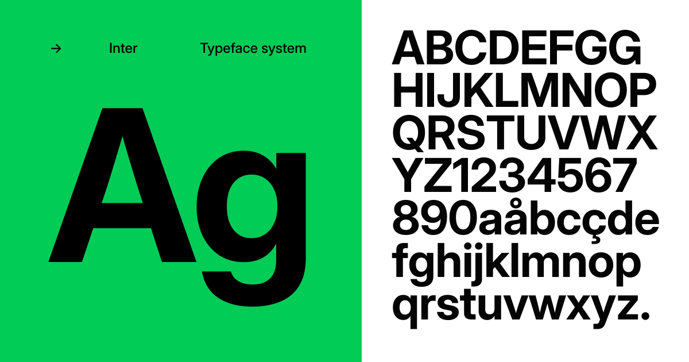
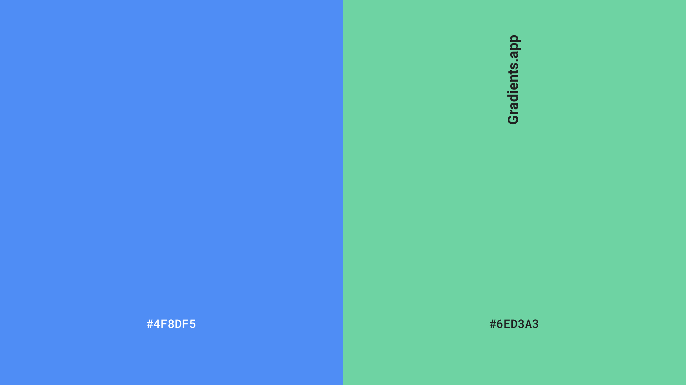
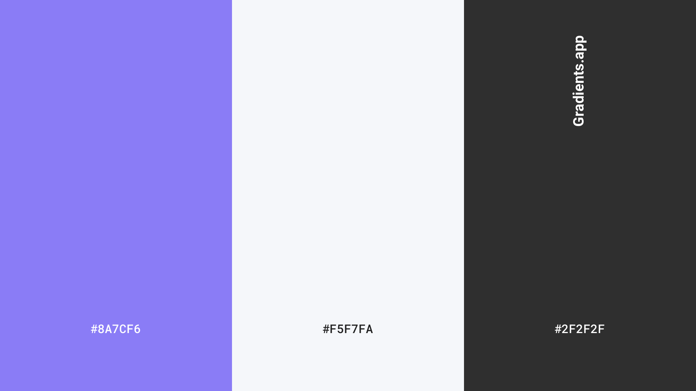
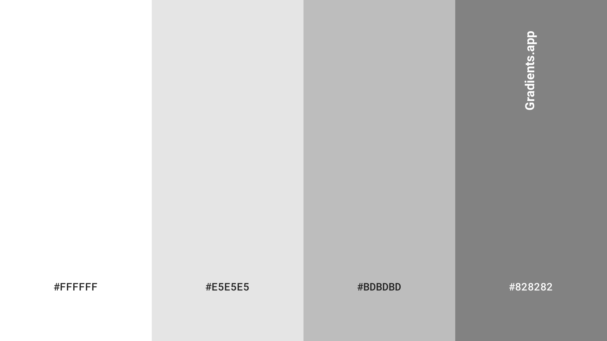

# Capítulo IV: Product Design

---
## 4.1. Style Guidelines

### 4.1.1. General Style Guidelines

#### Typography

La tipografía utilizada en MindFlow fue seleccionada considerando criterios de legibilidad, claridad visual y consistencia en interfaces digitales. Se priorizó el uso de una tipografía sans-serif moderna, optimizada para entornos web y aplicaciones móviles.

La fuente principal elegida es Inter, debido a su alta legibilidad en pantallas, su diseño limpio y su uso extendido en aplicaciones tecnológicas modernas.

Inter permite mantener una jerarquía tipográfica clara para títulos, subtítulos y contenido, facilitando la lectura del usuario dentro de la plataforma.

Tipografía seleccionada

- Primary Font: Inter  
- Tipo: Sans-serif  
- Uso: Títulos, subtítulos, botones e interfaz general  

---

#### Primary Colors

Los colores primarios de MindFlow representan los valores centrales de la plataforma: calma emocional, confianza tecnológica y bienestar.

Se seleccionaron tonos fríos y suaves para generar una experiencia visual relajante que reduzca la fatiga visual y transmita estabilidad.

Colores primarios

- Primary Blue — #4F8DF5  
- Soft Green — #6ED3A3  

Estos colores se utilizan principalmente en:

- botones principales  
- elementos interactivos  
- indicadores de estado positivo  
- elementos clave de branding  

---

#### Secondary Colors

Los colores secundarios complementan la identidad visual del sistema y permiten crear jerarquía visual dentro de la interfaz.

Se utilizan para elementos de apoyo, secciones informativas y componentes secundarios de la interfaz.

Colores secundarios

- Accent Purple — #8A7CF6  
- Neutral Gray — #F5F7FA  
- Dark Gray — #2F2F2F  

Estos colores se utilizan en:

- fondos de secciones  
- tarjetas informativas  
- textos secundarios  
- elementos decorativos de interfaz  

---

#### Wireframe Colors

Para el diseño de wireframes se utilizan colores neutros que permiten concentrarse en la estructura de la interfaz y no en el diseño visual final.

Estos colores facilitan la representación de layouts, jerarquías de información y distribución de componentes.

Colores utilizados en wireframes

- Light Gray — #E5E5E5  
- Medium Gray — #BDBDBD  
- Dark Gray — #828282  
- White — #FFFFFF  

Estos colores permiten diferenciar:

- contenedores  
- secciones  
- elementos interactivos  
- placeholders de contenido  

### 4.1.2. Web Style Guidelines

En esta sección se describen los estándares visuales y de interacción definidos para las interfaces web de MindFlow. Estos lineamientos permiten mantener consistencia en la experiencia de usuario, asegurando que los elementos visuales, componentes y comportamientos interactivos sigan un mismo patrón de diseño en toda la aplicación.

Las Web Style Guidelines consideran principios de diseño responsive, accesibilidad y usabilidad, con el objetivo de que la plataforma pueda adaptarse correctamente a distintos tamaños de pantalla y dispositivos, manteniendo siempre claridad visual y facilidad de interacción.

#### Layout and Grid System

El diseño de las interfaces web utiliza un sistema de grid flexible que permite organizar los elementos de forma consistente y adaptable a diferentes resoluciones de pantalla.

El sistema de grid se basa en:

- Grid de 12 columnas  
- Margen lateral adaptable  
- Espaciado consistente basado en múltiplos de 8px  

Este enfoque facilita la construcción de interfaces responsivas y permite distribuir componentes como tarjetas, formularios y paneles de manera equilibrada dentro del layout.

#### Buttons

Los botones representan uno de los elementos interactivos principales dentro de la plataforma. Se definen estilos consistentes para mantener una interacción clara y reconocible.

Tipos de botones definidos:

Primary Button  
Utilizado para acciones principales como guardar registros emocionales o iniciar procesos importantes dentro de la aplicación.

Secondary Button  
Utilizado para acciones complementarias o alternativas dentro de una misma interfaz.

Text Button  
Utilizado en acciones secundarias o navegación ligera dentro de la aplicación.

#### Forms and Input Fields

Los formularios permiten al usuario interactuar con el sistema ingresando información, como registros emocionales o configuración de hábitos.

Los campos de entrada siguen un diseño simple y claro, con etiquetas visibles y retroalimentación visual en caso de error o validación.

Elementos incluidos en formularios:

- Text input  
- Dropdown selectors  
- Text areas  
- Validation messages  

#### Cards and Content Containers

Las tarjetas (cards) se utilizan para organizar información dentro de la interfaz de manera clara y estructurada. Este componente es especialmente útil para mostrar registros emocionales, estadísticas o recomendaciones del sistema.

Las cards incluyen:

- fondo neutro  
- bordes suaves  
- sombra ligera para jerarquía visual  

#### Responsive Behavior

La interfaz web de MindFlow fue diseñada siguiendo principios de diseño responsive, permitiendo que el contenido se adapte correctamente a diferentes dispositivos.

Se consideran tres tamaños principales de visualización:

Desktop  
Pantallas mayores a 1024px.

Tablet  
Pantallas entre 768px y 1024px.

Mobile  
Pantallas menores a 768px.

Cada layout reorganiza los componentes para mantener la legibilidad y facilidad de navegación.

## 4.2. Information Architecture

En esta sección el equipo presenta las decisiones y el sustento que orientan la manera en que se organizará el contenido dentro de las experiencias web y móvil del proyecto, incluyendo el Landing Page y las aplicaciones del sistema.

La arquitectura de información tiene como propósito facilitar la comprensión de la estructura del producto digital, permitiendo que los visitantes y usuarios puedan adaptarse rápidamente a su funcionamiento y encontrar la información o funcionalidades que necesitan sin esfuerzo innecesario.

Para lograrlo, se han definido distintos sistemas que estructuran la experiencia digital:

- Organization Systems  
- Labeling Systems  
- Navigation Systems  
- Searching Systems  

Estos sistemas permiten organizar la información, definir la forma en que se nombran los contenidos, estructurar la navegación dentro de la plataforma y facilitar la localización de información específica cuando el usuario la requiere.

---

## 4.2.1. Organization Systems

Los Organization Systems definen la manera en que la información se agrupa y estructura dentro del Landing Page y las aplicaciones del sistema.

En el proyecto se consideran distintos tipos de organización visual del contenido, dependiendo del contexto de uso y del tipo de información que se presenta:

- organización jerárquica 
- organización secuencial
- organización matricial  

### Organización jerárquica

La organización jerárquica se utiliza principalmente en el Landing Page y en los dashboards principales de la aplicación, donde es necesario destacar la información más relevante y guiar la atención del usuario.

Este tipo de organización establece distintos niveles de importancia dentro de la interfaz mediante el uso de tamaño, contraste, posición y agrupación de elementos, permitiendo que los usuarios identifiquen rápidamente los contenidos o acciones más importantes.

### Organización secuencial

La organización secuencial se aplica en aquellas funcionalidades donde el usuario debe seguir una serie de pasos para completar una tarea dentro del sistema.

Este enfoque permite estructurar procesos de manera clara y ordenada, facilitando la comprensión del flujo de interacción y reduciendo la probabilidad de errores durante la ejecución de las tareas.

### Organización matricial

La organización matricial se utiliza en aquellas secciones donde la información debe visualizarse considerando diferentes variables o dimensiones al mismo tiempo.

Este tipo de estructura permite relacionar distintos tipos de datos dentro de una misma vista, facilitando la comparación de información y el análisis de resultados.

### Esquemas de categorización del contenido

Además de la organización visual, el sistema también utiliza diferentes esquemas de categorización para estructurar el contenido de acuerdo con su naturaleza:

- organización alfabética  
- organización cronológica  
- organización por tópicos  
- organización según audiencia  

La organización alfabética permite localizar elementos de manera rápida dentro de listados extensos. La organización cronológica se utiliza cuando la información está asociada a registros históricos o eventos que ocurren a lo largo del tiempo. La organización por tópicos agrupa los contenidos según áreas funcionales del sistema. Finalmente, la organización según audiencia considera los distintos tipos de usuarios que interactúan con la plataforma, permitiendo adaptar la estructura de la información de acuerdo con sus necesidades y contexto de uso.

La combinación de estos sistemas permite estructurar el contenido del producto digital de manera clara y coherente, facilitando la navegación y mejorando la experiencia general de los usuarios.

## 4.2.2. Labeling Systems

En esta sección el equipo define la manera en que se representará la información dentro del Landing Page y las aplicaciones del sistema mediante el uso de etiquetas claras y comprensibles. El objetivo del sistema de etiquetado es facilitar la interpretación del contenido y evitar confusiones durante la interacción del usuario con la plataforma.

Las etiquetas utilizadas en el sistema se caracterizan por ser simples, directas y consistentes a lo largo de toda la experiencia digital. Se busca emplear el menor número posible de palabras para representar cada conjunto de información, permitiendo que los usuarios identifiquen rápidamente el propósito de cada sección o funcionalidad.

El sistema de etiquetado también busca mantener coherencia entre las distintas partes del producto digital, de modo que los mismos conceptos se representen siempre con la misma terminología. Esto contribuye a generar familiaridad en el uso de la plataforma y facilita la navegación entre las diferentes secciones.

Entre las principales etiquetas utilizadas para representar los conjuntos de información dentro del sistema se encuentran:

- Dashboard  
- Assets  
- Maintenance  
- Failures  
- Reports  
- Notifications  
- Settings  

Estas etiquetas permiten organizar los módulos principales del sistema y establecer relaciones claras entre los distintos tipos de información. Asimismo, contribuyen a que los usuarios comprendan rápidamente la función de cada sección y puedan acceder a las herramientas necesarias para realizar sus tareas dentro de la plataforma.

### 4.2.3. SEO Tags and Meta Tags

### 4.2.4. Searching Systems

### 4.2.5. Navigation Systems

## 4.3. Landing Page UI Design

---

### 4.3.1. Landing Page Wireframe

### 4.3.2. Landing Page Mock-up

## 4.4. Web Applications UX/UI Design

---

### 4.4.1. Web Applications Wireframes

### 4.4.2. Web Applications Wireflow Diagrams

### 4.4.3. Web Applications Mock-ups

### 4.4.4. Web Applications User Flow Diagrams

## 4.5. Web Applications Prototyping

---

## 4.6. Domain-Driven Software Architecture

---

### 4.6.1. Design-Level EventStorming

### 4.6.2. Software Architecture Context Diagram

### 4.6.3. Software Architecture Container Diagrams

### 4.6.4. Software Architecture Components Diagrams

## 4.7. Software Object-Oriented Design

---

### 4.7.1. Class Diagrams

## 4.8. Database Design

---

### 4.8.1. Database Diagrams
