# Capítulo IV: Product Design

---
## 4.1. Style Guidelines
En esta sección se detallan las pautas de estilo para el diseño de la marca y la interfaz de usuario de MindFlow, asegurando una identidad visual coherente y una experiencia de usuario intuitiva.

Link de Figma para la Web Application: https://www.figma.com/design/W8t3VfSTOtEugJ14qkQqzA/Web-Application?node-id=0-1&t=hD8F0b2ut0qpzpiI-1

Link de Figma para la Landing Page: https://www.figma.com/design/t6wSCWYshqMoU1z2OkGxV5/Untitled?node-id=0-1&t=fRy5VIVtScC41BuW-1
### 4.1.1. General Style Guidelines

#### Typography

La tipografía utilizada en MindFlow fue seleccionada considerando criterios de legibilidad, claridad visual y consistencia en interfaces digitales. Se priorizó el uso de una tipografía sans-serif moderna, optimizada para entornos web y aplicaciones móviles.

La fuente principal elegida es Inter, debido a su alta legibilidad en pantallas, su diseño limpio y su uso extendido en aplicaciones tecnológicas modernas.

Inter permite mantener una jerarquía tipográfica clara para títulos, subtítulos y contenido, facilitando la lectura del usuario dentro de la plataforma.

Tipografía seleccionada

- Primary Font: Inter  
- Tipo: Sans-serif  
- Uso: Títulos, subtítulos, botones e interfaz general  

---

#### Primary Colors

Los colores primarios de MindFlow representan los valores centrales de la plataforma: calma emocional, confianza tecnológica y bienestar.

Se seleccionaron tonos fríos y suaves para generar una experiencia visual relajante que reduzca la fatiga visual y transmita estabilidad.

Colores primarios

- Primary Blue — #4F8DF5  
- Soft Green — #6ED3A3  

Estos colores se utilizan principalmente en:

- botones principales  
- elementos interactivos  
- indicadores de estado positivo  
- elementos clave de branding  

---

#### Secondary Colors

Los colores secundarios complementan la identidad visual del sistema y permiten crear jerarquía visual dentro de la interfaz.

Se utilizan para elementos de apoyo, secciones informativas y componentes secundarios de la interfaz.

Colores secundarios

- Accent Purple — #8A7CF6  
- Neutral Gray — #F5F7FA  
- Dark Gray — #2F2F2F  

Estos colores se utilizan en:

- fondos de secciones  
- tarjetas informativas  
- textos secundarios  
- elementos decorativos de interfaz  

---

#### Wireframe Colors

Para el diseño de wireframes se utilizan colores neutros que permiten concentrarse en la estructura de la interfaz y no en el diseño visual final.

Estos colores facilitan la representación de layouts, jerarquías de información y distribución de componentes.

Colores utilizados en wireframes

- Light Gray — #E5E5E5  
- Medium Gray — #BDBDBD  
- Dark Gray — #828282  
- White — #FFFFFF  

Estos colores permiten diferenciar:

- contenedores  
- secciones  
- elementos interactivos  
- placeholders de contenido  

### 4.1.2. Web Style Guidelines

Las Web Style Guidelines consideran principios de diseño responsive, accesibilidad y usabilidad, con el objetivo de que la plataforma pueda adaptarse correctamente a distintos tamaños de pantalla y dispositivos, manteniendo siempre claridad visual y facilidad de interacción.

#### Layout and Grid System

El diseño de las interfaces web utiliza un sistema de grid flexible que permite organizar los elementos de forma consistente y adaptable a diferentes resoluciones de pantalla.

El sistema de grid se basa en:

- Grid de 12 columnas  
- Margen lateral adaptable  
- Espaciado consistente basado en múltiplos de 8px  

Este enfoque facilita la construcción de interfaces responsivas y permite distribuir componentes como tarjetas, formularios y paneles de manera equilibrada dentro del layout.

#### Buttons

Los botones representan uno de los elementos interactivos principales dentro de la plataforma. Se definen estilos consistentes para mantener una interacción clara y reconocible.

Tipos de botones definidos:

Primary Button  
Utilizado para acciones principales como guardar registros emocionales o iniciar procesos importantes dentro de la aplicación.

Secondary Button  
Utilizado para acciones complementarias o alternativas dentro de una misma interfaz.

Text Button  
Utilizado en acciones secundarias o navegación ligera dentro de la aplicación.

#### Forms and Input Fields

Los formularios permiten al usuario interactuar con el sistema ingresando información, como registros emocionales o configuración de hábitos.

Los campos de entrada siguen un diseño simple y claro, con etiquetas visibles y retroalimentación visual en caso de error o validación.

Elementos incluidos en formularios:

- Text input  
- Dropdown selectors  
- Text areas  
- Validation messages  

#### Cards and Content Containers

Las tarjetas (cards) se utilizan para organizar información dentro de la interfaz de manera clara y estructurada. Este componente es especialmente útil para mostrar registros emocionales, estadísticas o recomendaciones del sistema.

Las cards incluyen:

- fondo neutro  
- bordes suaves  
- sombra ligera para jerarquía visual  

#### Responsive Behavior

La interfaz web de MindFlow fue diseñada siguiendo principios de diseño responsive, permitiendo que el contenido se adapte correctamente a diferentes dispositivos.

Se consideran tres tamaños principales de visualización:

Desktop  
Pantallas mayores a 1024px.

Tablet  
Pantallas entre 768px y 1024px.

Mobile  
Pantallas menores a 768px.

Cada layout reorganiza los componentes para mantener la legibilidad y facilidad de navegación.

## 4.2. Information Architecture

La arquitectura de información tiene como propósito facilitar la comprensión de la estructura del producto digital, permitiendo que los visitantes y usuarios puedan adaptarse rápidamente a su funcionamiento y encontrar la información o funcionalidades que necesitan sin esfuerzo innecesario.

Para lograrlo, se han definido distintos sistemas que estructuran la experiencia digital:

- Organization Systems  
- Labeling Systems  
- Navigation Systems  
- Searching Systems  

Estos sistemas permiten organizar la información, definir la forma en que se nombran los contenidos, estructurar la navegación dentro de la plataforma y facilitar la localización de información específica cuando el usuario la requiere.

---

## 4.2.1. Organization Systems

Los Organization Systems definen la manera en que la información se agrupa y estructura dentro del Landing Page y las aplicaciones del sistema.

En el proyecto se consideran distintos tipos de organización visual del contenido, dependiendo del contexto de uso y del tipo de información que se presenta:

- organización jerárquica 
- organización secuencial
- organización matricial  

### Organización jerárquica

La organización jerárquica se utiliza principalmente en el Landing Page y en los dashboards principales de la aplicación, donde es necesario destacar la información más relevante y guiar la atención del usuario.

Este tipo de organización establece distintos niveles de importancia dentro de la interfaz mediante el uso de tamaño, contraste, posición y agrupación de elementos, permitiendo que los usuarios identifiquen rápidamente los contenidos o acciones más importantes.

### Organización secuencial

La organización secuencial se aplica en aquellas funcionalidades donde el usuario debe seguir una serie de pasos para completar una tarea dentro del sistema.

Este enfoque permite estructurar procesos de manera clara y ordenada, facilitando la comprensión del flujo de interacción y reduciendo la probabilidad de errores durante la ejecución de las tareas.

### Organización matricial

La organización matricial se utiliza en aquellas secciones donde la información debe visualizarse considerando diferentes variables o dimensiones al mismo tiempo.

Este tipo de estructura permite relacionar distintos tipos de datos dentro de una misma vista, facilitando la comparación de información y el análisis de resultados.

### Esquemas de categorización del contenido

Además de la organización visual, el sistema también utiliza diferentes esquemas de categorización para estructurar el contenido de acuerdo con su naturaleza:

- organización alfabética  
- organización cronológica  
- organización por tópicos  
- organización según audiencia  

La organización alfabética permite localizar elementos de manera rápida dentro de listados extensos. La organización cronológica se utiliza cuando la información está asociada a registros históricos o eventos que ocurren a lo largo del tiempo. La organización por tópicos agrupa los contenidos según áreas funcionales del sistema. Finalmente, la organización según audiencia considera los distintos tipos de usuarios que interactúan con la plataforma, permitiendo adaptar la estructura de la información de acuerdo con sus necesidades y contexto de uso.

La combinación de estos sistemas permite estructurar el contenido del producto digital de manera clara y coherente, facilitando la navegación y mejorando la experiencia general de los usuarios.

## 4.2.2. Labeling Systems

Las etiquetas utilizadas en el sistema se caracterizan por ser simples, directas y consistentes a lo largo de toda la experiencia digital. Se busca emplear el menor número posible de palabras para representar cada conjunto de información, permitiendo que los usuarios identifiquen rápidamente el propósito de cada sección o funcionalidad.

El sistema de etiquetado también busca mantener coherencia entre las distintas partes del producto digital, de modo que los mismos conceptos se representen siempre con la misma terminología. Esto contribuye a generar familiaridad en el uso de la plataforma y facilita la navegación entre las diferentes secciones.

Entre las principales etiquetas utilizadas para representar los conjuntos de información dentro del sistema se encuentran:

- Dashboard  
- Assets  
- Maintenance  
- Failures  
- Reports  
- Notifications  
- Settings  

Estas etiquetas permiten organizar los módulos principales del sistema y establecer relaciones claras entre los distintos tipos de información. Asimismo, contribuyen a que los usuarios comprendan rápidamente la función de cada sección y puedan acceder a las herramientas necesarias para realizar sus tareas dentro de la plataforma.

## 4.2.3. SEO Tags and Meta Tags

La plataforma TexCheck incorpora metaetiquetas que permiten mejorar la identificación del contenido por parte de los motores de búsqueda y estructurar correctamente la información para navegadores y sistemas de indexación.

Las meta tags definidas para la experiencia digital se utilizan tanto en el Landing Page como en la Web Application, permitiendo describir el propósito del sistema y facilitar su posicionamiento en buscadores.

Las principales meta tags utilizadas son las siguientes:

- **Title:** Define el título principal de la página que aparece en la pestaña del navegador y en los resultados de búsqueda.

- **Codificación de caracteres:** Permite que los caracteres especiales se muestren correctamente en todos los navegadores.

- **Description:** Proporciona un resumen breve del contenido del sitio que puede aparecer en los resultados de búsqueda.

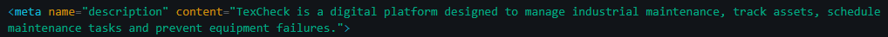

- **Keywords:** Define palabras clave relacionadas con el contenido del sistema para facilitar su indexación en motores de búsqueda.

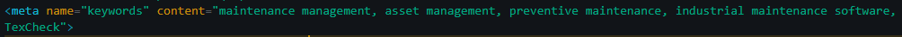

- **Author:** Identifica al autor o equipo responsable del contenido del sitio.

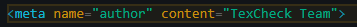

Estas metaetiquetas permiten describir adecuadamente el contenido de las páginas principales del sistema, facilitando su indexación en motores de búsqueda y mejorando la visibilidad de la plataforma.

## 4.2.4. Searching Systems

El sistema de búsqueda define los mecanismos que permiten a los usuarios localizar información dentro de la plataforma de manera rápida y eficiente. Estas funcionalidades buscan facilitar la exploración del contenido y evitar que los usuarios se sientan desorientados cuando interactúan con grandes volúmenes de información.

Las aplicaciones incorporan herramientas de búsqueda que permiten encontrar registros específicos dentro de los distintos módulos del sistema. Estas búsquedas se complementan con filtros que ayudan a refinar los resultados según diferentes criterios, permitiendo a los usuarios acceder de forma más precisa a la información que necesitan.

Las principales opciones de búsqueda disponibles en el sistema incluyen:

- búsqueda por palabra clave  
- filtros por categoría o tipo de información  
- filtros por estado  
- filtros por fecha  

Una vez realizada la búsqueda, los resultados se presentan en vistas organizadas que facilitan la lectura y comparación de la información. Los datos se muestran en tablas o listas estructuradas, permitiendo visualizar los registros encontrados junto con los atributos más relevantes asociados a cada elemento.

Este sistema de búsqueda contribuye a mejorar la eficiencia de la interacción con la plataforma, ya que permite acceder rápidamente a la información requerida y facilita la gestión de los datos dentro de las diferentes funcionalidades del sistema.

## 4.2.5. Navigation Systems

La navegación en MindFlow permite a los usuarios recorrer el Landing Page y las aplicaciones de manera clara mientras interactúan con las diferentes funcionalidades de la plataforma.

En la Web Application se utiliza un menú principal que agrupa los módulos más importantes, permitiendo acceder directamente a las principales secciones de trabajo. Este menú mantiene una estructura consistente en todas las pantallas, lo que facilita la identificación rápida de las funcionalidades disponibles.

Dentro de cada módulo se incorporan elementos de navegación contextual que permiten desplazarse entre distintas vistas o acciones relacionadas. Estos elementos se presentan mediante botones, enlaces y accesos directos que apoyan la interacción con las funcionalidades de la aplicación.

En el Landing Page, la navegación se organiza mediante un menú superior que dirige a los visitantes hacia las secciones principales del sitio, permitiendo recorrer la información del producto de forma ordenada.

Esta estructura facilita la orientación dentro de MindFlow y permite acceder de manera directa a las funcionalidades necesarias durante la interacción con la plataforma.

## 4.3. Landing Page UI Design

En esta sección se presenta la propuesta de interfaz de usuario para el Landing Page de MindFlow. El diseño traduce las decisiones previamente definidas en la arquitectura de información y en las guías de estilo, con el objetivo de ofrecer una experiencia clara, intuitiva y visualmente organizada para los visitantes del sitio.

La propuesta de UI busca facilitar la comprensión del producto desde el primer contacto, guiando al usuario a través de las funcionalidades principales de la plataforma y promoviendo la interacción mediante llamados a la acción claros. Asimismo, se consideran principios de jerarquía visual, organización del contenido y diseño inclusivo para asegurar que la información sea accesible y fácil de comprender.

---

### 4.3.1. Landing Page Wireframe

A continuación se presentan los wireframes del Landing Page para la versión Desktop Web Browser. Estos wireframes muestran la estructura y organización de los elementos principales de la página antes de aplicar el diseño visual final.

Los wireframes permiten definir la jerarquía de la información, la distribución de los componentes y el flujo visual que seguirá el usuario al recorrer el sitio.

#### Sección Hero

Esta sección corresponde a la parte superior del Landing Page, donde se presenta la propuesta de valor principal de MindFlow. Incluye el menú de navegación superior, un encabezado principal, un breve texto descriptivo y botones de acción que invitan al usuario a comenzar a utilizar la plataforma o conocer más sobre sus funcionalidades.

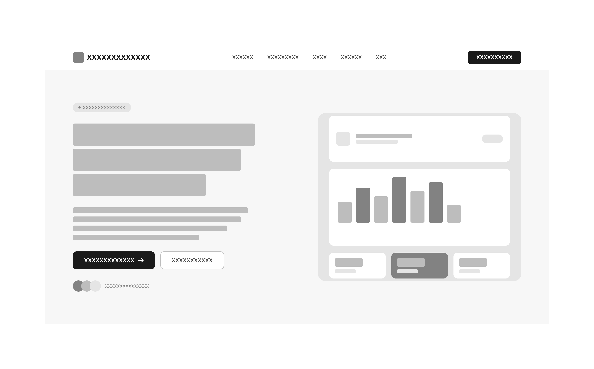

---

#### Sección de funcionalidades principales

En esta sección se presentan las funcionalidades principales de MindFlow mediante tarjetas informativas organizadas en una grilla. Cada tarjeta representa una característica clave de la plataforma, permitiendo que los visitantes comprendan rápidamente los beneficios del producto.

Esta organización facilita la lectura y mantiene una jerarquía visual clara, ayudando al usuario a identificar las capacidades principales del sistema.

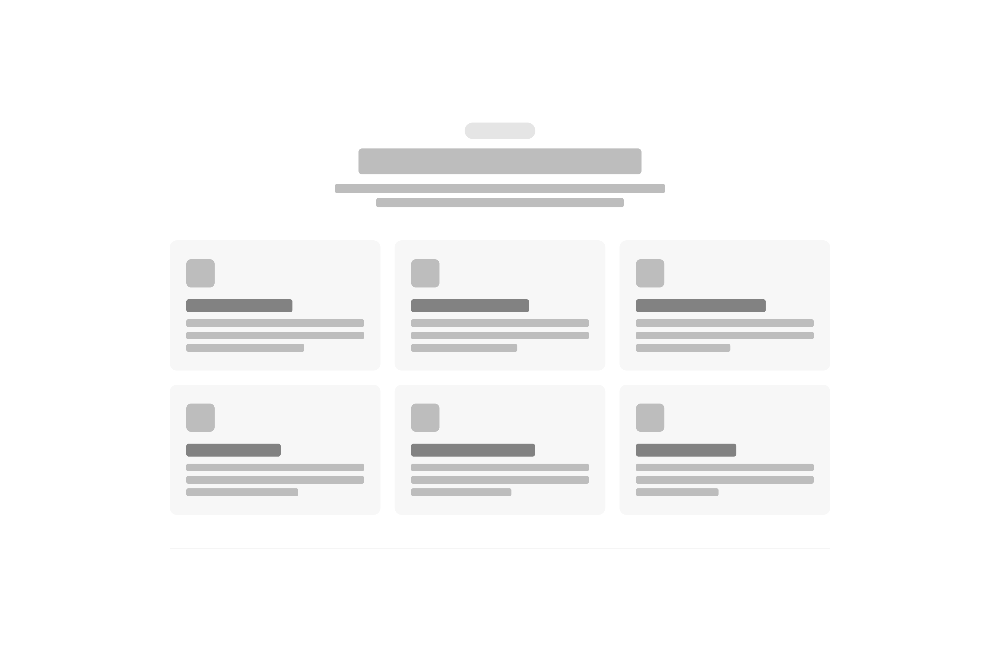

---

#### Sección de análisis emocional

Esta sección muestra cómo la plataforma permite visualizar información relacionada con el estado emocional del usuario mediante diferentes representaciones visuales. Se incluyen componentes como el calendario de estados de ánimo, resúmenes generados por inteligencia artificial y visualizaciones de palabras clave.

El objetivo de esta sección es comunicar el valor analítico de la plataforma y cómo ayuda a los usuarios a comprender sus patrones emocionales.

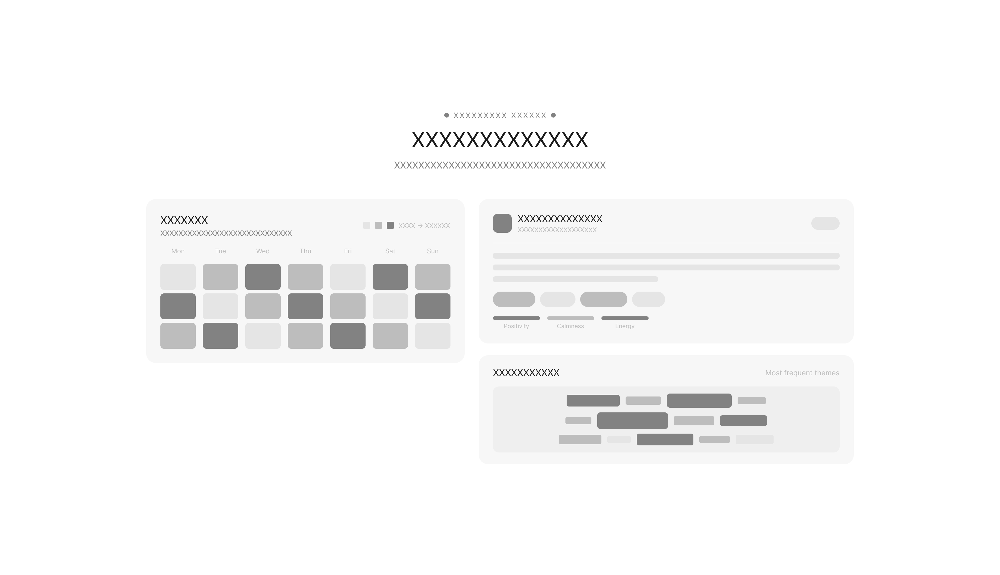

---

#### Sección de bienestar y hábitos

Esta sección presenta funcionalidades relacionadas con el desarrollo de hábitos saludables y herramientas de bienestar. A través de tarjetas informativas se destacan características como seguimiento de hábitos, recordatorios de hidratación y ejercicios de respiración guiada.

La organización visual facilita la comprensión de las herramientas disponibles para mejorar el bienestar personal.

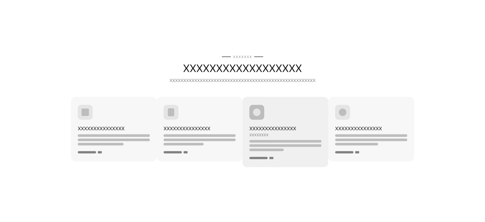

---

#### Sección de panel analítico

En esta sección se muestra una vista previa del panel analítico de la plataforma, donde los usuarios pueden visualizar información relacionada con sus emociones y actividades mediante gráficos y resúmenes.

Esta representación permite comunicar el valor de los datos generados dentro de la plataforma y cómo estos apoyan el proceso de reflexión personal.

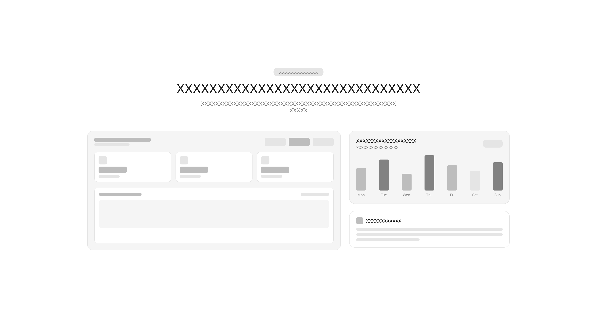

---

#### Sección de planes o funcionalidades premium

Esta sección presenta los diferentes planes o funcionalidades avanzadas disponibles dentro de la plataforma. La información se organiza en tarjetas comparativas que permiten identificar fácilmente las características incluidas en cada opción.

Esta estructura facilita la comparación y ayuda a los usuarios a comprender los beneficios adicionales que ofrece la versión premium.

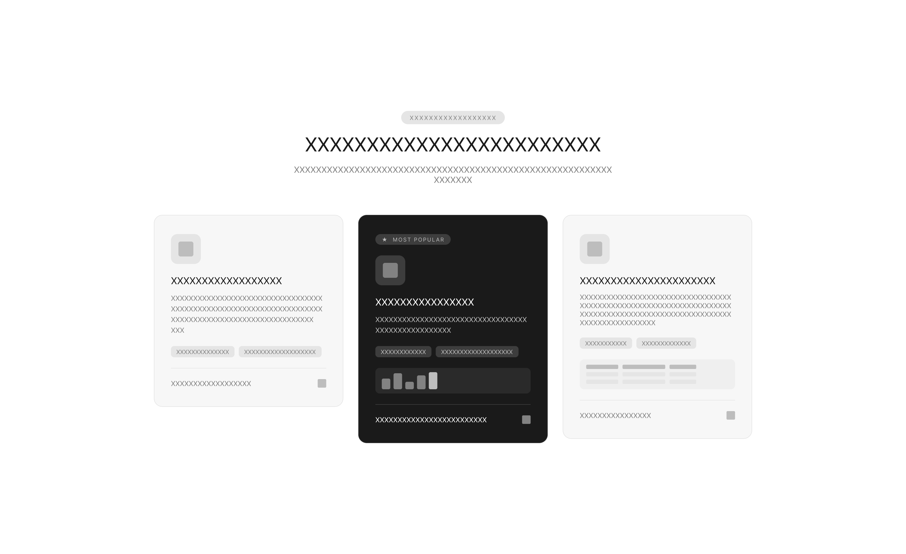

---

#### Sección de llamada a la acción final y footer

La sección final del Landing Page incluye una llamada a la acción que invita al usuario a comenzar a utilizar MindFlow. Debajo se presenta el footer del sitio, que contiene enlaces de navegación adicionales, información de contacto y recursos de soporte.

Esta sección permite cerrar el recorrido del usuario dentro del Landing Page y ofrecer accesos rápidos a información relevante.

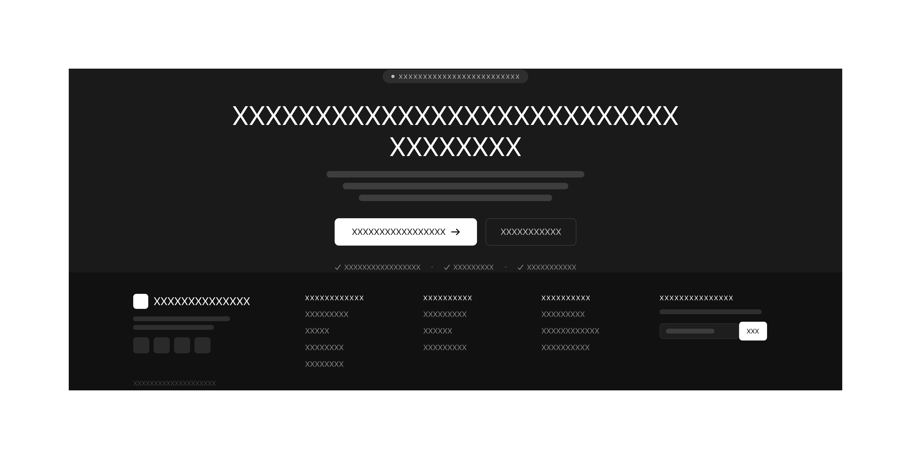

### 4.3.2. Landing Page Mock-up

El mock-up del Landing Page de MindFlow representa la versión visual final del diseño propuesto a partir de los wireframes previamente definidos. En esta etapa se incorporan los elementos visuales del sistema de diseño, incluyendo tipografía, paleta de colores, iconografía y estilos de componentes, permitiendo visualizar con mayor precisión la experiencia que tendrá el usuario al interactuar con el sitio.

El diseño mantiene una estructura clara y organizada que facilita la lectura progresiva del contenido. La jerarquía visual se establece mediante el uso de tamaños de tipografía diferenciados, contraste de colores y agrupación de componentes, permitiendo que los usuarios identifiquen rápidamente la propuesta de valor de la plataforma y comprendan sus funcionalidades principales.

La sección superior del Landing Page presenta el encabezado principal junto con una breve descripción del propósito de MindFlow y botones de acción que invitan al usuario a comenzar a utilizar la plataforma o conocer más sobre sus funcionalidades. Este primer bloque busca captar la atención del visitante y comunicar de manera inmediata el valor del producto.

Posteriormente se presentan diferentes secciones que explican las capacidades de la plataforma, incluyendo herramientas de registro emocional, análisis mediante inteligencia artificial y visualización de datos relacionados con el bienestar emocional. Estas funcionalidades se muestran mediante tarjetas informativas y componentes visuales que facilitan la comprensión del contenido.

El diseño también incorpora representaciones gráficas que muestran cómo los usuarios pueden visualizar sus patrones emocionales a lo largo del tiempo. Estas visualizaciones permiten comunicar el valor analítico de la plataforma y cómo esta ayuda a los usuarios a comprender mejor su bienestar emocional.

Hacia la parte final del Landing Page se incluye una sección de llamada a la acción que invita a los visitantes a comenzar a utilizar MindFlow. Finalmente, el sitio concluye con un footer que presenta enlaces de navegación adicionales, información del producto y recursos relevantes para el usuario.

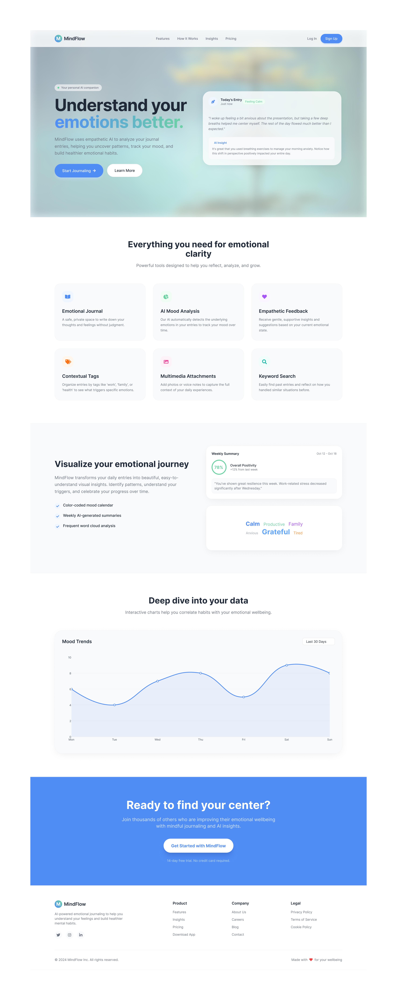

## 4.4. Web Applications UX/UI Design

---

### 4.4.1. Web Applications Wireframes
Los wireframes de la Web Application de MindFlow representan la estructura base de la plataforma en baja fidelidad. Su objetivo principal es definir la arquitectura de la información, la jerarquía de los contenidos y los flujos de interacción sin la distracción de elementos visuales como colores o tipografías definitivas.

Para el diseño de estos esquemas se utilizaron los colores neutros definidos en las Style Guidelines, permitiendo al equipo concentrarse exclusivamente en la usabilidad y disposición de los siguientes módulos clave:

### 4.4.2. Web Applications Wireflow Diagrams

### 4.4.3. Web Applications Mock-ups
Los mock-ups de la Web Application constituyen la representación visual de alta fidelidad del producto final. En esta etapa, la estructura definida en los wireframes cobra vida mediante la aplicación estricta de las Web Style Guidelines descritas anteriormente.

El diseño busca transmitir calma emocional y confianza tecnológica, reduciendo la carga cognitiva de los usuarios y fomentando la retención. A continuación, se detallan las características de las vistas principales:

### 4.4.4. Web Applications User Flow Diagrams

## 4.5. Web Applications Prototyping
Para el prototipo de MindFlow se adoptaron los siguientes criterios de interacción. La navegación principal se centraliza en una barra lateral izquierda que otorga acceso directo a las secciones principales: Dashboard, Diario, Hábitos, Analíticas y Configuración. Las acciones críticas, como el registro del estado emocional en el AI Mood Journal, la visualización del feedback empático y la ejecución de intervenciones rápidas, se presentan mediante tarjetas interactivas y paneles dinámicos en la misma vista para no interrumpir el flujo cognitivo ni la contención del usuario.

El acceso al sistema sigue un flujo lineal de Registro → Login → Dashboard, contando con una ruta alternativa de restablecimiento de contraseña y una capa de seguridad adicional a través del bloqueo por PIN. La experiencia y el diseño visual mantienen una estricta consistencia entre la Landing Page y la aplicación web, donde los call-to-action de la página de aterrizaje redirigen fluidamente al usuario hacia el registro mediante OAuth o correo tradicional.

A continuación se presenta el flujo de interacción del prototipo elaborado en Figma: https://www.figma.com/design/iIGtOTVpNTMNgyT0om6QyY/Web-Applications-Prototyping?node-id=0-1&t=wQUWGyL6lBhFsmmT-1

---

## 4.6. Domain-Driven Software Architecture

---

### 4.6.1. Design-Level EventStorming

### 4.6.2. Software Architecture Context Diagram

---

### 4.6.3. Software Architecture Container Diagrams

---

### 4.6.4. Software Architecture Components Diagrams

## 4.7. Software Object-Oriented Design

---

### 4.7.1. Class Diagrams
En esta sección, se presentan los diagramas de clases que ilustran las principales entidades del sistema, sus atributos y las relaciones entre ellas. Estos diagramas son fundamentales para entender la estructura del software y cómo interactúan los diferentes componentes.

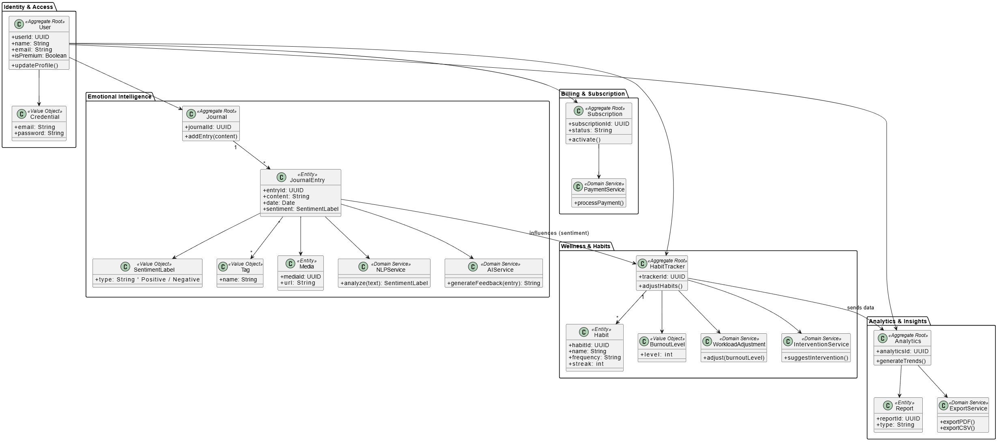

## 4.8. Database Design
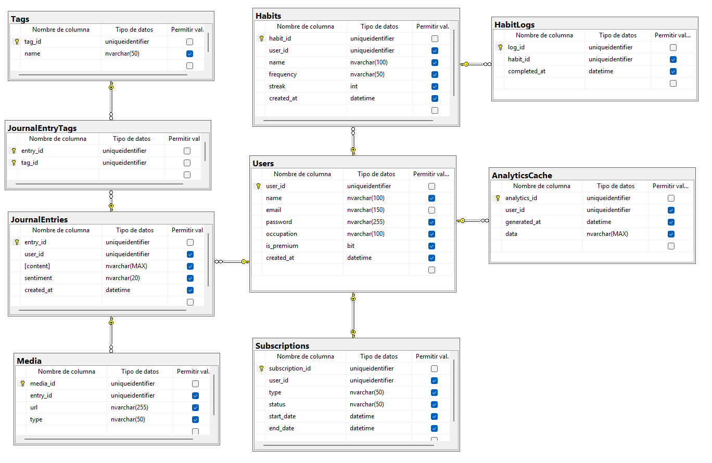
---

### 4.8.1. Database Diagrams
