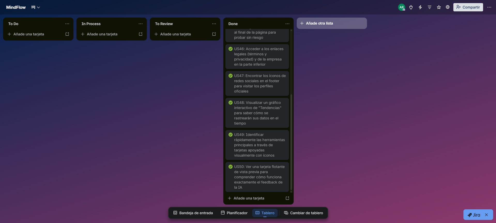
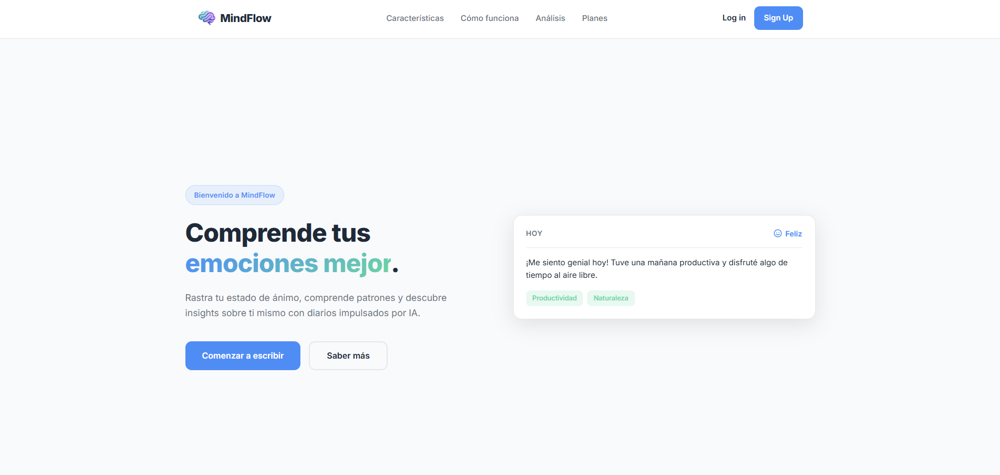
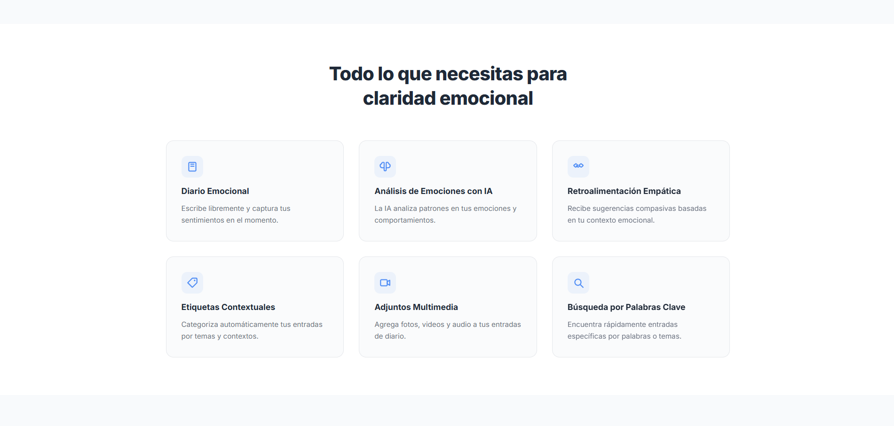
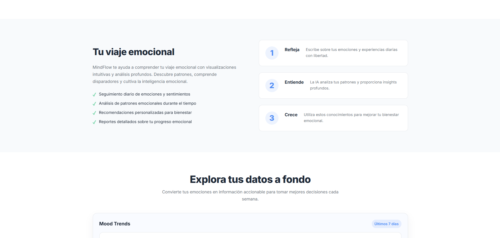
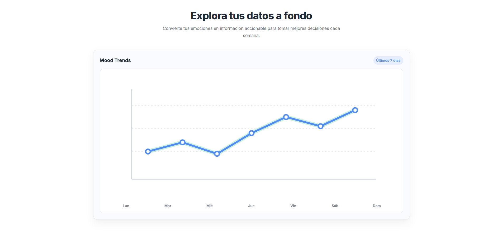
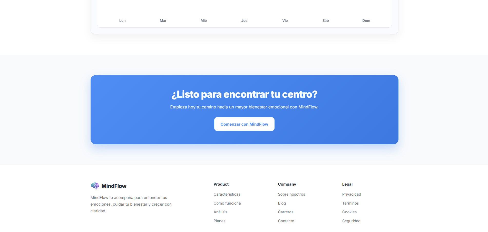
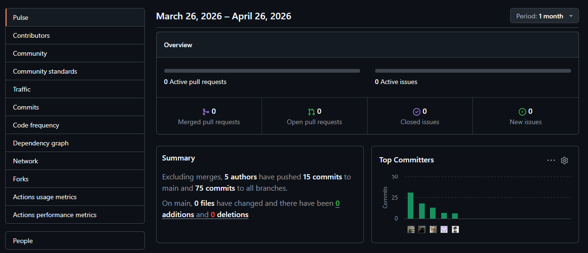

# Capítulo V: Product Implementation, Validation & Deployment

---

## 5.1. Software Configuration Management

---

### 5.1.1. Software Development Environment Configuration
A continuación, se describen los productos de software empleados en el desarrollo del proyecto. Esta sección tiene como objetivo facilitar la comprensión y continuidad
del trabajo a los actuales y futuros desarrolladores, asegurando una colaboración efectiva a lo largo del ciclo de vida del producto digital.

**Project Management**
- Trello – https://trello.com/ 
  Se ha utilizado Trello como herramienta principal de gestión de tareas. Esta plataforma permite visualizar el progreso de cada etapa del proyecto mediante
  tableros personalizables, facilitando la organización de pendientes, tareas en desarrollo y actividades finalizadas. Además, su interfaz intuitiva y accesibilidad
  desde cualquier navegador con una cuenta registrada la convierten en una solución ágil para el seguimiento de proyectos en equipo.

**Requirements Management**
- Google Docs – https://docs.google.com/ 
  Para la redacción, gestión y revisión de los requisitos del sistema se ha empleado Google Docs. Su funcionalidad de edición colaborativa en tiempo real ha
  permitido que todos los integrantes del equipo puedan aportar, comentar y revisar los documentos desde cualquier dispositivo.

**Product UX/UI Design**
- Figma – https://www.figma.com/ 
  Figma ha sido fundamental para el diseño de interfaces y la creación de prototipos interactivos. Permite que varios usuarios trabajen simultáneamente en los
  wireframes y mockups, lo que ha facilitado una comunicación más eficiente entre el equipo de diseño y desarrollo.
- Miro https://miro.com/es/ 
  Pizarra digital colaborativa utilizada para sesiones de Big Picture EventStorming y Design-Level EventStorming, facilitando la identificación de Bounded Contexts, Events, Commands y Aggregates del dominio.
- LucidChart https://www.lucidchart.com/pages/es  
  Aplicación de diagramación colaborativa para la creación de Wireflows, User Flows, diagramas UML (Class Diagrams) y Database Diagrams de la arquitectura del software.

**Software Development**
- Landing Page y Frontend (HTML, CSS, JS) – https://www.jetbrains.com/webstorm/ 
  Desarrollada con HTML5, CSS3 y JavaScript. El entorno de desarrollo fue IntelliJ Webstorm por sus herramientas avanzadas de depuración y control de versiones.

- JetBrains WebStorm – https://www.jetbrains.com/webstorm/
  Entorno de desarrollo integrado (IDE) principal para todo el proyecto. Se utiliza para centralizar la codificación tanto del frontend como del backend, optimizando la depuración y el control de versiones en el equipo.

- Frontend (Vue.js) – https://vuejs.org/
  Framework de JavaScript empleado para construir la interfaz de usuario como una Single Page Application (SPA). Garantiza una experiencia interactiva, modular y reactiva.

- Web Services (C# y .NET) – https://dotnet.microsoft.com/
  Tecnología utilizada para el desarrollo del backend. Se emplea C# bajo la plataforma .NET para construir una API robusta, segura y escalable que gestiona la lógica de negocio y la persistencia de datos.

- Servicios de IA (NLP / LLMs)
  Integración de APIs de modelos de lenguaje para habilitar el procesamiento de lenguaje natural, el análisis de sentimiento y la generación de respuestas empáticas en la plataforma.

**Software Documentation**
- Google Docs y GitHub README  
  La documentación del software se ha centralizado en Google Docs. El archivo README en GitHub incluye instrucciones de despliegue, estructura del repositorio y
  requerimientos técnicos.
- Markdown https://www.markdownguide.org/  
  Lenguaje de marcado ligero para la elaboración del Project Report en el repositorio GitHub. Permite estructurar documentación con formato consistente y compatible con control de versiones.
- Deployment & Hosting

## Deployment & Hosting

### **GitHub Pages**

Descripción: Es un servicio de alojamiento de sitios estáticos que procesa archivos HTML, CSS y JavaScript directamente desde un repositorio en GitHub para la publicación de aplicaciones web.

Uso: Se utiliza para el despliegue de la Landing Page y la aplicación frontend (Single Page Application) desarrollada con el framework Vue.js. El proceso se integra con el flujo de trabajo de Git, donde la rama de producción (main o gh-pages) se sincroniza automáticamente para actualizar el sitio. Esto permite una distribución eficiente de la interfaz de usuario, garantizando que los cambios en el código se reflejen de manera inmediata en el entorno de producción bajo un protocolo seguro HTTPS.

### **Plataformas PaaS (Platform as a Service)**

Descripción: Plataformas en la nube diseñadas para el despliegue de aplicaciones robustas del lado del servidor, con soporte nativo para entornos de ejecución backend modernos como .NET.

Uso: Se emplea para el despliegue de los Web Services y la API RESTful desarrollados con C# y .NET. A diferencia de los sitios estáticos, estas plataformas permiten la ejecución del entorno de .NET (.NET Runtime) y la conectividad segura con sistemas de gestión de bases de datos relacionales. Esto asegura que la lógica de negocio, el procesamiento de datos y la integración con los modelos de Inteligencia Artificial estén disponibles de manera persistente, estable y escalable para ser consumidos por el frontend alojado en GitHub Pages.

### 5.1.2. Source Code Management

Para el seguimiento y control de modificaciones en el código fuente, el equipo utiliza **GitHub** como plataforma principal, organizada bajo la organización oficial **1ASI0730-2610-20177-CogniTech-MindFlow**.

Se aplica **GitFlow** como flujo de trabajo (*workflow*) de control de versiones, **Conventional Commits** para la estandarización de los mensajes de confirmación y **Semantic Versioning** para la gestión de versiones y lanzamientos (*releases*).

A continuación, se detallan los repositorios que conforman la solución técnica de **MindFlow**:

| Producto | Repositorio |
| :--- | :--- |
| **Project Report** | [https://github.com/1ASI0730-2610-20177-CogniTech-MindFlow/MindFlow-Project-Report.git](https://github.com/1ASI0730-2610-20177-CogniTech-MindFlow/MindFlow-Project-Report.git) |
| **Landing Page** | [https://github.com/1ASI0730-2610-20177-CogniTech-MindFlow/MindFlow-Landing-Page.git](https://github.com/1ASI0730-2610-20177-CogniTech-MindFlow/MindFlow-Landing-Page.git) |
| **Frontend Web Application** | [https://github.com/1ASI0730-2610-20177-CogniTech-MindFlow/MindFlow-Frontend.git](https://github.com/1ASI0730-2610-20177-CogniTech-MindFlow/MindFlow-Frontend.git) |
| **Web Services** | [https://github.com/1ASI0730-2610-20177-CogniTech-MindFlow/MindFlow-Backend.git](https://github.com/1ASI0730-2610-20177-CogniTech-MindFlow/MindFlow-Backend.git) |

#### **GitFlow Workflow**
El equipo implementa GitFlow para organizar el desarrollo. Las ramas se clasifican de la siguiente manera:

* **Ramas principales:**
  * `main`: Contiene el código fuente en un estado estable y listo para producción. Solo se actualiza mediante fusiones (*merges*) de ramas de *release*.
  * `develop`: Rama de integración donde se consolidan las funcionalidades terminadas antes de pasar a producción.
* **Ramas de soporte:**
  * `feature/<nombre>`: Ramas temporales creadas desde `develop` para el desarrollo de funcionalidades específicas o secciones del informe (ej. `feature/chapter-1`). Al finalizar, se fusionan de vuelta a `develop`.
  * `release/<version>`: Ramas de preparación para un lanzamiento oficial, permitiendo realizar ajustes finales y pruebas de integración antes de fusionar a `main`.

#### **Conventional Commits**
Los mensajes de confirmación (*commit*) siguen la estructura: `<type>(scope): description`. Los tipos permitidos incluyen `feat` (funcionalidad), `fix` (corrección), `docs` (documentación), `style` (formato), `refactor` (mejora de código) y `chore` (mantenimiento).

### 5.1.3. Source Code Style Guide & Conventions

En este apartado se definen los estándares de codificación y nomenclatura adoptados por el equipo para garantizar la mantenibilidad y legibilidad del código de **MindFlow**. Se aplican las siguientes convenciones basadas en las guías de estilo de Google:

- **Language Standards**: Todo el código fuente, incluyendo nombres de variables, funciones, clases, IDs de CSS y comentarios, se redacta exclusivamente en idioma **inglés** para mantener un estándar profesional global.

- **Naming Conventions**:
  - **Backend (C# / .NET)**: Se utiliza `PascalCase` para nombres de clases, interfaces, propiedades y métodos (ej. `MoodJournalController`, `GetEntriesByUserId`). Se utiliza `camelCase` para variables locales y parámetros. Adicionalmente, las interfaces siempre llevan el prefijo `I` (ej. `IHabitTrackerService`, `IAiFeedbackService`). Se siguen las convenciones oficiales de *Microsoft C# Coding Conventions*.
  - **Frontend (HTML/CSS)**: Se utiliza `kebab-case` para nombres de archivos de estilo y para clases e IDs en las hojas de estilo (ej. `.journal-card`, `.burnout-alert`, `.habit-item`). Se siguen las guías *Google HTML/CSS Style Guide* y *HTML Style Guide and Coding Conventions* de W3Schools.
  - **JavaScript / Vue.js 3**: Se aplica `camelCase` para variables, funciones y composables (ej. `habitList`, `fetchMoodEntries`). Se utiliza `PascalCase` para los nombres de los Componentes de un Solo Archivo (SFC) y al importarlos en los templates (ej. `MoodJournalComponent.vue`, `BurnoutAlert.vue`). Se sigue estrictamente la *Vue.js Style Guide* oficial (Essential & Strongly Recommended rules).

- **Source Control Conventions**: Se aplica el estándar de **Conventional Commits**, utilizando prefijos descriptivos en inglés como `feat:`, `fix:`, `docs:`, `style:`, `refactor:` y `chore:` para asegurar un historial de versiones estructurado y rastreable.

- **Code Formatting**: Se mantiene una indentación consistente de 2 espacios en archivos HTML, CSS y JS siguiendo las convenciones de Vue.js. En el desarrollo backend con c# se sigue el formato automático de WebStorm para mantener la limpieza y consistencia de los archivos de clase.

- **Gherkin**: Los criterios de aceptación de los User Stories se redactan siguiendo las convenciones de Gherkin Conventions for Readable Specifications para garantizar especificaciones legibles y comprobables.

### 5.1.4. Software Deployment Configuration
Esta sección detalla la configuración del despliegue de la solución, permitiendo que los productos digitales sean accesibles de forma continua en un entorno de producción.

- **Hosting & Cloud Platforms**:
  - **Landing Page**: Se ha desplegado satisfactoriamente en **GitHub Pages**, aprovechando su integración nativa con los repositorios de GitHub y su soporte para sitios estáticos bajo protocolo HTTPS.
  - **Frontend Web Application**: Se ha definido el despliegue en **GitHub Pages** mediante el *build* de producción generado por Vue.js, publicando el contenido de la carpeta `dist/` en la rama de producción.
  - **Web Services & API**: Para las fases posteriores del proyecto, se definirá la plataforma PaaS (*Platform as a Service*) para el despliegue de los servicios web desarrollados en **C# y .NET**, garantizando la disponibilidad persistente de la API RESTful para ser consumida por el *frontend*.
- **Continuous Deployment (CD) Pipeline**:
  - **Integración**: El repositorio oficial en GitHub (`MindFLow-Landing-Page`) está vinculado directamente a GitHub Pages como plataforma de despliegue.
  - **Branching Strategy**: La rama `main` actúa como la rama de producción oficial. Cualquier cambio integrado mediante *merge* o *push* en esta rama activa automáticamente un nuevo despliegue hacia la URL pública: [https://github.com/1ASI0730-2610-20177-CogniTech-MindFlow/MindFlow-Landing-Page.git](https://github.com/1ASI0730-2610-20177-CogniTech-MindFlow/MindFlow-Landing-Page.git)
- **Environment Configuration**:
  - **Estado Actual (Sprint 1)**: El despliegue actual no requiere el uso de variables de entorno ni claves de API externas, dado que corresponde al despliegue de la Landing Page como prototipo visual e informativo desarrollado con HTML5, CSS3 y JavaScript.
  - **Planificación Futura**: En los próximos Sprints, se configurarán variables de entorno para gestionar de forma segura las cadenas de conexión a la base de datos relacional y las claves de las APIs de los modelos de lenguaje (LLM/NLP) para la Inteligencia Artificial.

## 5.2. Landing Page, Services & Applications Implementation

---

### 5.2.1. Sprint 1
En este Sprint se desarrolló e implementó la primera versión
del Landing Page de MindFlow, incluyendo su despliegue
en un entorno accesible públicamente.
#### 5.2.1.1. Sprint Planning 1
A continuación se presenta el resumen del Sprint Planning Meeting
realizado para el Sprint 1.

| Sprint # | Sprint 1                                                                                                                                                                                                                                                                                                                                                                      |
|----------|-------------------------------------------------------------------------------------------------------------------------------------------------------------------------------------------------------------------------------------------------------------------------------------------------------------------------------------------------------------------------------|
| **Sprint Planning Background** |                                                                                                                                                                                                                                                                                                                                                                               |
| Date | 2026-04-17                                                                                                                                                                                                                                                                                                                                                                    |
| Time | 06:00 PM                                                                                                                                                                                                                                                                                                                                                                      |
| Location | Reunión virtual vía Google Meet                                                                                                                                                                                                                                                                                                                                               |
| Prepared By | Rocca Mariaca, Angel Mathias                                                                                                                                                                                                                                                                                                                                                  |
| Attendees | Cabrera Sotelo, Camila Celeste/ Caisahuana Osores, Becker Junior/ Díaz De la cruz, Sebastián Gabriel/ Jáuregui Cerna, Jean Franco/ Rocca Mariaca, Angel Mathias                                                                                                                                                                                                               |
| **Sprint Goal & User Stories** |                                                                                                                                                                                                                                                                                                                                                                               |
| Sprint 1 Goal | Our approach focuses on strengthening MindFlow's digital presence by launching its initial landing page. We believe this will effectively communicate our value proposition to university students and young professionals. This will be validated once the site is published on GitHub Pages, integrating strategic sections and calls to action targeted to both audiences. |
| Sprint 1 Velocity | 18                                                                                                                                                                                                                                                                                                                                                                            |
| Sum of Story Points | 20                                                                                                                                                                                                                                                                                                                                                                            
#### 5.2.1.2. Aspect Leaders and Collaborators
En esta sección se detalla la matriz de liderazgo y colaboración (LACX) para el Sprint 1. Cada aspecto representa una fase crítica de la entrega, donde se designa un líder (L) responsable de la dirección del entregable y colaboradores (C) que apoyaron en su ejecución, cumpliendo con el objetivo de proporcionar liderazgo conjunto y un entorno colaborativo.

| Team Member (Last Name, First Name) | GitHub Username | Idea de Negocio y Bases | Landing Page | Diseño de App Web (Figma) | User Stories y Funciones | Análisis de Usuario y Needfinding |
| :--- |:----------------|:-----------------------:|:------------:|:-------------------------:|:------------------------:|:---------------------------------:|
| Cabrera Sotelo, Camila Celeste | whcamm          |            C            |      C       |           **L**           |            C             |                 C                 |
| Caisahuana Osores, Becker Junior | becker693       |            C            |      C       |             C             |          **L**           |                 C                 |
| Díaz De la cruz, Sebastián Gabriel | tipaso07        |            C            |    **L**     |             C             |            C             |                 C                 |
| Jáuregui Cerna, Jean Franco | JFranco556      |            C            |      C       |             C             |            C             |                 **L**                  |
| Rocca Mariaca, Angel Mathias | MRMpro13        |          **L**          |      C       |             C             |            C             |                 C                 |
#### 5.2.1.3. Sprint Backlog 1

Enlace de Trello: https://trello.com/invite/b/69ee88a6130c90b4e5b1d5b2/ATTId18d929499f3de387496062b322b92179F3FB526/mindflow
#### 5.2.1.4. Development Evidence for Sprint Review
Durante el Sprint 1, el equipo utilizó GitHub como sistema de control de versiones, siguiendo el flujo de trabajo GitFlow para asegurar una integración ordenada del código. A continuación, se presenta el registro de los commits más relevantes que evidencian el desarrollo de la Landing Page y la colaboración del equipo.

**Repository:** 1ASI0730-2610-20177-CogniTech-MindFlow/MindFlow-Landing-Page

| Repository | Branch | Commit Id | Commit Message | Commit Message Body | Committed on (Date) |
| :--- | :--- | :--- | :--- | :--- | :--- |
| `MindFlow-Landing-Page` | `main` | `116956f` | `Delete CNAME` | `Removed the CNAME file after updating the deployment configuration.` | 26/04/2026 |
| `MindFlow-Landing-Page` | `main` | `db4b64c` | `Create CNAME` | `Created the CNAME file to configure the custom domain for GitHub Pages.` | 26/04/2026 |
| `MindFlow-Landing-Page` | `main` | `8f7d39f` | `fix(landing): Small improvements` | `Applied minor layout and content improvements to the landing page.` | 26/04/2026 |
| `MindFlow-Landing-Page` | `main` | `915f60c` | `Update index.html with new logo and content` | `Updated `index.html` with the new logo and revised content.` | 26/04/2026 |
| `MindFlow-Landing-Page` | `main` | `58bd198` | `Add Logo por LandingPage` | `Added the logo to the landing page header.` | 26/04/2026 |
| `MindFlow-Landing-Page` | `main` | `2bb352c` | `Rename assets/MindFlow_logo.png to assets/images/MindFlow_logo.png` | `Moved the logo asset to the `assets/images/` folder.` | 26/04/2026 |
| `MindFlow-Landing-Page` | `main` | `7d82e38` | `Add MindFlow Logo` | `Added the MindFlow logo asset to the project.` | 26/04/2026 |
| `MindFlow-Landing-Page` | `main` | `f85bb97` | `fix(landing): Update file paths for styles and scripts` | `Updated CSS and JS file paths to ensure correct loading in deployment.` | 26/04/2026 |
| `MindFlow-Landing-Page` | `main` | `3bea106` | `Add to Landing-Page: RESPONSIVE` | `Added responsive behavior and media-query adjustments.` | 26/04/2026 |
| `MindFlow-Landing-Page` | `main` | `9f20df4` | `Add to Landing-Page: HTML interactions` | `Added HTML structure for interactive elements.` | 26/04/2026 |
| `MindFlow-Landing-Page` | `main` | `ccc5152` | `Add to Landing-Page: interactions` | `Added JavaScript interactions for landing page elements.` | 26/04/2026 |
| `MindFlow-Landing-Page` | `main` | `ff7519b` | `Add to Landing-Page: footer styles` | `Added CSS styles for the footer section.` | 26/04/2026 |
| `MindFlow-Landing-Page` | `main` | `a1d3026` | `Add to Landing-Page: HTML footer` | `Added HTML structure for the footer section.` | 26/04/2026 |
| `MindFlow-Landing-Page` | `main` | `bc214c8` | `Add to Landing-Page: cta styles` | `Added CSS styles for the CTA section.` | 26/04/2026 |
| `MindFlow-Landing-Page` | `main` | `fde311e` | `Add to Landing-Page: HTML cta` | `Added HTML structure for the CTA section.` | 26/04/2026 |
| `MindFlow-Landing-Page` | `main` | `578ea95` | `Add to Landing-Page: analytics styles` | `Added CSS styles for the analytics section.` | 26/04/2026 |
| `MindFlow-Landing-Page` | `main` | `1c4ed7c` | `Add to Landing-Page: ANALYTICS HTML` | `Added HTML structure for the analytics section.` | 26/04/2026 |
| `MindFlow-Landing-Page` | `main` | `f86644b` | `Add to Landing-Page: journey styles` | `Added CSS styles for the journey section.` | 26/04/2026 |
| `MindFlow-Landing-Page` | `main` | `dcf0463` | `Add to Landing-Page: jorney HTML` | `Added HTML structure for the journey section.` | 26/04/2026 |
| `MindFlow-Landing-Page` | `main` | `b58a0c8` | `Add to Landing-Page: Feature styles` | `Added CSS styles for the feature section.` | 26/04/2026 |
| `MindFlow-Landing-Page` | `main` | `eedddd9` | `Add to Landing-Page: feature html` | `Added HTML structure for the feature section.` | 26/04/2026 |
| `MindFlow-Landing-Page` | `main` | `eea888d` | `Add to Landing-Page: Hero Style` | `Added CSS styles for the hero section.` | 26/04/2026 |
| `MindFlow-Landing-Page` | `main` | `cc1e39b` | `Add to Landing-Page: NavBar html` | `Added NavBar structure for the landing page HTML sections.` | 26/04/2026 |
| `MindFlow-Landing-Page` | `main` | `cf3719a` | `Add to Landing-Page: Script Base` | `Added JS structure for the landing page sections.` | 26/04/2026 |
| `MindFlow-Landing-Page` | `main` | `63ef417` | `Add to Landing-Page: Css Base` | `Added CSS style structure for the landing page sections.` | 26/04/2026 |
| `MindFlow-Landing-Page` | `main` | `eaf4bf8` | `Add to Landing-Page: HTML Base` | `Added HTML structure for the landing page sections.` | 26/04/2026 |
| `MindFlow-Landing-Page` | `main` | `9b05451` | `add index, script and styless in blank` | `Initial HTML, CSS structure and JS for the landing page layout.` | 26/04/2026 |
| `MindFlow-Landing-Page` | `main` | `370452c` | `Initial commit` | `Initial repository setup with base project files.` | 26/04/2026 |
| `MindFlow-Landing-Page` | `main` | `e0c6a37` | `Add to Landing-Page: hero html` | `Added Hero section for the landing page HTML.` | 23/04/2026 |

#### 5.2.1.5. Execution Evidence for Sprint Review
En esta sección se presenta la evidencia de la ejecución del Sprint 1, demostrando el cumplimiento de los objetivos establecidos y el despliegue del producto en un entorno de producción accesible.

Enlace del Landing Page: https://github.com/1ASI0730-2610-20177-CogniTech-MindFlow/MindFlow-Landing-Page.git

Evidencia de Despliegue (GitHub Pages): https://1asi0730-2610-20177-cognitech-mindflow.github.io/MindFlow-Landing-Page/

A continuación, se presenta la captura del dashboard de GitHub que confirma el despliegue exitoso (Production Deployment) de la Landing Page desde el repositorio oficial de GitHub.

#### 5.2.1.6. Services Documentation Evidence for Sprint Review
Para el presente Sprint 1, el alcance se centró exclusivamente en la implementación y despliegue del Landing Page (sitio web estático). Por lo tanto, no se han desarrollado servicios RESTful API en esta etapa. La documentación detallada de los endpoints mediante OpenAPI (Swagger) se incluirá en los informes correspondientes a los siguientes Sprints, una vez iniciada la fase de implementación de los Web Services.

#### 5.2.1.7. Software Deployment Evidence for Sprint Review
Durante el Sprint 1, se realizó el despliegue de la Landing Page de VITAL CARE
utilizando GitHub Pages como plataforma de hosting. A continuación se describen
las actividades realizadas para lograr la publicación exitosa del sitio.

1. Se creó el repositorio `MindFlow-Landing-Page` bajo la organización
   `1ASI0730-2610-20177-CogniTech-MindFlow` en GitHub.

2. Se desarrolló la Landing Page en la rama `main` siguiendo el flujo
   GitFlow, integrando las secciones de hero, problemática, beneficios,
   startup, planes y footer.

3. Una vez validado el contenido, se dirigió el repositorio hacia GitHub Pages configurando la rama `main` como fuente de despliegue.

4. Se verificó el despliegue exitoso accediendo a la URL pública:
   [https://1asi0730-2610-20177-cognitech-mindflow.github.io/MindFlow-Landing-Page/](https://1asi0730-2610-20177-cognitech-mindflow.github.io/MindFlow-Landing-Page/)
#### 5.2.1.8. Team Collaboration Insights during Sprint

---
# Conclusiones

---
## Conclusiones y recomendaciones

---

# Bibliografía

---

# Anexos
Recopilación de entrevistas
- Entrevista 1: https://upcedupe-my.sharepoint.com/:v:/g/personal/u202410421_upc_edu_pe/IQC6LCtoZRnfR4iKU3dIHCeYATI4FuIHWP1zmVrAm3H4_R8?nav=eyJyZWZlcnJhbEluZm8iOnsicmVmZXJyYWxBcHAiOiJPbmVEcml2ZUZvckJ1c2luZXNzIiwicmVmZXJyYWxBcHBQbGF0Zm9ybSI6IldlYiIsInJlZmVycmFsTW9kZSI6InZpZXciLCJyZWZlcnJhbFZpZXciOiJNeUZpbGVzTGlua0NvcHkifX0&e=jFGNLe
- Entrevista 2: https://upcedupe-my.sharepoint.com/:v:/g/personal/u202410421_upc_edu_pe/IQAp-_6iUOSJS4FRQuTW-F-9AdcZK5XV42aVZmzgo0PuIAw?nav=eyJyZWZlcnJhbEluZm8iOnsicmVmZXJyYWxBcHAiOiJPbmVEcml2ZUZvckJ1c2luZXNzIiwicmVmZXJyYWxBcHBQbGF0Zm9ybSI6IldlYiIsInJlZmVycmFsTW9kZSI6InZpZXciLCJyZWZlcnJhbFZpZXciOiJNeUZpbGVzTGlua0NvcHkifX0&e=HwtMj
- Entrevista 3: https://upcedupe-my.sharepoint.com/:v:/g/personal/u202410421_upc_edu_pe/IQDiIjKmBwlYSY162dNCHfq1AcmQjaPB0B48xM6UgMCISww?nav=eyJyZWZlcnJhbEluZm8iOnsicmVmZXJyYWxBcHAiOiJPbmVEcml2ZUZvckJ1c2luZXNzIiwicmVmZXJyYWxBcHBQbGF0Zm9ybSI6IldlYiIsInJlZmVycmFsTW9kZSI6InZpZXciLCJyZWZlcnJhbFZpZXciOiJNeUZpbGVzTGlua0NvcHkifX0&e=ciHjIU
- Entrevista 4: https://upcedupe-my.sharepoint.com/:v:/g/personal/u202410421_upc_edu_pe/IQBLlsZ3G-OZSLcOUS5eF6rQARMpWE6b_f3IIphyY7o3vlI?nav=eyJyZWZlcnJhbEluZm8iOnsicmVmZXJyYWxBcHAiOiJPbmVEcml2ZUZvckJ1c2luZXNzIiwicmVmZXJyYWxBcHBQbGF0Zm9ybSI6IldlYiIsInJlZmVycmFsTW9kZSI6InZpZXciLCJyZWZlcnJhbFZpZXciOiJNeUZpbGVzTGlua0NvcHkifX0&e=p0isA8
- Entrevista 5: https://upcedupe-my.sharepoint.com/:v:/g/personal/u202410421_upc_edu_pe/IQAXQKz8cFuBRYmMRiluA61vAYFJfoUS8D6IibXF6VSNjnE?nav=eyJyZWZlcnJhbEluZm8iOnsicmVmZXJyYWxBcHAiOiJPbmVEcml2ZUZvckJ1c2luZXNzIiwicmVmZXJyYWxBcHBQbGF0Zm9ybSI6IldlYiIsInJlZmVycmFsTW9kZSI6InZpZXciLCJyZWZlcnJhbFZpZXciOiJNeUZpbGVzTGlua0NvcHkifX0&e=qxkwbB
- Entrevista 6: https://upcedupe-my.sharepoint.com/:v:/g/personal/u202410421_upc_edu_pe/IQAu709K0qBWQZsvqeI53bCHAdB9HmsozDqHD-ua8jw6HjU?nav=eyJyZWZlcnJhbEluZm8iOnsicmVmZXJyYWxBcHAiOiJPbmVEcml2ZUZvckJ1c2luZXNzIiwicmVmZXJyYWxBcHBQbGF0Zm9ybSI6IldlYiIsInJlZmVycmFsTW9kZSI6InZpZXciLCJyZWZlcnJhbFZpZXciOiJNeUZpbGVzTGlua0NvcHkifX0&e=rM0yrn
## Videos de Exposiciones

| Entrega | Título         | Enlace |
|---------|----------------|--------|
| AV1 | Exposición AV1 |https://drive.google.com/drive/folders/1zaVJczj7mF71U5WlXfVcNgUmt_EtWrW-?usp=drive_link |
| TB1 |                | |
| AV2 |                | |
| TB2 |                | |