# Capítulo V: Product Implementation, Validation & Deployment

---

## 5.1. Software Configuration Management

---

### 5.1.1. Software Development Environment Configuration
A continuación, se describen los productos de software empleados en el desarrollo del proyecto. Esta sección tiene como objetivo facilitar la comprensión y continuidad
del trabajo a los actuales y futuros desarrolladores, asegurando una colaboración efectiva a lo largo del ciclo de vida del producto digital.

**Project Management**
- Trello – [https://trello.com/](https://trello.com/) 
  Se ha utilizado Trello como herramienta principal de gestión de tareas. Esta plataforma permite visualizar el progreso de cada etapa del proyecto mediante
  tableros personalizables, facilitando la organización de pendientes, tareas en desarrollo y actividades finalizadas. Además, su interfaz intuitiva y accesibilidad
  desde cualquier navegador con una cuenta registrada la convierten en una solución ágil para el seguimiento de proyectos en equipo.

**Requirements Management**
- Google Docs – [https://docs.google.com/](https://docs.google.com/) 
  Para la redacción, gestión y revisión de los requisitos del sistema se ha empleado Google Docs. Su funcionalidad de edición colaborativa en tiempo real ha
  permitido que todos los integrantes del equipo puedan aportar, comentar y revisar los documentos desde cualquier dispositivo.

**Product UX/UI Design**
- Figma – [https://www.figma.com/](https://www.figma.com/) 
  Figma ha sido fundamental para el diseño de interfaces y la creación de prototipos interactivos. Permite que varios usuarios trabajen simultáneamente en los
  wireframes y mockups, lo que ha facilitado una comunicación más eficiente entre el equipo de diseño y desarrollo.
- Miro [https://miro.com/es/](https://miro.com/es/) 
  Pizarra digital colaborativa utilizada para sesiones de Big Picture EventStorming y Design-Level EventStorming, facilitando la identificación de Bounded Contexts, Events, Commands y Aggregates del dominio.
- LucidChart [https://www.lucidchart.com/pages/es](https://www.lucidchart.com/pages/es)  
  Aplicación de diagramación colaborativa para la creación de Wireflows, User Flows, diagramas UML (Class Diagrams) y Database Diagrams de la arquitectura del software.

**Software Development**
- Landing Page y Frontend (HTML, CSS, JS) – [https://www.jetbrains.com/webstorm/](https://www.jetbrains.com/webstorm/) 
  Desarrollada con HTML5, CSS3 y JavaScript. El entorno de desarrollo fue IntelliJ Webstorm por sus herramientas avanzadas de depuración y control de versiones.

- JetBrains WebStorm – [https://www.jetbrains.com/webstorm/](https://www.jetbrains.com/webstorm/)
  Entorno de desarrollo integrado (IDE) principal para todo el proyecto. Se utiliza para centralizar la codificación tanto del frontend como del backend, optimizando la depuración y el control de versiones en el equipo.

- Frontend (Vue.js) – [https://vuejs.org/](https://vuejs.org/)
  Framework de JavaScript empleado para construir la interfaz de usuario como una Single Page Application (SPA). Garantiza una experiencia interactiva, modular y reactiva.

- Web Services (C# y .NET) – [https://dotnet.microsoft.com/](https://dotnet.microsoft.com/)
  Tecnología utilizada para el desarrollo del backend. Se emplea C# bajo la plataforma .NET para construir una API robusta, segura y escalable que gestiona la lógica de negocio y la persistencia de datos.

- Servicios de IA (NLP / LLMs)
  Integración de APIs de modelos de lenguaje para habilitar el procesamiento de lenguaje natural, el análisis de sentimiento y la generación de respuestas empáticas en la plataforma.

**Software Documentation**
- Google Docs y GitHub README  
  La documentación del software se ha centralizado en Google Docs. El archivo README en GitHub incluye instrucciones de despliegue, estructura del repositorio y
  requerimientos técnicos.
- Markdown [https://www.markdownguide.org/](https://www.markdownguide.org/)  
  Lenguaje de marcado ligero para la elaboración del Project Report en el repositorio GitHub. Permite estructurar documentación con formato consistente y compatible con control de versiones.
- Deployment & Hosting

## Deployment & Hosting

### **GitHub Pages**

Descripción: Es un servicio de alojamiento de sitios estáticos que procesa archivos HTML, CSS y JavaScript directamente desde un repositorio en GitHub para la publicación de aplicaciones web.

Uso: Se utiliza para el despliegue de la Landing Page y la aplicación frontend (Single Page Application) desarrollada con el framework Vue.js. El proceso se integra con el flujo de trabajo de Git, donde la rama de producción (main o gh-pages) se sincroniza automáticamente para actualizar el sitio. Esto permite una distribución eficiente de la interfaz de usuario, garantizando que los cambios en el código se reflejen de manera inmediata en el entorno de producción bajo un protocolo seguro HTTPS.

### **Plataformas PaaS (Platform as a Service)**

Descripción: Plataformas en la nube diseñadas para el despliegue de aplicaciones robustas del lado del servidor, con soporte nativo para entornos de ejecución backend modernos como .NET.

Uso: Se emplea para el despliegue de los Web Services y la API RESTful desarrollados con C# y .NET. A diferencia de los sitios estáticos, estas plataformas permiten la ejecución del entorno de .NET (.NET Runtime) y la conectividad segura con sistemas de gestión de bases de datos relacionales. Esto asegura que la lógica de negocio, el procesamiento de datos y la integración con los modelos de Inteligencia Artificial estén disponibles de manera persistente, estable y escalable para ser consumidos por el frontend alojado en GitHub Pages.

### 5.1.2. Source Code Management

Para el seguimiento y control de modificaciones en el código fuente, el equipo utiliza **GitHub** como plataforma principal, organizada bajo la organización oficial **1ASI0730-2610-20177-CogniTech-MindFlow**.

Se aplica **GitFlow** como flujo de trabajo (*workflow*) de control de versiones, **Conventional Commits** para la estandarización de los mensajes de confirmación y **Semantic Versioning** para la gestión de versiones y lanzamientos (*releases*).

A continuación, se detallan los repositorios utilizados a lo largo del proyecto:

| Producto | Repositorio |
| :--- | :--- |
| **Project Report** | [https://github.com/1ASI0730-2610-20177-CogniTech-MindFlow/MindFlow-Project-Report.git](https://github.com/1ASI0730-2610-20177-CogniTech-MindFlow/MindFlow-Project-Report.git) |
| **Landing Page** | [https://github.com/1ASI0730-2610-20177-CogniTech-MindFlow/MindFlow-Landing-Page.git](https://github.com/1ASI0730-2610-20177-CogniTech-MindFlow/MindFlow-Landing-Page.git) |
| **Frontend Web Application** | [https://github.com/1ASI0730-2610-20177-CogniTech-MindFlow/MindFlow-Frontend.git](https://github.com/1ASI0730-2610-20177-CogniTech-MindFlow/MindFlow-Frontend.git) |
| **Web Services** | [https://github.com/1ASI0730-2610-20177-CogniTech-MindFlow/MindFlow-Backend.git](https://github.com/1ASI0730-2610-20177-CogniTech-MindFlow/MindFlow-Backend.git) |

#### **GitFlow Workflow**
El equipo implementa GitFlow para organizar el desarrollo. Las ramas se clasifican de la siguiente manera:

* **Ramas principales:**
  * `main`: Contiene el código fuente en un estado estable y listo para producción. Solo se actualiza mediante fusiones (*merges*) de ramas de *release*.
  * `develop`: Rama de integración donde se consolidan las funcionalidades terminadas antes de pasar a producción.
* **Ramas de soporte:**
  * `feature/<nombre>`: Ramas temporales creadas desde `develop` para el desarrollo de funcionalidades específicas o secciones del informe (ej. `feature/chapter-1`). Al finalizar, se fusionan de vuelta a `develop`.
  * `release/<version>`: Ramas de preparación para un lanzamiento oficial, permitiendo realizar ajustes finales y pruebas de integración antes de fusionar a `main`.

#### **Conventional Commits**
Los mensajes de confirmación (*commit*) siguen la estructura: `<type>(scope): description`. Los tipos permitidos incluyen `feat` (funcionalidad), `fix` (corrección), `docs` (documentación), `style` (formato), `refactor` (mejora de código) y `chore` (mantenimiento).

### 5.1.3. Source Code Style Guide & Conventions

En este apartado se definen los estándares de codificación y nomenclatura adoptados por el equipo para garantizar la mantenibilidad y legibilidad del código de **MindFlow**. Se aplican las siguientes convenciones basadas en las guías de estilo de Google:

- **Language Standards**: Todo el código fuente, incluyendo nombres de variables, funciones, clases, IDs de CSS y comentarios, se redacta exclusivamente en idioma **inglés** para mantener un estándar profesional global.

- **Naming Conventions**:
  - **Backend (C# / .NET)**: Se utiliza `PascalCase` para nombres de clases, interfaces, propiedades y métodos (ej. `MoodJournalController`, `GetEntriesByUserId`). Se utiliza `camelCase` para variables locales y parámetros. Adicionalmente, las interfaces siempre llevan el prefijo `I` (ej. `IHabitTrackerService`, `IAiFeedbackService`). Se siguen las convenciones oficiales de *Microsoft C# Coding Conventions*.
  - **Frontend (HTML/CSS)**: Se utiliza `kebab-case` para nombres de archivos de estilo y para clases e IDs en las hojas de estilo (ej. `.journal-card`, `.burnout-alert`, `.habit-item`). Se siguen las guías *Google HTML/CSS Style Guide* y *HTML Style Guide and Coding Conventions* de W3Schools.
  - **JavaScript / Vue.js 3**: Se aplica `camelCase` para variables, funciones y composables (ej. `habitList`, `fetchMoodEntries`). Se utiliza `PascalCase` para los nombres de los Componentes de un Solo Archivo (SFC) y al importarlos en los templates (ej. `MoodJournalComponent.vue`, `BurnoutAlert.vue`). Se sigue estrictamente la *Vue.js Style Guide* oficial (Essential & Strongly Recommended rules).

- **Source Control Conventions**: Se aplica el estándar de **Conventional Commits**, utilizando prefijos descriptivos en inglés como `feat:`, `fix:`, `docs:`, `style:`, `refactor:` y `chore:` para asegurar un historial de versiones estructurado y rastreable.

- **Code Formatting**: Se mantiene una indentación consistente de 2 espacios en archivos HTML, CSS y JS siguiendo las convenciones de Vue.js. En el desarrollo backend con c# se sigue el formato automático de WebStorm para mantener la limpieza y consistencia de los archivos de clase.

- **Gherkin**: Los criterios de aceptación de los User Stories se redactan siguiendo las convenciones de Gherkin Conventions for Readable Specifications para garantizar especificaciones legibles y comprobables.

### 5.1.4. Software Deployment Configuration
Esta sección detalla la configuración del despliegue de la solución, permitiendo que los productos digitales sean accesibles de forma continua en un entorno de producción.

- **Hosting & Cloud Platforms**:
  - **Landing Page**: Se ha desplegado satisfactoriamente en **GitHub Pages**, aprovechando su integración nativa con los repositorios de GitHub y su soporte para sitios estáticos bajo protocolo HTTPS.
  - **Frontend Web Application**: Se ha definido el despliegue en **GitHub Pages** mediante el *build* de producción generado por Vue.js, publicando el contenido de la carpeta `dist/` en la rama de producción.
  - **Web Services & API**: Para las fases posteriores del proyecto, se definirá la plataforma PaaS (*Platform as a Service*) para el despliegue de los servicios web desarrollados en **C# y .NET**, garantizando la disponibilidad persistente de la API RESTful para ser consumida por el *frontend*.
- **Continuous Deployment (CD) Pipeline**:
  - **Integración**: El repositorio oficial en GitHub (`MindFLow-Landing-Page`) está vinculado directamente a GitHub Pages como plataforma de despliegue.
  - **Branching Strategy**: La rama `main` actúa como la rama de producción oficial. Cualquier cambio integrado mediante *merge* o *push* en esta rama activa automáticamente un nuevo despliegue hacia la URL pública: [https://github.com/1ASI0730-2610-20177-CogniTech-MindFlow/MindFlow-Landing-Page.git](https://github.com/1ASI0730-2610-20177-CogniTech-MindFlow/MindFlow-Landing-Page.git)
- **Environment Configuration**:
  - **Estado Actual (Sprint 1)**: El despliegue actual no requiere el uso de variables de entorno ni claves de API externas, dado que corresponde al despliegue de la Landing Page como prototipo visual e informativo desarrollado con HTML5, CSS3 y JavaScript.
  - **Planificación Futura**: En los próximos Sprints, se configurarán variables de entorno para gestionar de forma segura las cadenas de conexión a la base de datos relacional y las claves de las APIs de los modelos de lenguaje (LLM/NLP) para la Inteligencia Artificial.

## 5.2. Landing Page, Services & Applications Implementation

---

### 5.2.1. Sprint 1
En este Sprint se desarrolló e implementó la primera versión
del Landing Page de MindFlow, incluyendo su despliegue
en un entorno accesible públicamente.
#### 5.2.1.1. Sprint Planning 1
A continuación se presenta el resumen del Sprint Planning Meeting
realizado para el Sprint 1.

| Sprint # | Sprint 1                                                                                                                                                                                                                                                                                                                                                                      |
|----------|-------------------------------------------------------------------------------------------------------------------------------------------------------------------------------------------------------------------------------------------------------------------------------------------------------------------------------------------------------------------------------|
| **Sprint Planning Background** |                                                                                                                                                                                                                                                                                                                                                                               |
| Date | 2026-04-17                                                                                                                                                                                                                                                                                                                                                                    |
| Time | 06:00 PM                                                                                                                                                                                                                                                                                                                                                                      |
| Location | Reunión virtual vía Google Meet                                                                                                                                                                                                                                                                                                                                               |
| Prepared By | Rocca Mariaca, Angel Mathias                                                                                                                                                                                                                                                                                                                                                  |
| Attendees | Cabrera Sotelo, Camila Celeste/ Caisahuana Osores, Becker Junior/ Díaz De la cruz, Sebastián Gabriel/ Jáuregui Cerna, Jean Franco/ Rocca Mariaca, Angel Mathias                                                                                                                                                                                                               |
| **Sprint Goal & User Stories** |                                                                                                                                                                                                                                                                                                                                                                               |
| Sprint 1 Goal | Our approach focuses on strengthening MindFlow's digital presence by launching its initial landing page. We believe this will effectively communicate our value proposition to university students and young professionals. This will be validated once the site is published on GitHub Pages, integrating strategic sections and calls to action targeted to both audiences. |
| Sprint 1 Velocity | 18                                                                                                                                                                                                                                                                                                                                                                            |
| Sum of Story Points | 20                                                                                                                                                                                                                                                                                                                                                                            
#### 5.2.1.2. Aspect Leaders and Collaborators
En esta sección se detalla la matriz de liderazgo y colaboración (LACX) para el Sprint 1. Cada aspecto representa una fase crítica de la entrega, donde se designa un líder (L) responsable de la dirección del entregable y colaboradores (C) que apoyaron en su ejecución, cumpliendo con el objetivo de proporcionar liderazgo conjunto y un entorno colaborativo.

| Team Member (Last Name, First Name) | GitHub Username | Idea de Negocio y Bases | Landing Page | Diseño de App Web (Figma) | User Stories y Funciones | Análisis de Usuario y Needfinding |
| :--- |:----------------|:-----------------------:|:------------:|:-------------------------:|:------------------------:|:---------------------------------:|
| Cabrera Sotelo, Camila Celeste | whcamm          |            C            |      C       |           **L**           |            C             |                 C                 |
| Caisahuana Osores, Becker Junior | becker693       |            C            |      C       |             C             |          **L**           |                 C                 |
| Díaz De la cruz, Sebastián Gabriel | tipaso07        |            C            |    **L**     |             C             |            C             |                 C                 |
| Jáuregui Cerna, Jean Franco | JFranco556      |            C            |      C       |             C             |            C             |                 **L**                  |
| Rocca Mariaca, Angel Mathias | MRMpro13        |          **L**          |      C       |             C             |            C             |                 C                 |
#### 5.2.1.3. Sprint Backlog 1
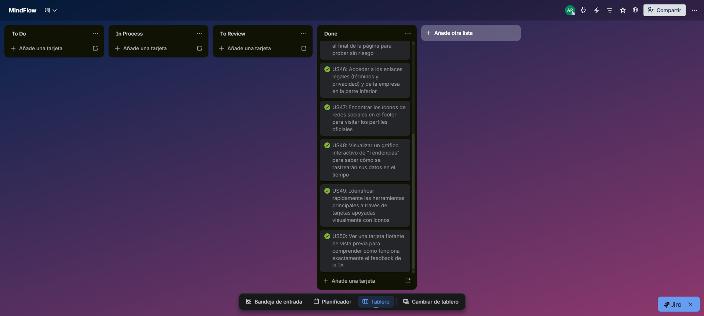

Enlace de Trello: [https://trello.com/invite/b/69ee88a6130c90b4e5b1d5b2/ATTId18d929499f3de387496062b322b92179F3FB526/mindflow](https://trello.com/invite/b/69ee88a6130c90b4e5b1d5b2/ATTId18d929499f3de387496062b322b92179F3FB526/mindflow)
#### 5.2.1.4. Development Evidence for Sprint Review
Durante el Sprint 1, el equipo utilizó GitHub como sistema de control de versiones, siguiendo el flujo de trabajo GitFlow para asegurar una integración ordenada del código. A continuación, se presenta el registro de los commits más relevantes que evidencian el desarrollo de la Landing Page y la colaboración del equipo.

**Repository:** 1ASI0730-2610-20177-CogniTech-MindFlow/MindFlow-Landing-Page

| Repository | Branch | Commit Id | Commit Message | Commit Message Body | Committed on (Date) |
| :--- | :--- | :--- | :--- | :--- | :--- |
| `MindFlow-Landing-Page` | `main` | `116956f` | `Delete CNAME` | `Removed the CNAME file after updating the deployment configuration.` | 26/04/2026 |
| `MindFlow-Landing-Page` | `main` | `db4b64c` | `Create CNAME` | `Created the CNAME file to configure the custom domain for GitHub Pages.` | 26/04/2026 |
| `MindFlow-Landing-Page` | `main` | `8f7d39f` | `fix(landing): Small improvements` | `Applied minor layout and content improvements to the landing page.` | 26/04/2026 |
| `MindFlow-Landing-Page` | `main` | `915f60c` | `Update index.html with new logo and content` | `Updated `index.html` with the new logo and revised content.` | 26/04/2026 |
| `MindFlow-Landing-Page` | `main` | `58bd198` | `Add Logo por LandingPage` | `Added the logo to the landing page header.` | 26/04/2026 |
| `MindFlow-Landing-Page` | `main` | `2bb352c` | `Rename assets/MindFlow_logo.png to assets/images/MindFlow_logo.png` | `Moved the logo asset to the `assets/images/` folder.` | 26/04/2026 |
| `MindFlow-Landing-Page` | `main` | `7d82e38` | `Add MindFlow Logo` | `Added the MindFlow logo asset to the project.` | 26/04/2026 |
| `MindFlow-Landing-Page` | `main` | `f85bb97` | `fix(landing): Update file paths for styles and scripts` | `Updated CSS and JS file paths to ensure correct loading in deployment.` | 26/04/2026 |
| `MindFlow-Landing-Page` | `main` | `3bea106` | `Add to Landing-Page: RESPONSIVE` | `Added responsive behavior and media-query adjustments.` | 26/04/2026 |
| `MindFlow-Landing-Page` | `main` | `9f20df4` | `Add to Landing-Page: HTML interactions` | `Added HTML structure for interactive elements.` | 26/04/2026 |
| `MindFlow-Landing-Page` | `main` | `ccc5152` | `Add to Landing-Page: interactions` | `Added JavaScript interactions for landing page elements.` | 26/04/2026 |
| `MindFlow-Landing-Page` | `main` | `ff7519b` | `Add to Landing-Page: footer styles` | `Added CSS styles for the footer section.` | 26/04/2026 |
| `MindFlow-Landing-Page` | `main` | `a1d3026` | `Add to Landing-Page: HTML footer` | `Added HTML structure for the footer section.` | 26/04/2026 |
| `MindFlow-Landing-Page` | `main` | `bc214c8` | `Add to Landing-Page: cta styles` | `Added CSS styles for the CTA section.` | 26/04/2026 |
| `MindFlow-Landing-Page` | `main` | `fde311e` | `Add to Landing-Page: HTML cta` | `Added HTML structure for the CTA section.` | 26/04/2026 |
| `MindFlow-Landing-Page` | `main` | `578ea95` | `Add to Landing-Page: analytics styles` | `Added CSS styles for the analytics section.` | 26/04/2026 |
| `MindFlow-Landing-Page` | `main` | `1c4ed7c` | `Add to Landing-Page: ANALYTICS HTML` | `Added HTML structure for the analytics section.` | 26/04/2026 |
| `MindFlow-Landing-Page` | `main` | `f86644b` | `Add to Landing-Page: journey styles` | `Added CSS styles for the journey section.` | 26/04/2026 |
| `MindFlow-Landing-Page` | `main` | `dcf0463` | `Add to Landing-Page: jorney HTML` | `Added HTML structure for the journey section.` | 26/04/2026 |
| `MindFlow-Landing-Page` | `main` | `b58a0c8` | `Add to Landing-Page: Feature styles` | `Added CSS styles for the feature section.` | 26/04/2026 |
| `MindFlow-Landing-Page` | `main` | `eedddd9` | `Add to Landing-Page: feature html` | `Added HTML structure for the feature section.` | 26/04/2026 |
| `MindFlow-Landing-Page` | `main` | `eea888d` | `Add to Landing-Page: Hero Style` | `Added CSS styles for the hero section.` | 26/04/2026 |
| `MindFlow-Landing-Page` | `main` | `cc1e39b` | `Add to Landing-Page: NavBar html` | `Added NavBar structure for the landing page HTML sections.` | 26/04/2026 |
| `MindFlow-Landing-Page` | `main` | `cf3719a` | `Add to Landing-Page: Script Base` | `Added JS structure for the landing page sections.` | 26/04/2026 |
| `MindFlow-Landing-Page` | `main` | `63ef417` | `Add to Landing-Page: Css Base` | `Added CSS style structure for the landing page sections.` | 26/04/2026 |
| `MindFlow-Landing-Page` | `main` | `eaf4bf8` | `Add to Landing-Page: HTML Base` | `Added HTML structure for the landing page sections.` | 26/04/2026 |
| `MindFlow-Landing-Page` | `main` | `9b05451` | `add index, script and styless in blank` | `Initial HTML, CSS structure and JS for the landing page layout.` | 26/04/2026 |
| `MindFlow-Landing-Page` | `main` | `370452c` | `Initial commit` | `Initial repository setup with base project files.` | 26/04/2026 |
| `MindFlow-Landing-Page` | `main` | `e0c6a37` | `Add to Landing-Page: hero html` | `Added Hero section for the landing page HTML.` | 23/04/2026 |

#### 5.2.1.5. Execution Evidence for Sprint Review
En esta sección se presenta la evidencia de la ejecución del Sprint 1, demostrando el cumplimiento de los objetivos establecidos y el despliegue del producto en un entorno de producción accesible.

Enlace del Landing Page: [https://github.com/1ASI0730-2610-20177-CogniTech-MindFlow/MindFlow-Landing-Page.git](https://github.com/1ASI0730-2610-20177-CogniTech-MindFlow/MindFlow-Landing-Page.git)

Evidencia de Despliegue (GitHub Pages): [https://1asi0730-2610-20177-cognitech-mindflow.github.io/MindFlow-Landing-Page/](https://1asi0730-2610-20177-cognitech-mindflow.github.io/MindFlow-Landing-Page/)

A continuación, se presenta la captura del dashboard de GitHub que confirma el despliegue exitoso (Production Deployment) de la Landing Page desde el repositorio oficial de GitHub.

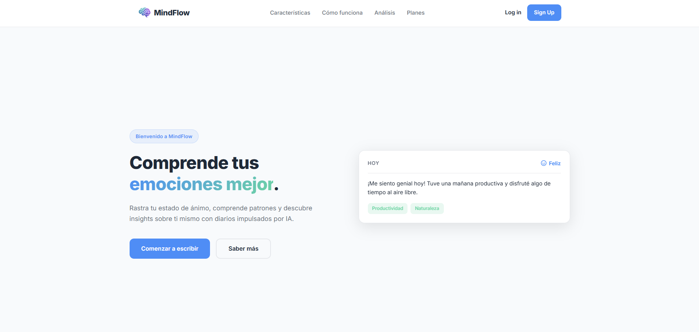
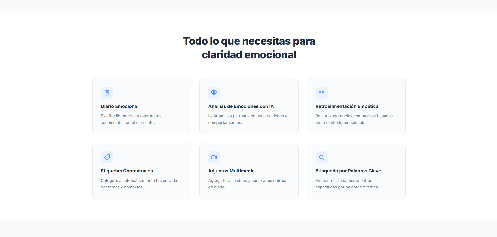
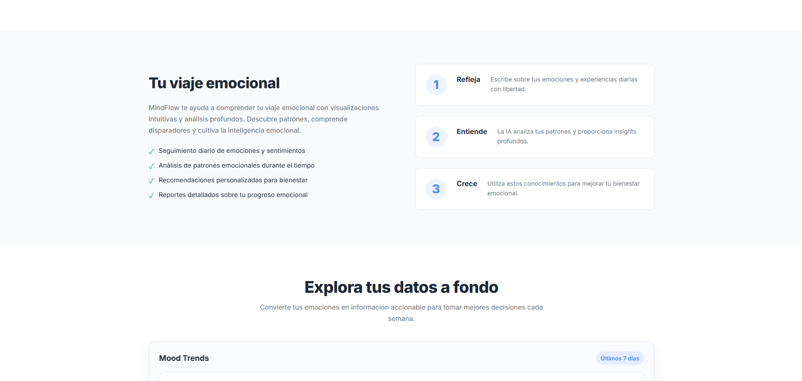
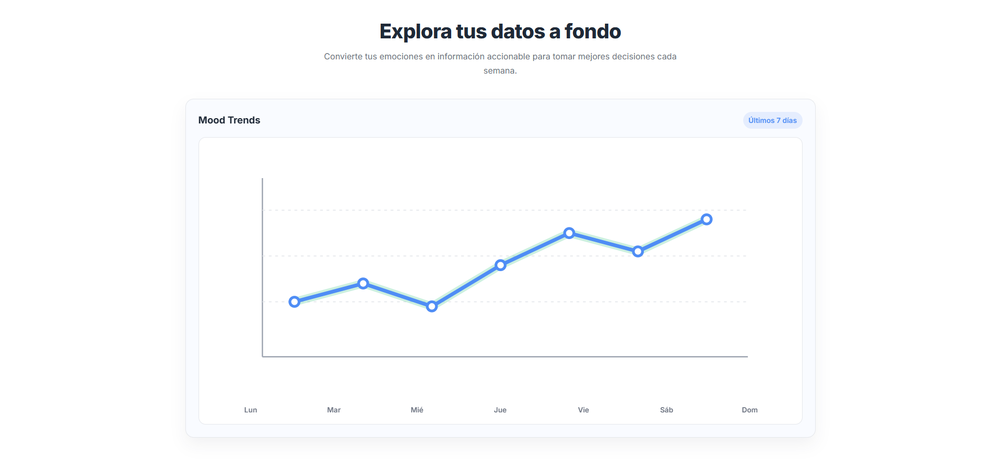
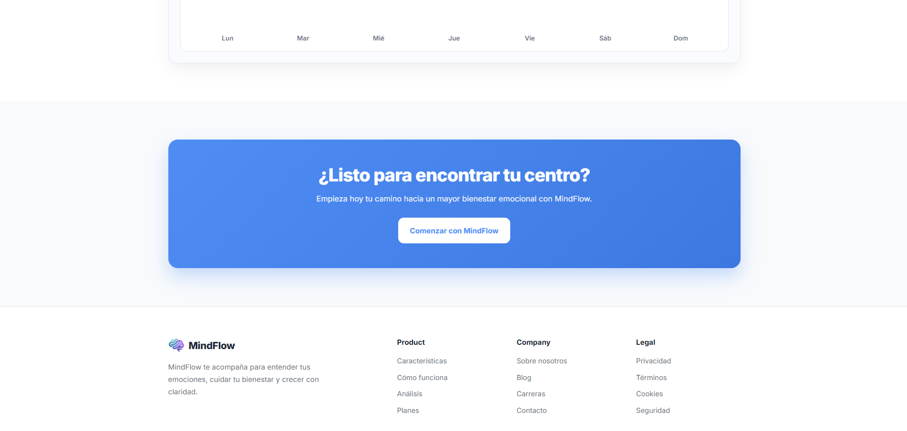

#### 5.2.1.6. Services Documentation Evidence for Sprint Review
Para el presente Sprint 1, el alcance se centró exclusivamente en la implementación y despliegue del Landing Page (sitio web estático). Por lo tanto, no se han desarrollado servicios RESTful API en esta etapa. La documentación detallada de los endpoints mediante OpenAPI (Swagger) se incluirá en los informes correspondientes a los siguientes Sprints, una vez iniciada la fase de implementación de los Web Services.

#### 5.2.1.7. Software Deployment Evidence for Sprint Review
Durante el Sprint 1, se realizó el despliegue de la Landing Page de VITAL CARE
utilizando GitHub Pages como plataforma de hosting. A continuación se describen
las actividades realizadas para lograr la publicación exitosa del sitio.

1. Se creó el repositorio `MindFlow-Landing-Page` bajo la organización
   `1ASI0730-2610-20177-CogniTech-MindFlow` en GitHub.

2. Se desarrolló la Landing Page en la rama `main` siguiendo el flujo
   GitFlow, integrando las secciones de hero, problemática, beneficios,
   startup, planes y footer.

3. Una vez validado el contenido, se dirigió el repositorio hacia GitHub Pages configurando la rama `main` como fuente de despliegue.

4. Se verificó el despliegue exitoso accediendo a la URL pública:
   [https://1asi0730-2610-20177-cognitech-mindflow.github.io/MindFlow-Landing-Page/](https://1asi0730-2610-20177-cognitech-mindflow.github.io/MindFlow-Landing-Page/)
#### 5.2.1.8. Team Collaboration Insights during Sprint
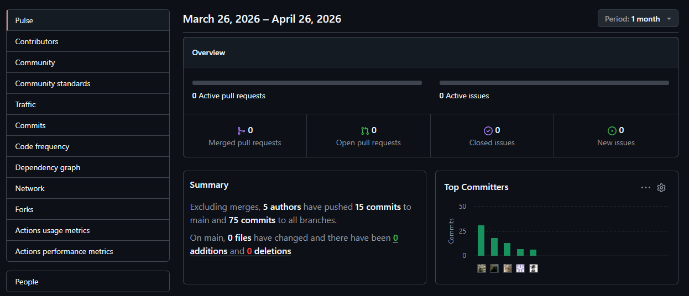
---
### 5.2.2. Sprint 2
#### 5.2.2.1.Sprint Planning 2.
| Sprint #                           | Sprint 2                                                                                                                                                                                                                                                                                                |
|------------------------------------|---------------------------------------------------------------------------------------------------------------------------------------------------------------------------------------------------------------------------------------------------------------------------------------------------------|
| **Sprint Planning Background**     |                                                                                                                                                                                                                                                                                                         |
| Date                               | 2026-05-11                                                                                                                                                                                                                                                                                              |
| Time                               | 04:30 PM                                                                                                                                                                                                                                                                                                |
| Location                           | Reunión virtual vía discord                                                                                                                                                                                                                                                                             |
| Prepared By                        | Caisahuana Osores, Becker Junior                                                                                                                                                                                                                                                                        |
| Attendees                          | Cabrera Sotelo, Camila Celeste / Caisahuana Osores, Becker Junior / Díaz De la cruz, Sebastián Gabriel / Jáuregui Cerna, Jean Franco / Rocca Mariaca, Angel Mathias                                                                                                                                     |
| Sprint 2 – 1 Review Summary        | The previous sprint laid a solid foundation for the initial structure. However, the team noticed some integration challenges that delayed the final delivery. The Product Owner provided valuable feedback regarding the user interface clarity, which we will address immediately.                                                                               |
| Sprint 2 – 1 Retrospective Summary | The team recognizes that communication during the integration phase needs improvement to avoid bottlenecks. The feedback received has been instrumental in adjusting our focus. We are committed to maintaining a cleaner architecture and better modularization moving forward to ensure high quality. |
| **Sprint Goal & User Stories**     |                                                                                                                                                                                                                                                                                                         |
| Sprint 1 Goal                      | Our focus is on strengthening the MindFlow digital experience through the development of the Analytics and Dashboard modules. We believe this will effectively provide users with a clear, responsive, and secure interface to track their emotional progress and daily habits.                                          |
| Sprint 1 Velocity                  | 78                                                                                                                                                                                                                                                                                                      |
| Sum of Story Points                | 24                                                                                                                                                                                                                                                                                                      |

#### 5.2.2.2. Aspect Leaders and Collaborators.
| Role | Team Member                                                     |
|---|-----------------------------------------------------------------|
| Frontend Architecture Leader | Caisahuana Osores, Becker Junior                                |
| UX/UI Design Collaborator | Cabrera Sotelo, Camila Celeste                                  |
| Backend Integration Collaborator | Rocca Mariaca, Angel Mathias  |
| Database Management Collaborator | Díaz De la cruz, Sebastián Gabriel                                    |
| QA and Testing Collaborator | Jáuregui Cerna, Jean Franco                                     |

#### 5.2.2.3.Sprint Backlog 2.
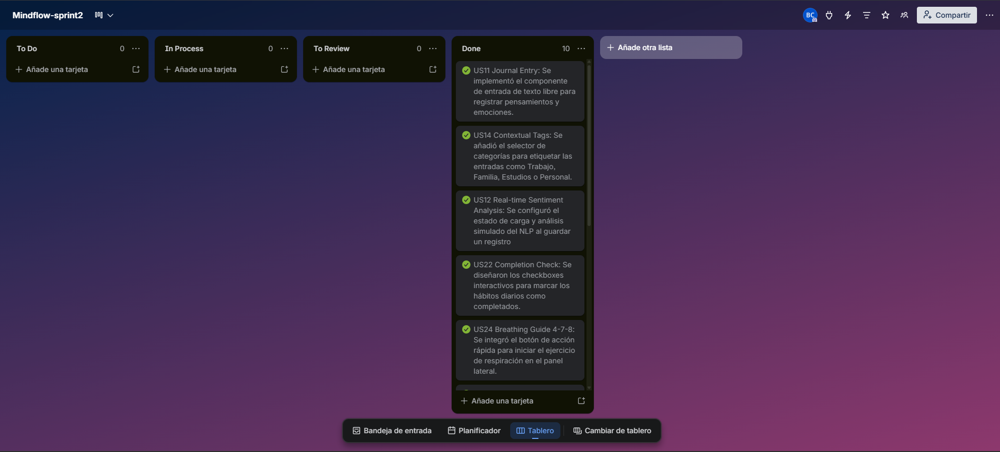

Enlace de Trello: [https://trello.com/invite/b/6a07bd49bd8ca58850e4501f/ATTIbebb0ef435bfc9608428b3b7f81f3e36DE5E1F2D/mindflow-sprint2](https://trello.com/invite/b/6a07bd49bd8ca58850e4501f/ATTIbebb0ef435bfc9608428b3b7f81f3e36DE5E1F2D/mindflow-sprint2)

#### 5.2.2.4.Development Evidence for Sprint Review.
Aquí se presentará el registro de commits de aplicación frontend durante el Sprint 2, evidenciando el desarrollo de funcionalidades relacionadas con la gestión de dashboard, diario(journal), habitos, analiticas, configuracion,planes y otros aspectos clave del sistema MindFlow

| Repository | Branch | Commit ID | Commit Message | Commit Message Body | Committed on Date |
|---|---|---|---|---|---|
| MindFlow-Frontend | main | 2d5c5cb | Merge pull request #8 from develop | Merged develop branch into main integrating all sprint features. | 15/05/2026 |
| MindFlow-Frontend | main | 80bc510 | Merge pull request #7 from feature/dashboard | Integrated dashboard features into the development branch. | 15/05/2026 |
| MindFlow-Frontend | main | cc2f715 | feat dashboard: assemble main dashboard view | Assembled the main dashboard view with asymmetric grid layout. | 15/05/2026 |
| MindFlow-Frontend | main | 29d6786 | feat dashboard: create daily habits checklist component | Created daily habits checklist component for user tracking. | 15/05/2026 |
| MindFlow-Frontend | main | 8b60ed1 | feat dashboard: add quick interventions action buttons | Added quick interventions action buttons to the main dashboard. | 15/05/2026 |
| MindFlow-Frontend | main | ce2457e | feat dashboard: implement weekly mood summary widget | Implemented weekly mood summary widget for visual tracking. | 15/05/2026 |
| MindFlow-Frontend | main | eee2cf9 | feat dashboard: implement store for state management | Implemented store for state management and AI feedback. | 15/05/2026 |
| MindFlow-Frontend | main | cefa732 | feat dashboard: setup api endpoint for ai analysis | Setup API endpoint for AI analysis processing. | 15/05/2026 |
| MindFlow-Frontend | main | a958085 | feat: update API integration to use mock API | Updated API integration to use mock API and improve fetching. | 15/05/2026 |
| MindFlow-Frontend | main | 07ebab6 | feat: implement dark mode support and enhance theme transitions | Implemented dark mode support and enhanced theme transitions. | 15/05/2026 |
| MindFlow-Frontend | main | 260e472 | feat: enhance animations and transitions in components | Enhanced animations and transitions in habit and journal components. | 15/05/2026 |
| MindFlow-Frontend | main | 3b2c6b2 | Add Subscriptions to Develop | Added Subscriptions module to Develop branch. | 15/05/2026 |
| MindFlow-Frontend | main | bd32afe | Add Journal to Develop | Added Journal module to Develop branch. | 15/05/2026 |
| MindFlow-Frontend | main | 5a45715 | Add: Create journal store using Pinia | Created journal store using Pinia for state management. | 15/05/2026 |
| MindFlow-Frontend | main | 6619997 | chore analytics: remove temporary placeholder files | Removed temporary placeholder files from analytics module. | 14/05/2026 |
| MindFlow-Frontend | main | e56f9cc | feat analytics: assemble responsive main dashboard view | Assembled responsive analytics view. | 14/05/2026 |
| MindFlow-Frontend | main | d28876e | feat analytics: implement pinia store for dashboard | Implemented Pinia store for analytics state management. | 14/05/2026 |
| MindFlow-Frontend | main | 401f2cf | chore deps: install chart.js for analytics graphics | Installed chart.js dependency for analytics graphics. | 14/05/2026 |
| MindFlow-Frontend | main | 16124d3 | feat: enhance subscription page with animations | Enhanced subscription page with animations. | 14/05/2026 |
| MindFlow-Frontend | main | e270a87 | feat: add localization support for plans page | Added localization support for plans page. | 13/05/2026 |
| MindFlow-Frontend | main | 5815cf2 | feat: implement settings page with profile management | Implemented settings page with profile management. | 13/05/2026 |
| MindFlow-Frontend | main | 7068b4f | feat: add initial application structure with routing | Added initial application structure with routing and localization. | 13/05/2026 |
| MindFlow-Frontend | develop | cc2f715 | feat[dashboard]: assemble main dashboard view with asymmetric grid layout | Assembled the main dashboard view integrating all widgets into a responsive asymmetric grid. | 15/05/2026 |
| MindFlow-Frontend | develop | 29d6786 | feat[dashboard]: create daily habits checklist component | Implemented custom interactive checkboxes for daily habit tracking. | 15/05/2026 |
| MindFlow-Frontend | develop | 8b60ed1 | feat[dashboard]: add quick interventions action buttons | Added quick action buttons for breathing and meditation exercises. | 15/05/2026 |
| MindFlow-Frontend | develop | ce2457e | feat[dashboard]: implement weekly mood summary widget | Built a CSS flexbox based chart to display the weekly mood summary. | 15/05/2026 |
| MindFlow-Frontend | develop | 9522634 | feat[dashboard]: create recent entries list component | Developed component to display the history of recent journal interactions. | 15/05/2026 |
| MindFlow-Frontend | develop | 73cadd2 | feat[dashboard]: build mood input component with ai feedback integration | Created text area component with dynamic AI response box. | 15/05/2026 |
| MindFlow-Frontend | develop | eee2cf9 | feat[dashboard]: implement store for state management and ai feedback | Added actions to Pinia store for submitting journal entries and toggling habits. | 15/05/2026 |
| MindFlow-Frontend | develop | 620c493 | feat[dashboard]: create domain models for journal entries and habits | Defined JournalEntry and DailyHabit models in the domain layer. | 15/05/2026 |
| MindFlow-Frontend | develop | cefa732 | feat[dashboard]: setup api endpoint for ai analysis processing | Created infrastructure endpoint to simulate AI feedback processing. | 15/05/2026 |
| MindFlow-Frontend | develop | 8bd23c9 | feat[router]: enable dashboard route in main navigation | Activated the main dashboard route in the router configuration file. | 15/05/2026 |
| MindFlow-Frontend | develop | a958085 | feat: update API integration to use mock API and improve subscription fetching logic | Updated subscription logic to reliably fetch data from the mock API endpoints. | 15/05/2026 |
| MindFlow-Frontend | develop | 07ebab6 | feat: implement dark mode support and enhance theme transitions across components | Added global dark mode styling and smoothed visual transitions. | 15/05/2026 |
| MindFlow-Frontend | develop | d7ce45b | fix: attemp to fix Vercel deploy | Adjusted build configuration to resolve Vercel deployment errors. | 15/05/2026 |
| MindFlow-Frontend | develop | 260e472 | feat: enhance animations and transitions in habit and journal components | Added smooth reveal animations to habit and journal interface elements. | 15/05/2026 |
| MindFlow-Frontend | develop | c2dfa02 | feat: localize habit and analytics components | Integrated i18n support for habit and analytics text strings. | 15/05/2026 |
| MindFlow-Frontend | develop | 70616de | fix: Remove temporary placeholder files | Cleaned up unused placeholder files from the project structure. | 15/05/2026 |
| MindFlow-Frontend | develop | ac7a6a7 | fix: Delete dupplicate component | Removed redundant component files to optimize bundle size. | 15/05/2026 |
| MindFlow-Frontend | develop | 255058e | fix: Fix merge problem | Resolved Git merge conflicts in routing configuration. | 15/05/2026 |
| MindFlow-Frontend | develop | 49f059b | Add: habits.vue | Created main view component for the habits tracking section. | 15/05/2026 |
| MindFlow-Frontend | develop | 938fe06 | Add: Components .vue in Presentation/components | Scaffolded base presentation components for the UI. | 15/05/2026 |
| MindFlow-Frontend | develop | 6bbd96a | Add: Implement HabitsHistoryAPI for habit tracking | Added infrastructure service to handle habit history endpoints. | 15/05/2026 |
| MindFlow-Frontend | develop | b7952fb | add: Implement habits API with default habits | Connected habits view to backend API for initial data loading. | 15/05/2026 |
| MindFlow-Frontend | develop | 0b8f442 | Add: HabitCompletionLog and weekly summary functions | Implemented logic to calculate and display weekly habit completion stats. | 15/05/2026 |
| MindFlow-Frontend | develop | 6daf284 | Add: habits store with state and actions | Created Pinia store to manage global state for user habits. | 15/05/2026 |
| MindFlow-Frontend | develop | 175c7b3 | Add: Create journal.vue | Created main view component for the personal journal section. | 15/05/2026 |
| MindFlow-Frontend | develop | 27efb8a | Add: Create JournalFilters.vue | Built UI component to filter journal entries by tags or dates. | 15/05/2026 |
| MindFlow-Frontend | develop | e90c784 | Add: Create JournalEntryCard.vue | Designed reusable card component to display individual journal logs. | 15/05/2026 |
| MindFlow-Frontend | develop | 7938033 | Add: JournalCalendar.vue | Implemented calendar widget for navigating historical journal entries. | 15/05/2026 |
| MindFlow-Frontend | develop | 2027f66 | Add: Create journal-api.js | Configured API service calls for journal data persistence. | 15/05/2026 |
| MindFlow-Frontend | develop | 8c3f5ea | Add: Create journal-entry.entity.js | Defined core domain entity structure for journal entries. | 15/05/2026 |
| MindFlow-Frontend | develop | 5a45715 | Add: Create journal store using Pinia for state management | Setup state management architecture for the journaling module. | 15/05/2026 |
| MindFlow-Frontend | develop | 6619997 | chore[analytics]: remove temporary placeholder files | Deleted placeholder files from domain and application folders. | 14/05/2026 |
| MindFlow-Frontend | develop | e56f9cc | feat[analytics]: assemble responsive main dashboard view | Integrated all analytics components into a responsive layout. | 14/05/2026 |
| MindFlow-Frontend | develop | aca4bbf | feat[analytics]: build high-end UI components and chart widgets | Developed clean-card styled components including word cloud and charts. | 14/05/2026 |
| MindFlow-Frontend | develop | d28876e | feat[analytics]: implement pinia store for dashboard state management | Configured Pinia store to handle dynamic data fetching for analytics. | 14/05/2026 |
| MindFlow-Frontend | develop | edff945 | feat[analytics]: setup domain models, mock db, and api endpoint | Created Domain-Driven Design structure for the analytics module. | 14/05/2026 |
| MindFlow-Frontend | develop | c690046 | feat[router]: register analytics view route | Registered the analytics path in the main Vue router configuration. | 14/05/2026 |
| MindFlow-Frontend | develop | 263843f | fix[layout]: adjust main container overflow for proper dashboard scrolling | Fixed layout CSS to ensure the sidebar remains static while content scrolls. | 14/05/2026 |
| MindFlow-Frontend | develop | 401f2cf | chore[deps]: install chart.js for analytics graphics | Added chart.js dependency to package.json for visualizations. | 14/05/2026 |
| MindFlow-Frontend | develop | 91a91f4 | feat: enhance settings page with animations and improved UI elements | Upgraded settings view with modern transition effects and styling. | 14/05/2026 |
| MindFlow-Frontend | develop | 16124d3 | feat: enhance subscription page with animations | Added visual polish and fluid animations to the premium plans page. | 14/05/2026 |
| MindFlow-Frontend | develop | e270a87 | feat: add localization support for plans page | Implemented multi-language text translations for subscription tiers. | 13/05/2026 |
| MindFlow-Frontend | develop | 16d1d7b | feat: add localization support for settings | Enabled English and Spanish translations in the configuration panel. | 13/05/2026 |
| MindFlow-Frontend | develop | 3f1ee87 | fix: add missing files | Restored accidentally deleted structural files to the repository. | 13/05/2026 |
| MindFlow-Frontend | develop | 28fa283 | feat: add subscription route and update premium banner functionality | Linked the sidebar premium banner to the newly created plans route. | 13/05/2026 |
| MindFlow-Frontend | develop | 22624ac | fix: validate userId in fetchProfile action to prevent errors | Added safety checks in the auth store to handle missing user IDs. | 13/05/2026 |
| MindFlow-Frontend | develop | 5815cf2 | feat: implement settings page with profile management | Built settings interface allowing users to update their core profile data. | 13/05/2026 |
| MindFlow-Frontend | develop | 7068b4f | feat: add initial application structure with routing and localization support | Set up base project architecture including Vue Router and Vue I18n. | 13/05/2026 |

#### 5.2.2.5.Execution Evidence for Sprint Review.
Aquí se muestran las funciones desarrolladas para esta entrega, algunas funciones fueron descartadas como el IAM por ser un módulo que se hará para la siguiente sprint

### Vista Dashboard
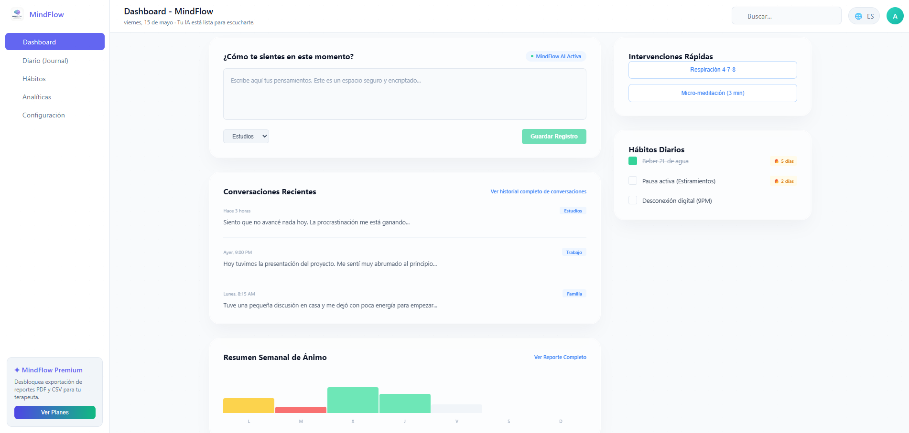

### Vista diario(journal)
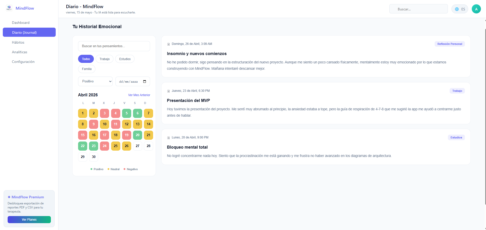

### Vista habitos
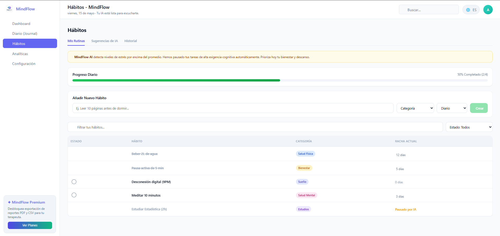

### Vista analiticas
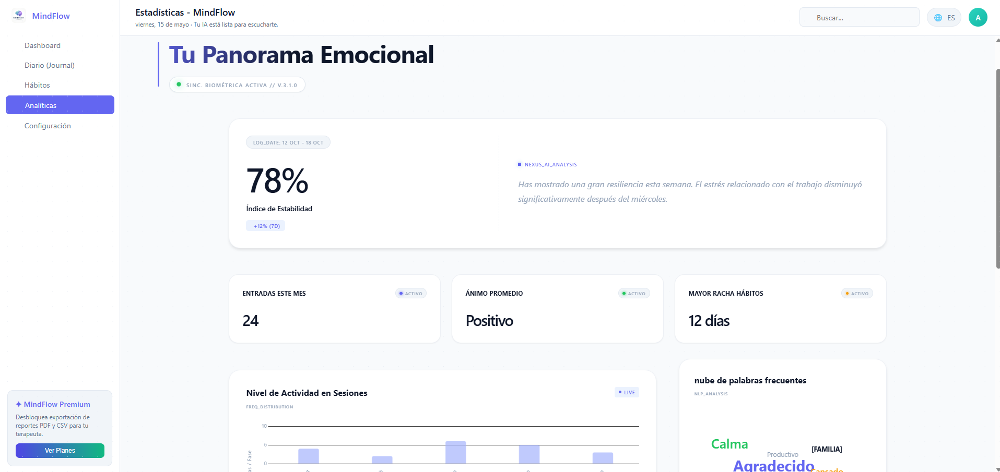

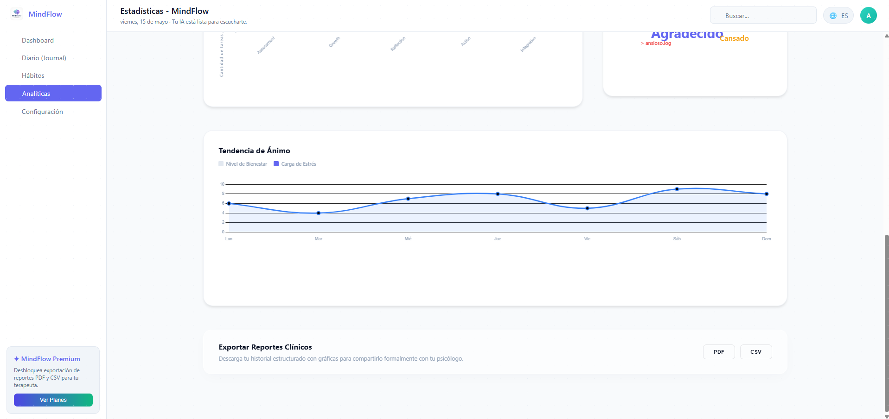

### Vista configuracion
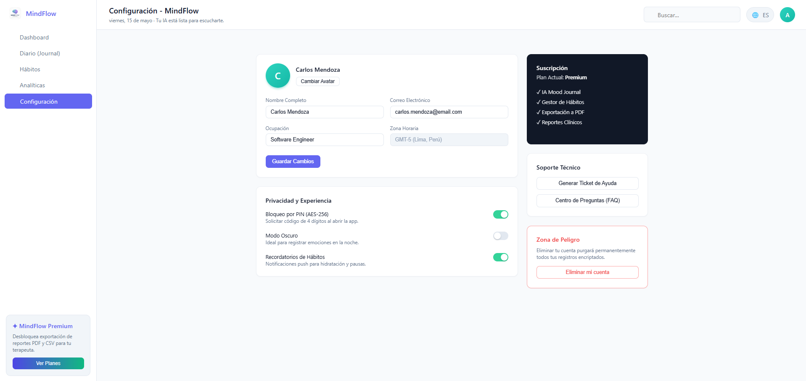

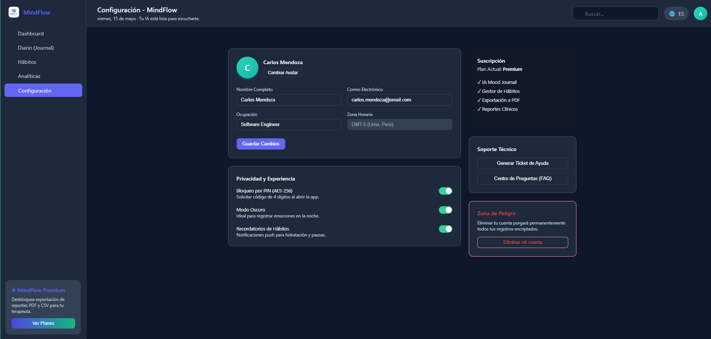

### Vista planes
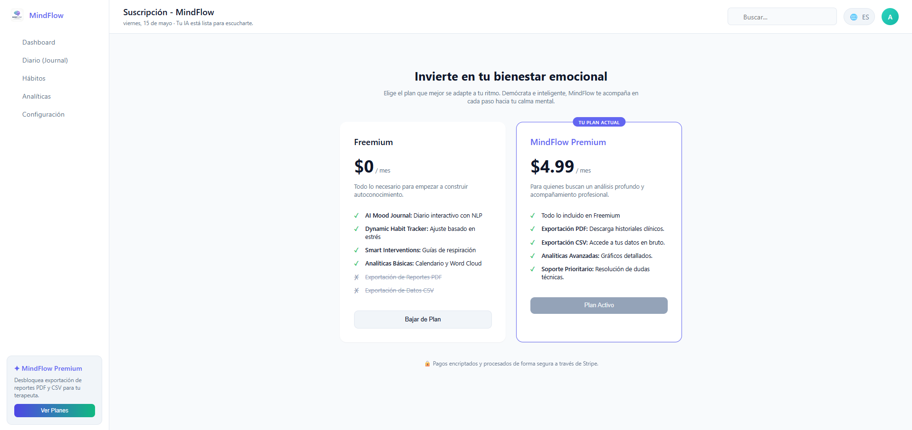

#### 5.2.2.6.Services Documentation Evidence for Sprint Review.
| Service Module | HTTP Method | Endpoint Path | Description |
|---|---|---|---|
| Analytics Service | GET | `/api/v1/analytics/summary` | Retrieves the emotional stability score, weekly trend, and overall AI-generated analysis. |
| Analytics Service | GET | `/api/v1/analytics/fluctuation` | Retrieves phase-distributed numerical data to render the activity fluctuation bar chart. |
| Analytics Service | GET | `/api/v1/analytics/trends` | Retrieves the history of wellness and stress levels for the mental progress line chart. |
| Dashboard Service | POST | `/api/v1/dashboard/journal/analyze` | Sends the user-written journal text to the NLP engine and returns structured empathetic AI feedback. |
| Dashboard Service | GET | `/api/v1/dashboard/journal/recent` | Lists the history of the user's most recent emotional journal entries. |
| Habits Service | GET | `/api/v1/habits/daily` | Returns the list of daily habits assigned to the user along with their current streaks. |
| Habits Service | PUT | `/api/v1/habits/{id}/toggle` | Updates the completion status of a specific habit and recalculates its corresponding streak. |

#### 5.2.2.7.Software Deployment Evidence for Sprint Review.
En esta sección se mostrará la evidencia de ejecución de la primera versión de la aplicación web desplegada aen Vercel

---
### En esta sección se muestra el ingreso del repositorio en la app de Vercel

### Aquí se muestra el proceso previo al despliegue de la aplicación web en Vercel

### Aquí se muestra la aplicación ya desplegada en Vercel, con la URL pública para su acceso

Enlace: [https://mindflow-frontend-cognitech-mindflow.vercel.app/](https://mindflow-frontend-cognitech-mindflow.vercel.app/)
#### 5.2.2.8.Team Collaboration Insights during Sprint.

### Desarrollo del reporte

#### TP1:

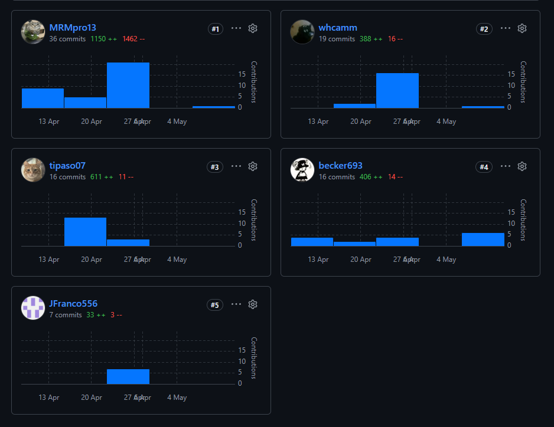

### Desarrollo de Landing Page
#### TP1:

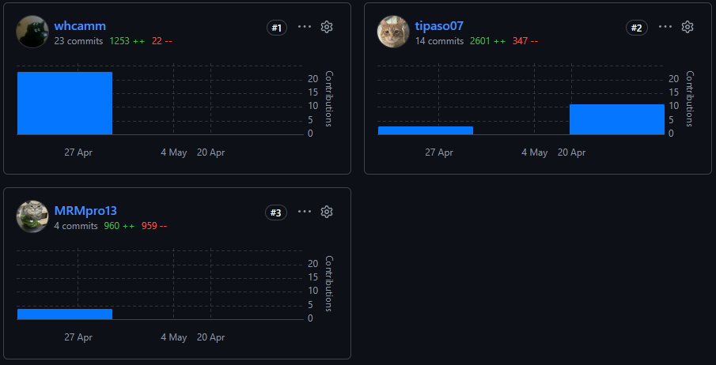

### Desarrollo del Frontend

#### TP1:

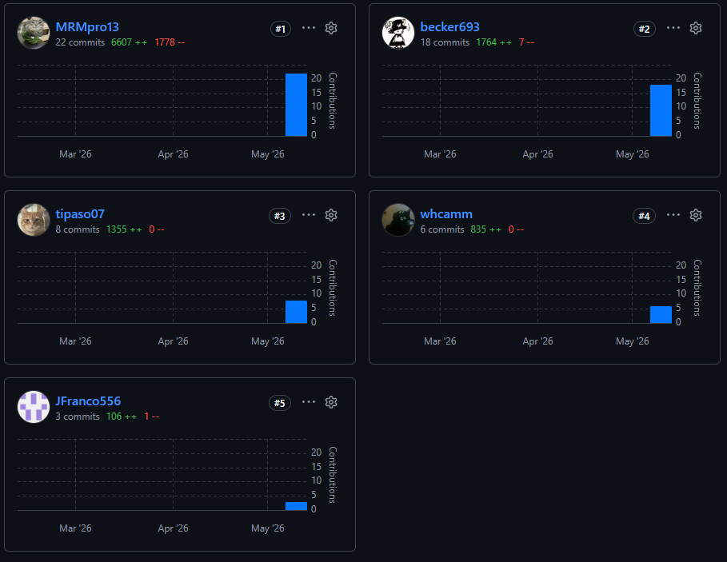

---
### 5.2.3. Sprint 3

#### 5.2.3.1. Sprint Planning 3.

| Sprint #                           | Sprint 3                                                                                                                                                                                                                                                                                                                                                                                                                       |
|------------------------------------|--------------------------------------------------------------------------------------------------------------------------------------------------------------------------------------------------------------------------------------------------------------------------------------------------------------------------------------------------------------------------------------------------------------------------------|
| **Sprint Planning Background**     |                                                                                                                                                                                                                                                                                                                                                                                                                                |
| Date                               | 2026-06-05                                                                                                                                                                                                                                                                                                                                                                                                                     |
| Time                               | 05:00 PM                                                                                                                                                                                                                                                                                                                                                                                                                       |
| Location                           | Reunión virtual vía Discord                                                                                                                                                                                                                                                                                                                                                                                                    |
| Prepared By                        | Rocca Mariaca, Angel Mathias                                                                                                                                                                                                                                                                                                                                                                                                   |
| Attendees                          | Cabrera Sotelo, Camila Celeste / Caisahuana Osores, Becker Junior / Díaz De la cruz, Sebastián Gabriel / Jáuregui Cerna, Jean Franco / Rocca Mariaca, Angel Mathias                                                                                                                                                                                                                                                           |
| Sprint 3 – 2 Review Summary        | During Sprint 2, the team successfully delivered the first version of the frontend application with Vue.js, including Dashboard, Journal, Habits, Analytics, Settings and Subscription modules. The deployment on Vercel was validated. However, all modules relied on mock APIs and lacked real backend integration, authentication, and AI-powered features, which became the primary focus for this sprint.                    |
| Sprint 3 – 2 Retrospective Summary | The team identified the need to transition from mock data to a fully functional backend with real database persistence. Communication improved through Discord channels, and the modular DDD architecture adopted in Sprint 2 facilitated the integration process. The team committed to implementing the complete backend API, real-time AI features, and a robust IAM system for this sprint.                                  |
| **Sprint Goal & User Stories**     |                                                                                                                                                                                                                                                                                                                                                                                                                                |
| Sprint 3 Goal                      | Our focus is on delivering the complete backend API with .NET 10, integrating real AI-powered features via Google Gemini, implementing the IAM bounded context with JWT authentication, deploying the chat system with conversational AI, connecting Stripe for subscription management, and performing full frontend-backend integration. This will be validated once all modules operate with real data persistence and AI feedback. |
| Sprint 3 Velocity                  | 95                                                                                                                                                                                                                                                                                                                                                                                                                             |
| Sum of Story Points                | 56                                                                                                                                                                                                                                                                                                                                                                                                                             |

#### 5.2.3.2. Aspect Leaders and Collaborators.
En esta sección se detalla la matriz de liderazgo y colaboración (LACX) para el Sprint 3. Cada aspecto representa una fase crítica de la entrega, donde se designa un líder (L) responsable de la dirección del entregable y colaboradores (C) que apoyaron en su ejecución.

| Team Member (Last Name, First Name) | GitHub Username | Backend API & DDD Architecture | IAM & Security (JWT) | AI Integration (Gemini & Chat) | Frontend-Backend Integration | QA, Testing & Deployment |
| :--- | :--- |:------------------------------:|:--------------------:|:------------------------------:|:----------------------------:|:------------------------:|
| Cabrera Sotelo, Camila Celeste | whcamm | C | C | C | **L** | C |
| Caisahuana Osores, Becker Junior | becker693 | C | **L** | C | C | C |
| Díaz De la cruz, Sebastián Gabriel | tipaso07 | C | C | C | C | **L** |
| Jáuregui Cerna, Jean Franco | JFranco556 | C | C | **L** | C | C |
| Rocca Mariaca, Angel Mathias | MRMpro13 | **L** | C | C | C | C |

#### 5.2.3.3. Sprint Backlog 3.

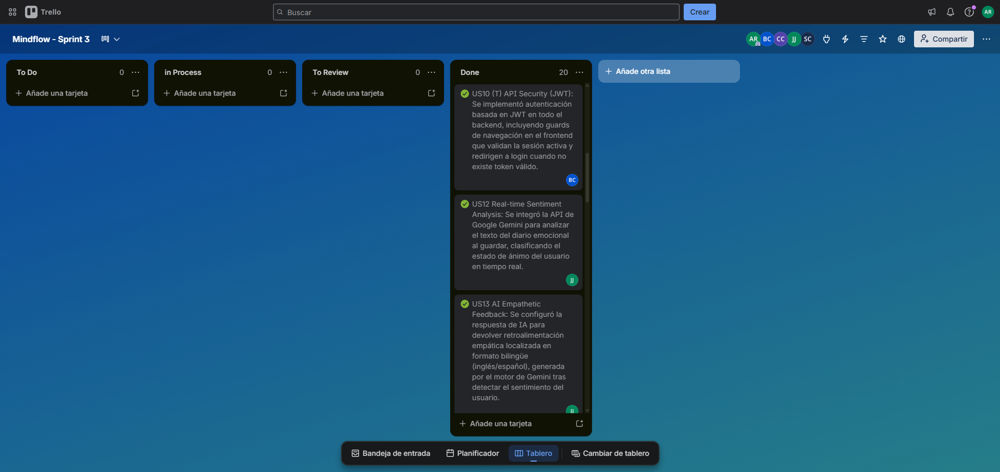

Enlace de Trello: [https://trello.com/b/7WeOkqeo/mindflow-sprint-3](https://trello.com/b/7WeOkqeo/mindflow-sprint-3)

#### 5.2.3.4. Development Evidence for Sprint Review.
Durante el Sprint 3, el equipo desarrolló el backend completo con .NET 10 y realizó la integración total con el frontend en Vue.js. A continuación se presentan los commits más relevantes que evidencian el desarrollo en ambos repositorios.

**Repository:** 1ASI0730-2610-20177-CogniTech-MindFlow/MindFlow-Backend

| Repository | Branch | Commit Id | Commit Message | Commit Message Body | Committed on (Date) |
| :--- | :--- | :--- | :--- | :--- | :--- |
| `MindFlow-Backend` | `main` | `4804f1c` | `first commit` | Configuración inicial del repositorio del backend. | 09/06/2026 |
| `MindFlow-Backend` | `main` | `f23465d` | `chore: initial structure` | Creación de la estructura inicial del proyecto con bounded contexts. | 10/06/2026 |
| `MindFlow-Backend` | `main` | `567104c` | `shared` | Configuración del módulo compartido del proyecto. | 10/06/2026 |
| `MindFlow-Backend` | `main` | `c6de514` | `feat: configure MySQL database and replace weather forecast boilerplate` | Configuración de la base de datos MySQL y limpieza del boilerplate inicial de .NET. | 12/06/2026 |
| `MindFlow-Backend` | `main` | `d323a1f` | `feat: add domain entities, value objects and repository interfaces` | Creación de entidades de dominio, value objects e interfaces de repositorio siguiendo DDD. | 12/06/2026 |
| `MindFlow-Backend` | `main` | `49e73e2` | `feat: add CQRS command and query records` | Implementación del patrón CQRS con registros de comandos y consultas. | 12/06/2026 |
| `MindFlow-Backend` | `main` | `25498c6` | `feat: add application command and query services` | Desarrollo de servicios de aplicación para comandos y consultas. | 12/06/2026 |
| `MindFlow-Backend` | `main` | `6691312` | `feat: add infrastructure repositories and EF configuration` | Implementación de repositorios con Entity Framework Core y configuración de persistencia. | 12/06/2026 |
| `MindFlow-Backend` | `main` | `5d07be0` | `feat: add REST controllers with authorization checks` | Creación de controladores REST con validaciones de autorización. | 12/06/2026 |
| `MindFlow-Backend` | `main` | `a80e666` | `feat: integrate bounded context into AppDbContext and add migration` | Integración de bounded contexts en el contexto de base de datos y generación de migraciones. | 12/06/2026 |
| `MindFlow-Backend` | `main` | `0297654` | `feat(iam-domain): create User aggregate and authentication commands` | Creación del agregado User y comandos de autenticación en el bounded context IAM. | 14/06/2026 |
| `MindFlow-Backend` | `main` | `fae5d2a` | `feat(iam-domain): define IUserRepository interface` | Definición de la interfaz del repositorio de usuarios. | 14/06/2026 |
| `MindFlow-Backend` | `main` | `bdfc6e6` | `feat(iam-application): implement UserCommandService for registration logic` | Implementación del servicio de comandos para la lógica de registro de usuarios. | 14/06/2026 |
| `MindFlow-Backend` | `main` | `c58238c` | `feat(iam-infrastructure): implement UserRepository and configure Entity Framework context` | Implementación del repositorio de usuarios con Entity Framework. | 14/06/2026 |
| `MindFlow-Backend` | `main` | `bb27bd8` | `feat(iam-rest): create UsersController and register module dependencies in Program.cs` | Creación del controlador REST de usuarios y registro de dependencias del módulo IAM. | 14/06/2026 |
| `MindFlow-Backend` | `main` | `b00b616` | `feat: add dockerfile and docker-compose` | Configuración de contenedores Docker para el despliegue del backend. | 14/06/2026 |
| `MindFlow-Backend` | `main` | `deb5e53` | `feat(config): add JWT authentication and clean journal placeholders` | Configuración de autenticación JWT y limpieza de placeholders del journal. | 15/06/2026 |
| `MindFlow-Backend` | `main` | `da5f729` | `feat(journal): add domain entities` | Creación de las entidades de dominio del bounded context Journal. | 15/06/2026 |
| `MindFlow-Backend` | `main` | `82d4dee` | `feat(journal): add JournalController with all REST endpoints` | Implementación del controlador Journal con todos los endpoints REST (CRUD). | 15/06/2026 |
| `MindFlow-Backend` | `main` | `3ce2b97` | `fix(journal): soft delete, recalculate HasPreview on update, and fix frontend query param names` | Implementación de soft delete y corrección de parámetros de consulta del frontend. | 15/06/2026 |
| `MindFlow-Backend` | `main` | `e498b91` | `feat(analytics): add AnalyticsComputationService with score, trends, KPIs, AI insights and word cloud extraction` | Servicio de cómputo de analíticas con score emocional, tendencias, KPIs e insights de IA. | 15/06/2026 |
| `MindFlow-Backend` | `main` | `eb372d3` | `feat(analytics): register ComputationService and add compute endpoints` | Registro del servicio de analíticas y creación de endpoints de cómputo. | 15/06/2026 |
| `MindFlow-Backend` | `main` | `0e24c3d` | `fix(journal): use JournalError enum instead of Error record` | Corrección del manejo de errores en el módulo Journal usando enums. | 16/06/2026 |
| `MindFlow-Backend` | `main` | `edaa897` | `feat: implement missing US across IAM, Journal and Habits` | Implementación de User Stories faltantes en los bounded contexts IAM, Journal y Habits. | 16/06/2026 |
| `MindFlow-Backend` | `main` | `175fbe4` | `feat: implement Google OAuth token-exchange authentication` | Implementación de autenticación OAuth con Google mediante intercambio de tokens. | 16/06/2026 |
| `MindFlow-Backend` | `main` | `f59dfbc` | `feat: implement password recovery flow with SMTP email` | Implementación del flujo de recuperación de contraseña con envío de email vía SMTP. | 16/06/2026 |
| `MindFlow-Backend` | `main` | `daf054a` | `feat: implement real file upload for journal media` | Implementación de carga real de archivos multimedia para entradas del diario. | 16/06/2026 |
| `MindFlow-Backend` | `main` | `1a32d88` | `feat: implement Gemini LLM bounded context for journal feedback` | Implementación del bounded context de IA con Google Gemini para retroalimentación del diario. | 16/06/2026 |
| `MindFlow-Backend` | `main` | `1bc03da` | `feat(wellness-engine): implement stress-based habit adjustment` | Motor de bienestar con ajuste automático de hábitos basado en nivel de estrés. | 16/06/2026 |
| `MindFlow-Backend` | `main` | `36bb739` | `feat: implement push notification BC with FCM hydration` | Implementación de notificaciones push con Firebase Cloud Messaging. | 16/06/2026 |
| `MindFlow-Backend` | `main` | `422f4c1` | `feat: implement Stripe checkout and premium subscription` | Integración de Stripe para checkout y gestión de suscripciones premium. | 16/06/2026 |
| `MindFlow-Backend` | `main` | `b996335` | `feat: implement PDF and CSV export for premium users` | Exportación de historial en formato PDF (QuestPDF) y CSV para usuarios premium. | 16/06/2026 |
| `MindFlow-Backend` | `main` | `7c5547d` | `feat: implement support tickets with email confirmation` | Sistema de tickets de soporte técnico con confirmación por email. | 16/06/2026 |
| `MindFlow-Backend` | `main` | `08754f4` | `test: add unit test project with 38 tests` | Creación del proyecto de tests unitarios con 38 pruebas automatizadas. | 17/06/2026 |
| `MindFlow-Backend` | `main` | `bb1ac07` | `ci: add GitHub Actions pipeline` | Configuración del pipeline CI/CD con GitHub Actions para build, test y despliegue. | 17/06/2026 |
| `MindFlow-Backend` | `main` | `03aa5fc` | `feat: add AI metrics logging` | Implementación de logging de métricas de respuestas de IA. | 17/06/2026 |
| `MindFlow-Backend` | `main` | `cae3ca3` | `perf: add database indexes` | Adición de índices en la base de datos para optimización de consultas. | 17/06/2026 |
| `MindFlow-Backend` | `main` | `7a401ad` | `feat: add AES-256 encryption for journal entries` | Implementación de cifrado AES-256 para proteger las entradas del diario. | 17/06/2026 |
| `MindFlow-Backend` | `main` | `8439fec` | `feat(iam): add PIN lock endpoints` | Endpoints para bloqueo y desbloqueo mediante PIN de seguridad. | 17/06/2026 |
| `MindFlow-Backend` | `main` | `d7c37d8` | `feat: add mood calendar endpoint` | Endpoint del calendario de estados de ánimo con colores por día. | 17/06/2026 |
| `MindFlow-Backend` | `main` | `dc2cd1e` | `feat: add AI feedback rating bounded context` | Bounded context para valoración de la retroalimentación de IA por parte del usuario. | 17/06/2026 |
| `MindFlow-Backend` | `main` | `c78d2c2` | `feat(analytics): add weekly summary background scheduler` | Programador en segundo plano para generar resúmenes semanales de bienestar. | 17/06/2026 |
| `MindFlow-Backend` | `main` | `e66241d` | `feat: add AI-powered habit suggestions endpoint` | Endpoint de sugerencias de hábitos generadas por IA. | 17/06/2026 |
| `MindFlow-Backend` | `main` | `288f92f` | `feat: replace local file storage with Cloudinary` | Migración del almacenamiento local de archivos a Cloudinary en la nube. | 17/06/2026 |
| `MindFlow-Backend` | `main` | `7b8a669` | `feat: add chat bounded context with AI-powered conversation endpoints` | Bounded context de chat con endpoints de conversación potenciados por IA. | 18/06/2026 |
| `MindFlow-Backend` | `main` | `87e3ea2` | `feat: add subscription cancellation endpoint` | Endpoint para cancelación de suscripciones premium. | 18/06/2026 |
| `MindFlow-Backend` | `main` | `1cfb282` | `feat: invalidate analytics cache on journal entry changes` | Invalidación de caché de analíticas al modificar entradas del diario. | 18/06/2026 |
| `MindFlow-Backend` | `main` | `e17f037` | `fix: enforce ownership checks on habit-logs, journal tags/media, and replace raw SQL` | Validaciones de propiedad en habit-logs, tags y media del journal; reemplazo de SQL crudo. | 18/06/2026 |
| `MindFlow-Backend` | `main` | `b0ceb28` | `feat: add matching query filters on EntryTag and Media for soft delete consistency` | Filtros de consulta en EntryTag y Media para consistencia con soft delete. | 20/06/2026 |
| `MindFlow-Backend` | `main` | `e98921d` | `fix: return localized AI insight as {en, es} object and persist name on sign-up` | Respuesta de IA localizada en formato bilingüe y persistencia del nombre en registro. | 20/06/2026 |
| `MindFlow-Backend` | `main` | `0f5189b` | `fix: recalculate habit status and streak at query time based on completion logs` | Recálculo dinámico del estado y racha de hábitos en tiempo de consulta. | 20/06/2026 |
| `MindFlow-Backend` | `main` | `5165901` | `fix: address code review findings across all bounded contexts` | Correcciones de hallazgos de code review en todos los bounded contexts. | 20/06/2026 |
| `MindFlow-Backend` | `main` | `aac55d2` | `feat: add notifications persistence with GET and mark-as-read endpoints` | Persistencia de notificaciones con endpoints de lectura y marcado como leído. | 21/06/2026 |
| `MindFlow-Backend` | `main` | `0539363` | `fix: add GET profile endpoint, deduplicate support tickets, and force HTTPS on upload URLs` | Endpoint GET de perfil, deduplicación de tickets y forzado de HTTPS en URLs de carga. | 21/06/2026 |
| `MindFlow-Backend` | `main` | `a6e00b7` | `fix: delete all user-related data before account deletion to prevent FK constraint errors` | Eliminación en cascada de datos del usuario para evitar errores de claves foráneas. | 21/06/2026 |

**Repository:** 1ASI0730-2610-20177-CogniTech-MindFlow/MindFlow-Frontend

| Repository | Branch | Commit Id | Commit Message | Commit Message Body | Committed on (Date) |
| :--- | :--- | :--- | :--- | :--- | :--- |
| `MindFlow-Frontend` | `main` | `866646f` | `fix: extract dashboard data aggregation to service` | Extracción de la lógica de agregación de datos del dashboard a un servicio dedicado. | 07/06/2026 |
| `MindFlow-Frontend` | `main` | `20a7967` | `fix: standardize BaseEndpoint inheritance and align journal store loading naming` | Estandarización de herencia BaseEndpoint y nomenclatura del store del journal. | 07/06/2026 |
| `MindFlow-Frontend` | `main` | `514450a` | `feat: externalize hardcoded Spanish strings to translation keys across components and entities` | Externalización de strings en español hardcodeados a claves de traducción i18n. | 07/06/2026 |
| `MindFlow-Frontend` | `main` | `5b932d1` | `fix: replace transition:all, remove !important, add prefers-reduced-motion, normalize hardcoded colors, and add design tokens` | Optimización de transiciones CSS, eliminación de !important y adición de design tokens. | 07/06/2026 |
| `MindFlow-Frontend` | `main` | `069326e` | `feat: improve accessibility — aria labels, focus trap, modal roles, dynamic lang` | Mejoras de accesibilidad con aria labels, focus trap y roles de modales. | 07/06/2026 |
| `MindFlow-Frontend` | `main` | `71f71f3` | `fix: lazy-load analytics, remove unused deps, fix will-change, manualChunks` | Lazy-loading de analíticas, eliminación de dependencias no usadas y optimización de chunks. | 07/06/2026 |
| `MindFlow-Frontend` | `main` | `516e538` | `fix: empty catch blocks, security key, console stubs, robots.txt` | Corrección de bloques catch vacíos, clave de seguridad y configuración de robots.txt. | 07/06/2026 |
| `MindFlow-Frontend` | `main` | `2eadc38` | `feat: polish chart components — hover states, shadows, backdrop-filter, legend pills, bar interactions` | Pulido visual de componentes de gráficos con estados hover, sombras y filtros. | 07/06/2026 |
| `MindFlow-Frontend` | `main` | `53fd680` | `feat: polish mood-input stars, quick-interventions glass icons, daily-habits checkbox glow` | Pulido de componentes de input de ánimo, intervenciones rápidas y checkboxes de hábitos. | 07/06/2026 |
| `MindFlow-Frontend` | `main` | `9604528` | `feat: polish dashboard grid dots dark mode, recent-entries gradient/tags, color-light fix` | Mejoras visuales del dashboard en modo oscuro y corrección de gradientes. | 07/06/2026 |
| `MindFlow-Frontend` | `main` | `6bc0b91` | `feat: polish home-vars, active-states, white-to-var, color-mix` | Pulido de variables CSS del home, estados activos y mezcla de colores. | 07/06/2026 |
| `MindFlow-Frontend` | `main` | `1566857` | `feat: add User, AuthSession, LoginRequest and Registration domain models` | Creación de modelos de dominio para User, AuthSession, LoginRequest y Registration. | 09/06/2026 |
| `MindFlow-Frontend` | `main` | `2dfdee5` | `feat: add session manager for local storage token management` | Gestor de sesión para manejo de tokens JWT en localStorage. | 09/06/2026 |
| `MindFlow-Frontend` | `main` | `88f6c4c` | `feat: add AuthApiService with login, register, password reset and session endpoints` | Servicio API de autenticación con endpoints de login, registro y recuperación de contraseña. | 09/06/2026 |
| `MindFlow-Frontend` | `main` | `2812a1d` | `feat: add Pinia auth store with login, register, logout and session restore` | Store de autenticación con Pinia para login, registro, logout y restauración de sesión. | 09/06/2026 |
| `MindFlow-Frontend` | `main` | `5a976f7` | `feat: add auth layout component for login and register pages` | Componente de layout para las páginas de autenticación. | 09/06/2026 |
| `MindFlow-Frontend` | `main` | `08c682a` | `feat: add login form component and login view` | Componente de formulario de login y vista de inicio de sesión. | 09/06/2026 |
| `MindFlow-Frontend` | `main` | `af76883` | `feat: add register form component and register view` | Componente de formulario de registro y vista de registro. | 09/06/2026 |
| `MindFlow-Frontend` | `main` | `8e7e221` | `feat: add forgot password view with email form and sent confirmation state` | Vista de recuperación de contraseña con formulario de email y confirmación de envío. | 09/06/2026 |
| `MindFlow-Frontend` | `main` | `84edfe3` | `feat: add auth routes and navigation guard with session check` | Rutas de autenticación y guard de navegación con verificación de sesión. | 09/06/2026 |
| `MindFlow-Frontend` | `main` | `39cb0b4` | `feat: add avatar dropdown with logout to topbar` | Dropdown de avatar con opción de logout en la barra superior. | 09/06/2026 |
| `MindFlow-Frontend` | `main` | `422033d` | `refactor: replace hardcoded 'u1' with authStore.currentUserId across all features` | Reemplazo de userId hardcodeado por el userId real del store de autenticación. | 09/06/2026 |
| `MindFlow-Frontend` | `main` | `3e3d78e` | `feat: update project` | Actualización general del proyecto con integraciones del backend. | 17/06/2026 |
| `MindFlow-Frontend` | `main` | `1551a88` | `feat: integrate chat system, fix subscription endpoints, improve analytics parsing and UI consistency` | Integración del sistema de chat, corrección de endpoints de suscripción y mejoras de analíticas. | 18/06/2026 |
| `MindFlow-Frontend` | `main` | `3d583aa` | `feat: integrate chat system, fix subscriptions, improve analytics and UI polish` | Integración final del chat, correcciones de suscripciones y pulido de UI. | 18/06/2026 |
| `MindFlow-Frontend` | `main` | `faadd84` | `fix: resolve user-reported bugs, improve habits logic, and add mobile responsive design` | Resolución de bugs reportados por usuarios, mejoras en lógica de hábitos y diseño responsivo móvil. | 21/06/2026 |

#### 5.2.3.5. Execution Evidence for Sprint Review.
En esta sección se presenta la evidencia de ejecución del Sprint 3, demostrando la implementación completa del backend con .NET 10 y la documentación interactiva de la API RESTful mediante Swagger (OpenAPI 3.0). Las siguientes capturas corresponden a la interfaz de Swagger UI desplegada en producción, accesible desde la URL pública del backend.

##### Swagger Evidence - AiFeedback & Analytics
Se muestran los endpoints del bounded context **AiFeedback** (POST, GET y GET /summary para valoraciones de la IA) y **Analytics** (GET/POST /analyticscache, POST /analyticscache/compute, GET/POST /wordcloud, GET /moodcalendar) que permiten consultar el score emocional, tendencias semanales, nube de palabras y calendario de estados de ánimo.

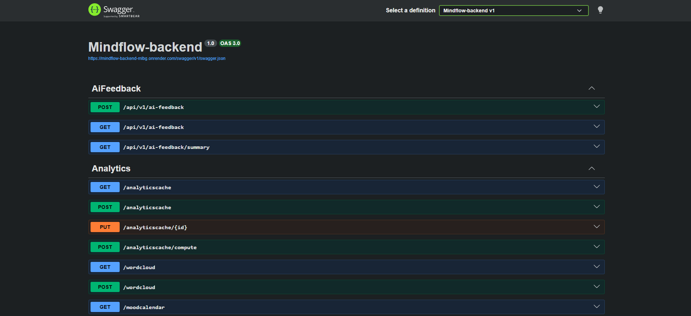

##### Swagger Evidence - Chat & HabitLogs
Se presentan los endpoints del bounded context **Chat** (POST/GET /chat/conversations, DELETE /chat/conversations/{id}, POST/GET /chat/conversations/{id}/messages) para conversaciones con IA en tiempo real, y **HabitLogs** (CRUD completo en /habit-logs) para el registro de completado de hábitos con recálculo automático de rachas.

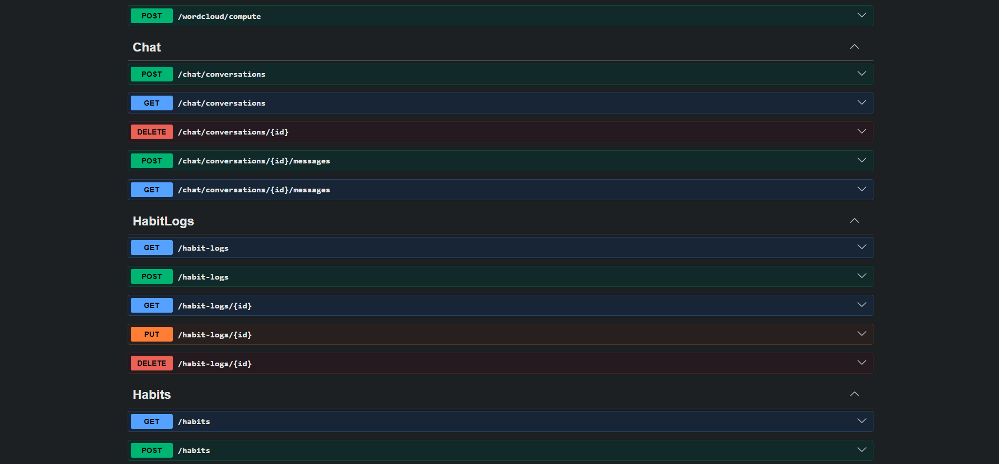

##### Swagger Evidence - Habits & Journal
Se evidencian los endpoints del bounded context **Habits** (CRUD en /habits, GET /habits/streak-summary, POST /habits/suggestions para sugerencias de IA) y **Journal** (CRUD en /journal/entries con análisis de sentimiento automático, gestión de /journal/tags, /journal/entry-tags y /journal/media con soporte de carga de archivos multimedia).

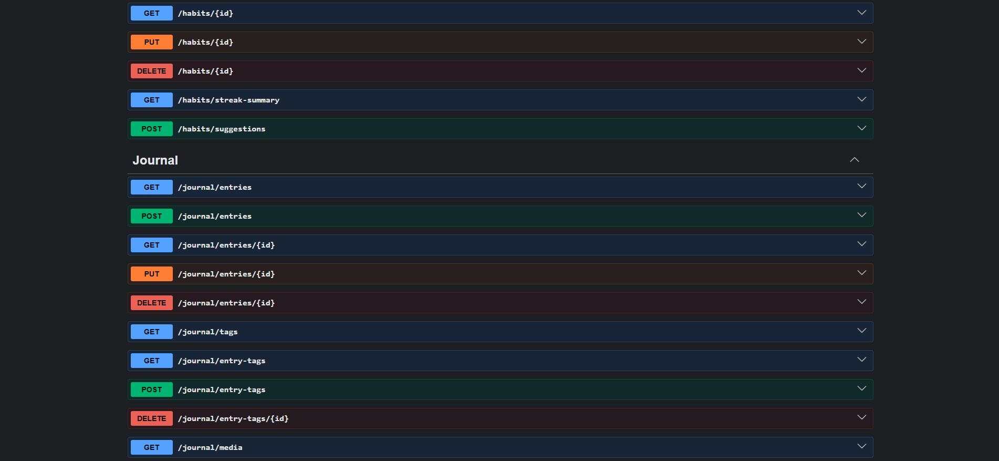

##### Swagger Evidence - Notifications, Reporting & Subscriptions
Se muestran los endpoints de **Notifications** (GET /notifications, PATCH /{id}/read, POST /register-device, DELETE /unregister-device para FCM), **Reporting** (GET /api/v1/reporting/export/pdf y /export/csv para exportación premium) y **Subscriptions** (POST /checkout, GET /me, POST /verify-session, POST /cancel, POST /webhook para integración con Stripe).

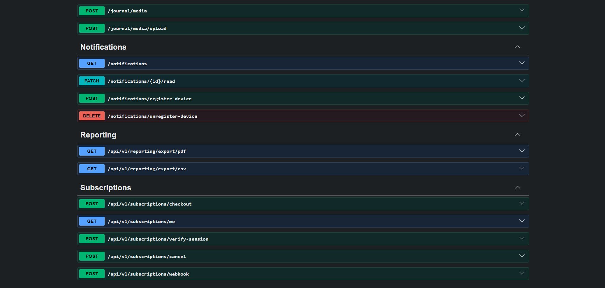

##### Swagger Evidence - Support & Users (IAM)
Se presentan los endpoints de **Support** (POST/GET /api/v1/support/tickets para tickets de soporte con confirmación por email) y **Users** (POST /sign-up, POST /sign-in, POST /google-auth, POST /forgot-password, POST /reset-password, GET/PUT /profile, DELETE /users, POST/DELETE/POST verify/GET status de PIN) que conforman el bounded context IAM completo con autenticación JWT.

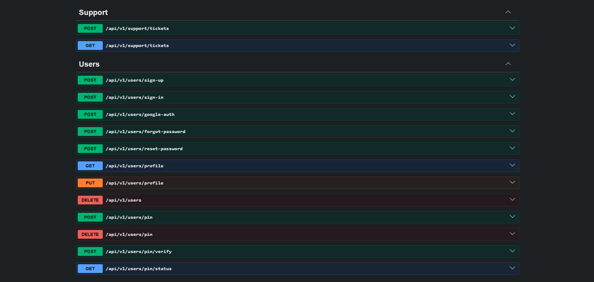

##### Swagger Evidence - Wellness Engine
Se muestra el endpoint del bounded context **Wellness** (POST /wellness/stress-check) que realiza el análisis de estrés del usuario y ajusta automáticamente la carga de hábitos cuando se detecta un nivel de ánimo bajo.

#### 5.2.3.6. Services Documentation Evidence for Sprint Review.
Durante el Sprint 3 se implementó la totalidad de la API RESTful del backend de MindFlow con .NET 10, documentada mediante OpenAPI 3.0 (Swagger). A continuación se presenta el catálogo completo de los endpoints desarrollados, organizados por bounded context.

**Bounded Context: Users (IAM)**

| Service Module | HTTP Method | Endpoint Path | Description |
|---|---|---|---|
| Users | POST | `/api/v1/users/sign-up` | Registra un nuevo usuario con email y contraseña hasheada con BCrypt. |
| Users | POST | `/api/v1/users/sign-in` | Autentica al usuario y retorna un token JWT para acceso a la API. |
| Users | POST | `/api/v1/users/google-auth` | Autentica al usuario mediante intercambio de token OAuth de Google. |
| Users | POST | `/api/v1/users/forgot-password` | Envía un email con enlace de recuperación de contraseña vía SMTP. |
| Users | POST | `/api/v1/users/reset-password` | Restablece la contraseña del usuario mediante token de recuperación. |
| Users | GET | `/api/v1/users/profile` | Obtiene los datos del perfil del usuario autenticado. |
| Users | PUT | `/api/v1/users/profile` | Actualiza el nombre y ocupación del perfil del usuario. |
| Users | DELETE | `/api/v1/users` | Elimina la cuenta del usuario y todos sus datos asociados en cascada. |
| Users | POST | `/api/v1/users/pin` | Configura un PIN de seguridad para proteger el acceso a la aplicación. |
| Users | POST | `/api/v1/users/pin/verify` | Verifica el PIN de seguridad ingresado por el usuario. |
| Users | DELETE | `/api/v1/users/pin` | Elimina el PIN de seguridad configurado. |
| Users | GET | `/api/v1/users/pin/status` | Consulta si el usuario tiene un PIN de seguridad activo. |

**Bounded Context: Journal**

| Service Module | HTTP Method | Endpoint Path | Description |
|---|---|---|---|
| Journal | GET | `/journal/entries` | Lista las entradas del diario emocional del usuario con filtros y ordenamiento. |
| Journal | POST | `/journal/entries` | Crea una nueva entrada con detección automática de sentimiento vía Google Gemini. |
| Journal | GET | `/journal/entries/{id}` | Obtiene una entrada específica del diario por su identificador. |
| Journal | PUT | `/journal/entries/{id}` | Actualiza el contenido de una entrada existente y recalcula el preview. |
| Journal | DELETE | `/journal/entries/{id}` | Realiza un soft delete de la entrada del diario. |
| Journal | GET | `/journal/tags` | Lista todas las etiquetas disponibles del usuario. |
| Journal | GET | `/journal/entry-tags` | Lista las asociaciones entre entradas y etiquetas contextuales. |
| Journal | POST | `/journal/entry-tags` | Asocia una etiqueta contextual a una entrada del diario. |
| Journal | DELETE | `/journal/entry-tags/{id}` | Elimina la asociación entre una etiqueta y una entrada. |
| Journal | GET | `/journal/media` | Lista los archivos multimedia asociados a las entradas. |
| Journal | POST | `/journal/media` | Crea un registro de media asociado a una entrada del diario. |
| Journal | POST | `/journal/media/upload` | Sube un archivo multimedia (máx. 10MB) a Cloudinary y lo vincula a una entrada. |

**Bounded Context: Habits**

| Service Module | HTTP Method | Endpoint Path | Description |
|---|---|---|---|
| Habits | GET | `/habits` | Lista los hábitos del usuario con recálculo de streak en tiempo real. |
| Habits | POST | `/habits` | Crea un nuevo hábito personalizado con nombre, categoría y frecuencia. |
| Habits | GET | `/habits/{id}` | Obtiene un hábito específico por su identificador. |
| Habits | PUT | `/habits/{id}` | Actualiza el nombre, categoría o frecuencia de un hábito existente. |
| Habits | DELETE | `/habits/{id}` | Elimina un hábito y sus logs de completado asociados. |
| Habits | GET | `/habits/streak-summary` | Obtiene el resumen de rachas activas y máximas del usuario. |
| Habits | POST | `/habits/suggestions` | Genera sugerencias de hábitos personalizadas mediante IA (Gemini). |

**Bounded Context: HabitLogs**

| Service Module | HTTP Method | Endpoint Path | Description |
|---|---|---|---|
| HabitLogs | GET | `/habit-logs` | Lista los logs de completado filtrados por hábito. |
| HabitLogs | POST | `/habit-logs` | Registra el completado de un hábito y recalcula el streak automáticamente. |
| HabitLogs | GET | `/habit-logs/{id}` | Obtiene un log de completado específico. |
| HabitLogs | PUT | `/habit-logs/{id}` | Actualiza un log de completado existente. |
| HabitLogs | DELETE | `/habit-logs/{id}` | Elimina un log de completado y recalcula la racha del hábito asociado. |

**Bounded Context: Analytics**

| Service Module | HTTP Method | Endpoint Path | Description |
|---|---|---|---|
| Analytics | GET | `/analyticscache` | Obtiene las analíticas semanales del usuario (score, tendencias, KPIs). |
| Analytics | POST | `/analyticscache` | Crea un registro de analíticas en caché. |
| Analytics | PUT | `/analyticscache/{id}` | Actualiza un registro de analíticas existente. |
| Analytics | POST | `/analyticscache/compute` | Fuerza el recómputo de analíticas con insights generados por IA. |
| Analytics | GET | `/wordcloud` | Obtiene la nube de palabras extraída de las entradas del diario. |
| Analytics | POST | `/wordcloud/compute` | Fuerza el recómputo de la nube de palabras. |
| Analytics | GET | `/moodcalendar` | Obtiene el calendario de estados de ánimo por mes con colores por día. |

**Bounded Context: Chat**

| Service Module | HTTP Method | Endpoint Path | Description |
|---|---|---|---|
| Chat | POST | `/chat/conversations` | Crea una nueva conversación con el asistente de IA. |
| Chat | GET | `/chat/conversations` | Lista todas las conversaciones del usuario. |
| Chat | DELETE | `/chat/conversations/{id}` | Elimina una conversación y su historial de mensajes. |
| Chat | POST | `/chat/conversations/{id}/messages` | Envía un mensaje al asistente de IA y recibe respuesta generada por Gemini. |
| Chat | GET | `/chat/conversations/{id}/messages` | Obtiene el historial de mensajes de una conversación. |

**Bounded Context: AiFeedback**

| Service Module | HTTP Method | Endpoint Path | Description |
|---|---|---|---|
| AiFeedback | POST | `/api/v1/ai-feedback` | Envía una valoración (1-5 estrellas) sobre la retroalimentación de IA recibida. |
| AiFeedback | GET | `/api/v1/ai-feedback` | Lista todas las valoraciones de IA realizadas por el usuario. |
| AiFeedback | GET | `/api/v1/ai-feedback/summary` | Obtiene la distribución estadística de las valoraciones de IA. |

**Bounded Context: Notifications**

| Service Module | HTTP Method | Endpoint Path | Description |
|---|---|---|---|
| Notifications | GET | `/notifications` | Lista las últimas 50 notificaciones del usuario. |
| Notifications | PATCH | `/notifications/{id}/read` | Marca una notificación como leída. |
| Notifications | POST | `/notifications/register-device` | Registra un token FCM para recibir notificaciones push. |
| Notifications | DELETE | `/notifications/unregister-device` | Desregistra un dispositivo del servicio de notificaciones push. |

**Bounded Context: Subscriptions**

| Service Module | HTTP Method | Endpoint Path | Description |
|---|---|---|---|
| Subscriptions | POST | `/api/v1/subscriptions/checkout` | Crea una sesión de checkout en Stripe para suscripción premium. |
| Subscriptions | GET | `/api/v1/subscriptions/me` | Obtiene el estado actual de la suscripción del usuario. |
| Subscriptions | POST | `/api/v1/subscriptions/verify-session` | Verifica el estado del pago tras completar el checkout de Stripe. |
| Subscriptions | POST | `/api/v1/subscriptions/cancel` | Cancela la suscripción premium activa del usuario. |
| Subscriptions | POST | `/api/v1/subscriptions/webhook` | Recibe y procesa eventos webhook de Stripe (activación, cancelación). |

**Bounded Context: Reporting**

| Service Module | HTTP Method | Endpoint Path | Description |
|---|---|---|---|
| Reporting | GET | `/api/v1/reporting/export/pdf` | Exporta el historial del diario emocional como documento PDF (solo premium). |
| Reporting | GET | `/api/v1/reporting/export/csv` | Exporta el historial del diario emocional como archivo CSV (solo premium). |

**Bounded Context: Support**

| Service Module | HTTP Method | Endpoint Path | Description |
|---|---|---|---|
| Support | POST | `/api/v1/support/tickets` | Crea un ticket de soporte técnico y envía email de confirmación al usuario. |
| Support | GET | `/api/v1/support/tickets` | Lista los tickets de soporte creados por el usuario. |

**Bounded Context: Wellness**

| Service Module | HTTP Method | Endpoint Path | Description |
|---|---|---|---|
| Wellness | POST | `/wellness/stress-check` | Realiza un análisis de estrés y ajusta automáticamente la carga de hábitos. |

#### 5.2.3.7. Software Deployment Evidence for Sprint Review.
Durante el Sprint 3 se realizó el despliegue completo de la infraestructura backend de MindFlow, incluyendo el Web Service y la base de datos relacional en plataformas cloud. A continuación se describen las actividades realizadas y la evidencia del despliegue exitoso.

##### Despliegue del Backend - Render

Se desplegó el Web Service del backend en **Render** como plataforma PaaS, utilizando Docker como entorno de ejecución. El repositorio `MindFlow-Backend` de la organización fue vinculado directamente a Render, configurando el despliegue automático desde la rama `main`. La instancia fue configurada en la región **Ohio (US East)** bajo el proyecto **Mindflow / Production**, con las variables de entorno necesarias para las conexiones a la base de datos, claves de API de Google Gemini, credenciales de Stripe y configuración SMTP.

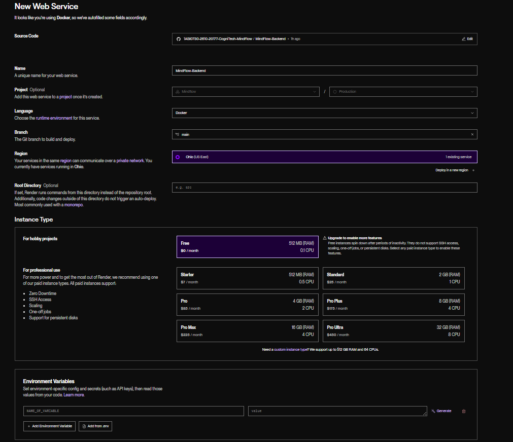

##### Despliegue de la Base de Datos - Railway (MySQL)

Se desplegó la base de datos relacional **MySQL 9.4** en **Railway** como servicio administrado en la nube. La instancia fue configurada bajo el proyecto **Mindflow-Database** en entorno de producción, con volumen persistente (`mysql-volume`) para garantizar la durabilidad de los datos.

**Configuración de Source e imagen:**
La base de datos utiliza la imagen oficial `mysql:9.4` con estado **Online** y acceso de red público habilitado a través de `thomas.proxy.rlwy.net:49350` redirigido al puerto estándar `:3306`.

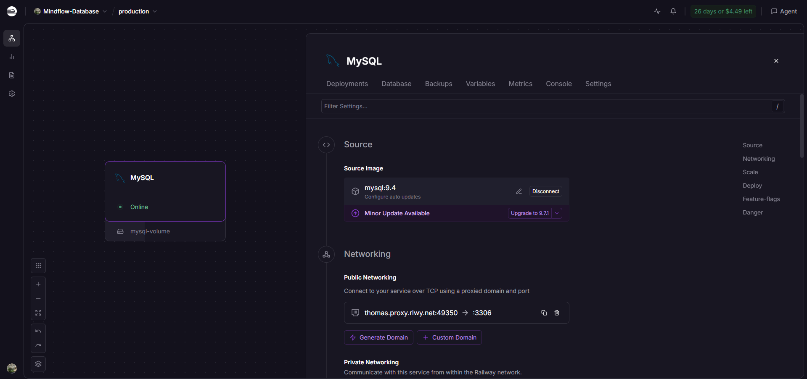

**Configuración de Networking privado y Scale:**
Se habilitó la red privada interna de Railway (`mysql.railway.internal`) con soporte IPv4 e IPv6 para la comunicación segura entre el backend y la base de datos. La instancia fue configurada en la región **US West (California, USA)** con 1 réplica.

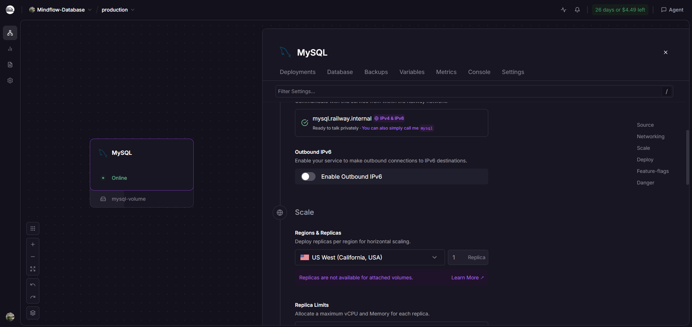

**Configuración de Replica Limits y Deploy:**
Se asignaron los recursos de la réplica con **2 vCPU** y **1 GB de memoria RAM**. El comando de inicio personalizado utiliza `docker-entrypoint.sh mysqld --innodb-use-native-aio=0 --disable-log-bin` para optimizar el rendimiento en entornos cloud.

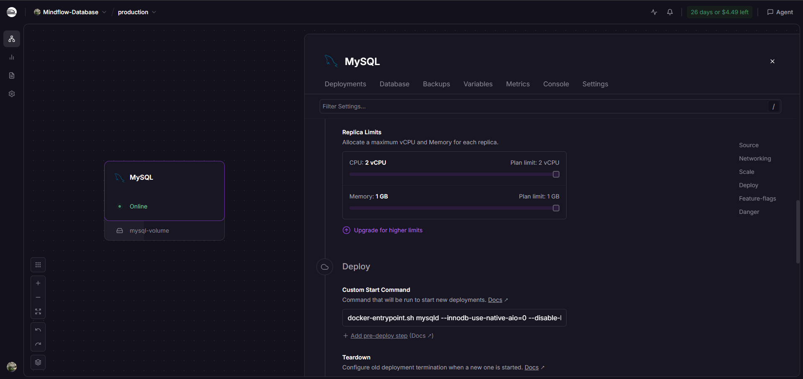

#### 5.2.3.8. Team Collaboration Insights during Sprint.

### Desarrollo del Backend

#### AV2
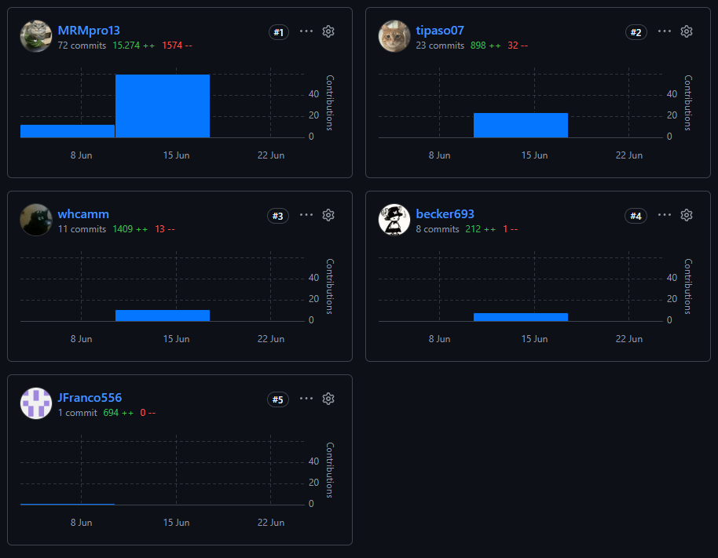

### Desarrollo del Frontend

#### AV2
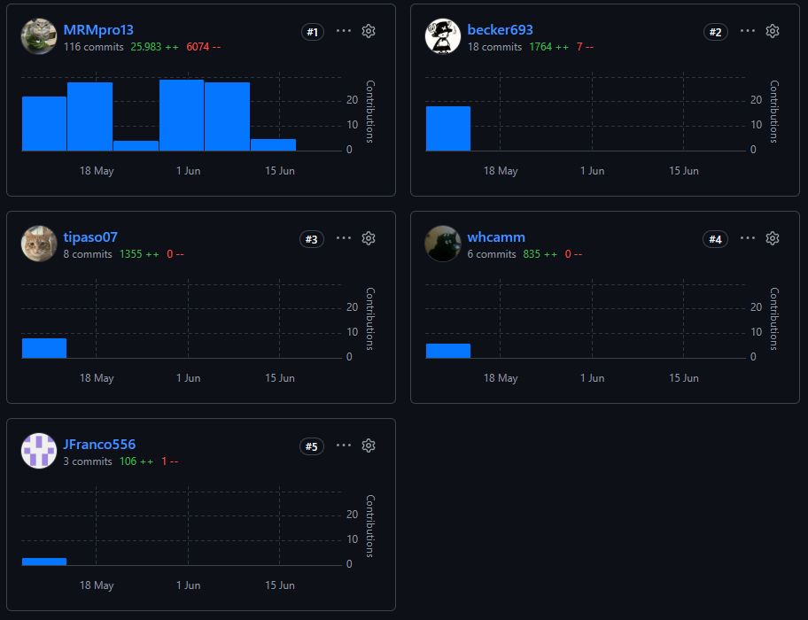

---
### 5.2.4. Sprint 4

#### 5.2.4.1. Sprint Planning 4.

| Sprint #                          | Sprint 4                                                                                                                                                                                                                                                                                                                                                                                                                            |
|-----------------------------------|-------------------------------------------------------------------------------------------------------------------------------------------------------------------------------------------------------------------------------------------------------------------------------------------------------------------------------------------------------------------------------------------------------------------------------------|
| **Sprint Planning Background**    |                                                                                                                                                                                                                                                                                                                                                                                                                                     |
| Date                              | 2026-07-01                                                                                                                                                                                                                                                                                                                                                                                                                          |
| Time                              | 06:00 PM                                                                                                                                                                                                                                                                                                                                                                                                                            |
| Location                          | Reunión virtual vía Discord                                                                                                                                                                                                                                                                                                                                                                                                         |
| Prepared By                       | Caisahuana Osores,Becker Junior                                                                                                                                                                                                                                                                                                                                                                                                     |
| Attendees                         | Cabrera Sotelo, Camila Celeste / Caisahuana Osores, Becker Junior / Díaz De la cruz, Sebastián Gabriel / Jáuregui Cerna, Jean Franco / Rocca Mariaca, Angel Mathias                                                                                                                                                                                                                                                                 |
| Sprint 3 Retrospective Summary |  The team worked very efficiently integrating the frontend with the backend. It was agreed that for this final sprint, the focus would be 100% on writing the final report, recording video evidence, and conducting validation interviews.  |
| Sprint 3 Review Summary        | The programming of all Bounded Contexts was successfully completed, and the Landing Page, Web Application, and Web Services were fully deployed. The system is now operating correctly in production.                    |
| **Sprint Goal & User Stories**    |                                                                                                                                                                                                                                                                                                                                                                                                                                     |
| Sprint 4 Goal                     |Our approach is to perform the final validation of the system in production, conduct validation interviews with users, and consolidate all project artifacts (Final Report, About-the-Product Video, and About-the-Team Video). We believe this will ensure a flawless presentation. This will be confirmed once all documents and videos are uploaded and approved for TB2.|
| Sprint 4 Velocity                 |  8 Story Points                                                                                                                                                                                                                                                                                                                                                                                                                                    |
| Sum of Story Points               |  8 Story Points                                                                                                                                                                                                                                                                                                                                                                                                                                   |

#### 5.2.4.2. Aspect Leaders and Collaborators.
En esta sección se detalla la matriz de liderazgo y colaboración (LACX) para el Sprint 3. Cada aspecto representa una fase crítica de la entrega, donde se designa un líder (L) responsable de la dirección del entregable y colaboradores (C) que apoyaron en su ejecución.

| Team Member (Last Name, First Name) | GitHub Username | Backend API & DDD Architecture | IAM & Security (JWT) | AI Integration (Gemini & Chat) | Frontend-Backend Integration | QA, Testing & Deployment |
| :--- | :--- |:------------------------------:|:--------------------:|:------------------------------:|:----------------------------:|:------------------------:|
| Cabrera Sotelo, Camila Celeste | whcamm | C | C | C | **L** | C |
| Caisahuana Osores, Becker Junior | becker693 | C | **L** | C | C | C |
| Díaz De la cruz, Sebastián Gabriel | tipaso07 | C | C | C | C | **L** |
| Jáuregui Cerna, Jean Franco | JFranco556 | C | C | **L** | C | C |
| Rocca Mariaca, Angel Mathias | MRMpro13 | **L** | C | C | C | C |

#### 5.2.4.3. Sprint Backlog 4.

#### 5.2.4.4. Development Evidence for Sprint Review.

#### 5.2.4.5. Execution Evidence for Sprint Review.
En esta sección se presenta la evidencia de ejecución del Sprint 4, En esta etapa del ciclo de vida del proyecto, la ejecución se centra en demostrar la estabilidad y funcionalidad del producto terminado en su entorno de operación. A continuación, se presentan las evidencias de la integración final entre el RESTful API, el Frontend Web Application y el Landing Page.

#### Landing Page
Vista final del Landing Page mostrando la propuesta de valor y los call-to-action funcionales.
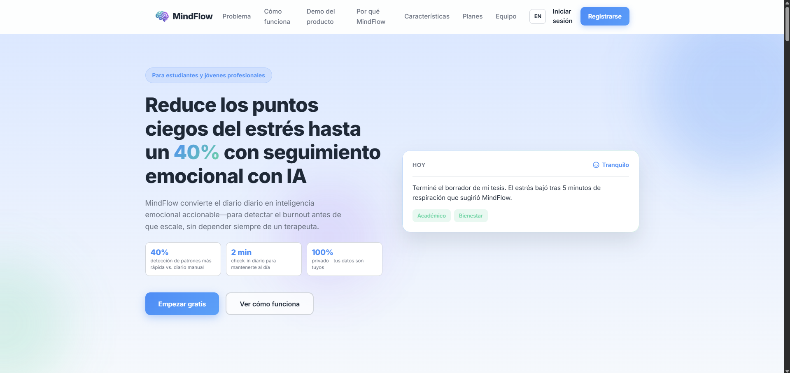

#### Registro de Usuarios
Interfaz de registro integrada con el servicio de autenticación y persistencia en base de datos.
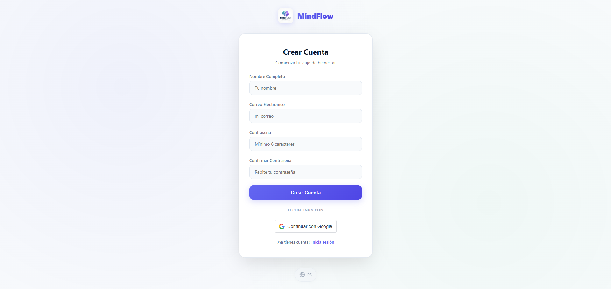

#### Flujo Core
Demostración del flujo principal de la aplicación donde el usuario interactúa con los servicios internos.
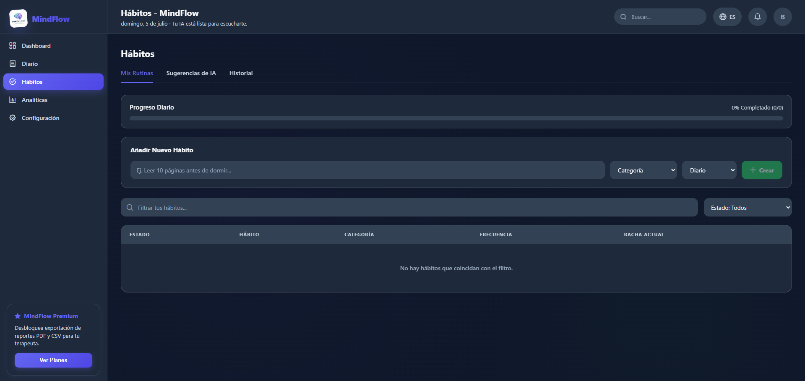

#### Integración de Servicios
Evidencia visual de la integración con servicios de terceros (IA/Chat) dentro de la interfaz.
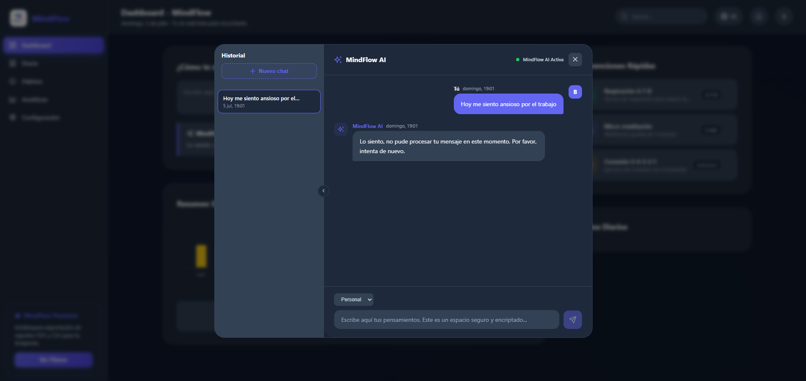

#### 5.2.4.6. Services Documentation Evidence for Sprint Review.
Durante el Sprint 4, el enfoque se centró en la validación final del sistema en producción, la consolidación de artefactos del proyecto y la realización de entrevistas de validación con usuarios. No se desarrollaron nuevos endpoints en este sprint, ya que toda la API RESTful fue completada e integrada satisfactoriamente durante el Sprint 3. A continuación se documenta el catálogo completo de Web Services operativos en producción, organizados por bounded context, confirmando su estabilidad y disponibilidad en el entorno desplegado.

**URL Base de la API en producción:** La API se encuentra desplegada y accesible vía HTTPS, documentada mediante OpenAPI 3.0 (Swagger).

**Bounded Context: Users (IAM)**

| Service Module | HTTP Method | Endpoint Path | Action Implemented | Response Summary |
|---|---|---|---|---|
| Users | POST | `/api/v1/users/sign-up` | Registra un nuevo usuario con email y contraseña hasheada con BCrypt. | `201 Created` — User ID + JWT token |
| Users | POST | `/api/v1/users/sign-in` | Autentica al usuario y retorna un token JWT. | `200 OK` — JWT access token |
| Users | POST | `/api/v1/users/google-auth` | Autentica mediante intercambio de token OAuth de Google. | `200 OK` — JWT access token |
| Users | POST | `/api/v1/users/forgot-password` | Envía email de recuperación de contraseña vía SMTP. | `200 OK` — Confirmation message |
| Users | POST | `/api/v1/users/reset-password` | Restablece contraseña mediante token de recuperación. | `200 OK` — Success confirmation |
| Users | GET | `/api/v1/users/profile` | Obtiene los datos del perfil del usuario autenticado. | `200 OK` — User profile object |
| Users | PUT | `/api/v1/users/profile` | Actualiza nombre y ocupación del perfil. | `200 OK` — Updated profile |
| Users | DELETE | `/api/v1/users` | Elimina la cuenta del usuario y datos asociados en cascada. | `204 No Content` |
| Users | POST | `/api/v1/users/pin` | Configura un PIN de seguridad. | `201 Created` |
| Users | POST | `/api/v1/users/pin/verify` | Verifica el PIN de seguridad ingresado. | `200 OK` — Verification result |
| Users | DELETE | `/api/v1/users/pin` | Elimina el PIN de seguridad configurado. | `204 No Content` |
| Users | GET | `/api/v1/users/pin/status` | Consulta si el usuario tiene PIN activo. | `200 OK` — Pin status boolean |

**Bounded Context: Journal**

| Service Module | HTTP Method | Endpoint Path | Action Implemented | Response Summary |
|---|---|---|---|---|
| Journal | GET | `/journal/entries` | Lista entradas del diario emocional con filtros y ordenamiento. | `200 OK` — Array of entries |
| Journal | POST | `/journal/entries` | Crea entrada con detección automática de sentimiento vía Gemini. | `201 Created` — Entry with AI analysis |
| Journal | GET | `/journal/entries/{id}` | Obtiene una entrada específica por ID. | `200 OK` — Entry object |
| Journal | PUT | `/journal/entries/{id}` | Actualiza contenido y recalcula preview. | `200 OK` — Updated entry |
| Journal | DELETE | `/journal/entries/{id}` | Soft delete de la entrada. | `204 No Content` |
| Journal | GET | `/journal/tags` | Lista etiquetas disponibles del usuario. | `200 OK` — Array of tags |
| Journal | GET | `/journal/entry-tags` | Lista asociaciones entre entradas y etiquetas. | `200 OK` — Array of entry-tags |
| Journal | POST | `/journal/entry-tags` | Asocia una etiqueta a una entrada. | `201 Created` — Entry-tag association |
| Journal | DELETE | `/journal/entry-tags/{id}` | Elimina asociación entre etiqueta y entrada. | `204 No Content` |
| Journal | GET | `/journal/media` | Lista archivos multimedia de las entradas. | `200 OK` — Array of media |
| Journal | POST | `/journal/media` | Crea registro de media asociado a una entrada. | `201 Created` — Media record |
| Journal | POST | `/journal/media/upload` | Sube archivo multimedia (máx. 10MB) a Cloudinary. | `201 Created` — Media URL |

**Bounded Context: Habits**

| Service Module | HTTP Method | Endpoint Path | Action Implemented | Response Summary |
|---|---|---|---|---|
| Habits | GET | `/habits` | Lista hábitos con recálculo de streak en tiempo real. | `200 OK` — Array of habits |
| Habits | POST | `/habits` | Crea hábito personalizado con nombre, categoría y frecuencia. | `201 Created` — Habit object |
| Habits | GET | `/habits/{id}` | Obtiene un hábito específico por ID. | `200 OK` — Habit object |
| Habits | PUT | `/habits/{id}` | Actualiza nombre, categoría o frecuencia. | `200 OK` — Updated habit |
| Habits | DELETE | `/habits/{id}` | Elimina hábito y logs asociados. | `204 No Content` |
| Habits | GET | `/habits/streak-summary` | Resumen de rachas activas y máximas. | `200 OK` — Streak summary |
| Habits | POST | `/habits/suggestions` | Genera sugerencias de hábitos vía IA (Gemini). | `200 OK` — AI suggestions |

**Bounded Context: HabitLogs**

| Service Module | HTTP Method | Endpoint Path | Action Implemented | Response Summary |
|---|---|---|---|---|
| HabitLogs | GET | `/habit-logs` | Lista logs de completado filtrados por hábito. | `200 OK` — Array of logs |
| HabitLogs | POST | `/habit-logs` | Registra completado y recalcula streak. | `201 Created` — Log object |
| HabitLogs | GET | `/habit-logs/{id}` | Obtiene log de completado específico. | `200 OK` — Log object |
| HabitLogs | PUT | `/habit-logs/{id}` | Actualiza log de completado. | `200 OK` — Updated log |
| HabitLogs | DELETE | `/habit-logs/{id}` | Elimina log y recalcula racha. | `204 No Content` |

**Bounded Context: Analytics**

| Service Module | HTTP Method | Endpoint Path | Action Implemented | Response Summary |
|---|---|---|---|---|
| Analytics | GET | `/analyticscache` | Obtiene analíticas semanales (score, tendencias, KPIs). | `200 OK` — Analytics object |
| Analytics | POST | `/analyticscache` | Crea registro de analíticas en caché. | `201 Created` — Cache record |
| Analytics | PUT | `/analyticscache/{id}` | Actualiza registro de analíticas existente. | `200 OK` — Updated record |
| Analytics | POST | `/analyticscache/compute` | Fuerza recómputo con insights generados por IA. | `200 OK` — Computed analytics |
| Analytics | GET | `/wordcloud` | Obtiene nube de palabras de las entradas del diario. | `200 OK` — Word cloud data |
| Analytics | POST | `/wordcloud/compute` | Fuerza recómputo de la nube de palabras. | `200 OK` — Computed word cloud |
| Analytics | GET | `/moodcalendar` | Calendario de estados de ánimo por mes con colores por día. | `200 OK` — Calendar data |

**Bounded Context: Chat**

| Service Module | HTTP Method | Endpoint Path | Action Implemented | Response Summary |
|---|---|---|---|---|
| Chat | POST | `/chat/conversations` | Crea nueva conversación con asistente de IA. | `201 Created` — Conversation object |
| Chat | GET | `/chat/conversations` | Lista todas las conversaciones del usuario. | `200 OK` — Array of conversations |
| Chat | DELETE | `/chat/conversations/{id}` | Elimina conversación e historial de mensajes. | `204 No Content` |
| Chat | POST | `/chat/conversations/{id}/messages` | Envía mensaje y recibe respuesta de IA (Gemini). | `201 Created` — AI response message |
| Chat | GET | `/chat/conversations/{id}/messages` | Obtiene historial de mensajes de una conversación. | `200 OK` — Array of messages |

**Bounded Context: AiFeedback**

| Service Module | HTTP Method | Endpoint Path | Action Implemented | Response Summary |
|---|---|---|---|---|
| AiFeedback | POST | `/api/v1/ai-feedback` | Envía valoración (1-5 estrellas) sobre retroalimentación de IA. | `201 Created` — Feedback record |
| AiFeedback | GET | `/api/v1/ai-feedback` | Lista valoraciones de IA del usuario. | `200 OK` — Array of feedback |
| AiFeedback | GET | `/api/v1/ai-feedback/summary` | Distribución estadística de valoraciones. | `200 OK` — Summary statistics |

**Bounded Context: Notifications**

| Service Module | HTTP Method | Endpoint Path | Action Implemented | Response Summary |
|---|---|---|---|---|
| Notifications | GET | `/notifications` | Lista las últimas 50 notificaciones del usuario. | `200 OK` — Array of notifications |
| Notifications | PATCH | `/notifications/{id}/read` | Marca una notificación como leída. | `200 OK` — Updated notification |
| Notifications | POST | `/notifications/register-device` | Registra dispositivo para notificaciones push (FCM). | `201 Created` |
| Notifications | DELETE | `/notifications/unregister-device` | Desregistra dispositivo de notificaciones push. | `204 No Content` |

**Bounded Context: Subscriptions (Stripe)**

| Service Module | HTTP Method | Endpoint Path | Action Implemented | Response Summary |
|---|---|---|---|---|
| Subscriptions | POST | `/api/v1/subscriptions/checkout` | Inicia sesión de checkout con Stripe. | `200 OK` — Stripe session URL |
| Subscriptions | GET | `/api/v1/subscriptions/me` | Obtiene estado de suscripción actual del usuario. | `200 OK` — Subscription status |
| Subscriptions | POST | `/api/v1/subscriptions/verify-session` | Verifica sesión de pago completada. | `200 OK` — Verification result |
| Subscriptions | POST | `/api/v1/subscriptions/cancel` | Cancela suscripción premium activa. | `200 OK` — Cancellation confirmation |
| Subscriptions | POST | `/api/v1/subscriptions/webhook` | Recibe eventos de Stripe (webhook). | `200 OK` — Event processed |

**Bounded Context: Reporting (Premium)**

| Service Module | HTTP Method | Endpoint Path | Action Implemented | Response Summary |
|---|---|---|---|---|
| Reporting | GET | `/api/v1/reporting/export/pdf` | Exporta historial del usuario en formato PDF (QuestPDF). | `200 OK` — PDF file download |
| Reporting | GET | `/api/v1/reporting/export/csv` | Exporta historial del usuario en formato CSV. | `200 OK` — CSV file download |

**Bounded Context: Support**

| Service Module | HTTP Method | Endpoint Path | Action Implemented | Response Summary |
|---|---|---|---|---|
| Support | POST | `/api/v1/support/tickets` | Crea ticket de soporte con confirmación por email. | `201 Created` — Ticket object |
| Support | GET | `/api/v1/support/tickets` | Lista tickets de soporte del usuario. | `200 OK` — Array of tickets |

**Bounded Context: Wellness Engine**

| Service Module | HTTP Method | Endpoint Path | Action Implemented | Response Summary |
|---|---|---|---|---|
| Wellness | POST | `/wellness/stress-check` | Analiza estrés y ajusta carga de hábitos automáticamente. | `200 OK` — Stress analysis result |

> **Resumen:** El sistema opera con un total de **68 endpoints** distribuidos en **12 bounded contexts**, todos documentados mediante OpenAPI 3.0 (Swagger) y accesibles en el entorno de producción con autenticación JWT. Durante el Sprint 4, se confirmó la estabilidad de todos los servicios mediante pruebas de validación con usuarios reales.

#### 5.2.4.7. Software Deployment Evidence for Sprint Review.

#### 5.2.4.8. Team Collaboration Insights during Sprint.

---
## 5.3. Validation Interviews.
### 5.3.1. Diseño de Entrevistas.

Para la validación del producto MindFlow se diseñó un banco de preguntas dirigido a los dos segmentos objetivo: estudiantes universitarios (18–25 años) y profesionales jóvenes (26–35 años). Las preguntas siguen un formato semiestructurado y están organizadas en tres bloques: exploración de la Landing Page, navegación por la aplicación web y cierre valorativo. El objetivo es recoger impresiones sobre la propuesta de valor, la usabilidad de cada módulo y la disposición de uso.

A continuación se presentan las preguntas diseñadas para cada segmento objetivo:

#### Segmento 1: Estudiantes Universitarios (18–25 años)

**Landing Page**

| N.° | Pregunta |
|:---:|:---------|
| 1 | Después de ver la página principal, ¿qué entiendes que es MindFlow y qué problema crees que busca resolver? |
| 2 | Revisa la sección "Problema". ¿Te sientes identificado/a con algo de lo que aparece? |
| 3 | ¿Qué te pareció la sección "Cómo funciona"? ¿Te queda claro cómo funcionaría el producto? |
| 4 | ¿Qué opinas sobre la sección "Por qué MindFlow"? |
| 5 | ¿Te registrarías para utilizar la plataforma? |

**Aplicación Web**

| N.° | Pregunta |
|:---:|:---------|
| 6 | Ahora entra al Dashboard. ¿Qué te parece la organización y la información que se presenta? |
| 7 | Prueba la sección Diario y registra una entrada. ¿Qué te pareció la experiencia? |
| 8 | ¿Qué opinas sobre la sección Hábitos? ¿Crees que te ayudaría en tu rutina diaria? |
| 9 | Observa las Analíticas. ¿Las gráficas y estadísticas son fáciles de entender? |
| 10 | ¿Qué te pareció la sección Configuración? |

**Cierre**

| N.° | Pregunta |
|:---:|:---------|
| 11 | ¿Qué fue lo que más te gustó de la plataforma? |
| 12 | ¿Qué mejorarías o qué funcionalidad agregarías? |
| 13 | ¿Utilizarías MindFlow en tu día a día? ¿Qué calificación le darías del 1 al 10? |

#### Segmento 2: Profesionales Jóvenes (26–35 años)

**Landing Page**

| N.° | Pregunta |
|:---:|:---------|
| 1 | Explora la página principal de MindFlow y coméntame qué impresión te genera. |
| 2 | Revisa la sección "Cómo funciona". ¿Te parece clara la propuesta? |
| 3 | ¿Qué te parece la sección "Por qué MindFlow"? ¿Qué te llamó la atención? |
| 4 | ¿Te registrarías para utilizar la plataforma? |

**Aplicación Web**

| N.° | Pregunta |
|:---:|:---------|
| 5 | Ahora entra al Dashboard. ¿Qué te parece la organización y las funcionalidades que se presentan? |
| 6 | Ahora entra al Diario. ¿Cómo evalúas la estructura y facilidad de uso? |
| 7 | ¿Qué te parece la sección Hábitos? ¿Consideras que podría ayudarte con tu ritmo de trabajo? |
| 8 | ¿Qué opinas sobre las Analíticas? ¿Las gráficas son fáciles de interpretar? |
| 9 | ¿Qué te pareció la sección Configuración? |

**Cierre**

| N.° | Pregunta |
|:---:|:---------|
| 10 | ¿Qué fue lo que más te gustó de la plataforma? |
| 11 | ¿Qué mejorarías o qué funcionalidad agregarías? |
| 12 | ¿Utilizarías MindFlow en tu día a día? ¿Qué calificación le darías del 1 al 10? |

### 5.3.2. Registro de Entrevistas.

### Segmento 1: Estudiantes Universitarios

### Entrevista 1

| Campo | Detalle |
|------|--------|
| Segmento Objetivo | Estudiantes universitarios (18–25 años) |
| Fecha Entrevista | 19/06/2026 |
| Entrevistador | Sebastián Díaz |
| Entrevistado | Ingrid Ledka |
| Edad | 18 |
| Distrito | San Isidro |
| Link del Video | [https://youtu.be/P6N2skZq-bw](https://youtu.be/P6N2skZq-bw) |
| Minuto de Inicio | 0:00 |
| Duración | 03:20 |
| Resumen | La entrevistada comprendió rápidamente la propuesta de valor de MindFlow y se identificó con la problemática del estrés académico. Destacó las intervenciones rápidas y las analíticas por ser herramientas útiles para actuar en momentos de estrés. Consideró que la aplicación es organizada y fácil de utilizar. Como mejora, sugirió que la IA pueda actuar en tiempo real y proporcionar recomendaciones automáticas según el estado emocional detectado. Calificó la plataforma con 8/10 y afirmó que la utilizaría. |

### Entrevista 2

| Campo | Detalle |
|------|--------|
| Segmento Objetivo | Estudiantes universitarios (18–25 años) |
| Fecha Entrevista | 19/06/2026 |
| Entrevistador | Sebastián Díaz |
| Entrevistado | Jiss Zerpa |
| Edad | 18 |
| Distrito | La Molina |
| Link del Video | [https://youtu.be/cvWedCwngBc](https://youtu.be/cvWedCwngBc) |
| Minuto de Inicio | 0:00 |
| Duración | 03:15 |
| Resumen | La participante percibió a MindFlow como una plataforma orientada al bienestar emocional y al manejo del estrés. Consideró que las funcionalidades son fáciles de comprender y destacó la simplicidad de la interfaz. Valoró especialmente la posibilidad de registrar emociones y hábitos sin dedicar demasiado tiempo. Como mejora, sugirió incorporar notificaciones y recomendaciones automáticas para brindar apoyo en momentos de estrés. Indicó que utilizaría la aplicación y le otorgó una calificación de 8/10. |

### Entrevista 3

| Campo | Detalle |
|------|--------|
| Segmento Objetivo | Estudiantes universitarios (18–25 años) |
| Fecha Entrevista | 20/06/2026 |
| Entrevistador | Sebastián Díaz |
| Entrevistado | Lucero |
| Edad | 19 |
| Distrito | La Molina |
| Link del Video | [https://youtu.be/qgEe9cTHaUo](https://youtu.be/qgEe9cTHaUo) |
| Minuto de Inicio | 0:00 |
| Duración | 04:22 |
| Resumen | La entrevistada comprendió claramente el propósito de MindFlow y destacó el uso de inteligencia artificial para detectar patrones emocionales. Mostró especial interés por el diario emocional y las analíticas, considerándolas el principal valor diferencial de la plataforma. Valoró la organización del Dashboard y las opciones relacionadas con la privacidad. Como mejora, sugirió incorporar análisis emocionales más profundos y recomendaciones personalizadas. Manifestó que utilizaría la plataforma y la calificó con 9/10. |

---

### Segmento 2: Profesionales Jóvenes

### Entrevista 1

| Campo | Detalle |
|------|--------|
| Segmento Objetivo | Profesionales jóvenes (26–35 años) |
| Fecha Entrevista | 19/06/2026 |
| Entrevistador | Sebastián Díaz |
| Entrevistado | Ghorghet Baltazar |
| Edad | 26 |
| Distrito | San Isidro |
| Link del Video | [https://youtu.be/wJwLmqzYwRE](https://youtu.be/wJwLmqzYwRE) |
| Minuto de Inicio | 0:00 |
| Duración | 03:47 |
| Resumen | El entrevistado percibió a MindFlow como una plataforma profesional y bien estructurada para gestionar el estrés y los patrones emocionales. Valoró la simplicidad del proceso de registro y el uso de IA para identificar patrones y sugerir intervenciones. Destacó las intervenciones rápidas, el seguimiento de hábitos y las analíticas por ser herramientas prácticas para personas con poco tiempo disponible. Como mejora, sugirió incorporar recordatorios automáticos y recomendaciones basadas en los niveles de estrés. Indicó que utilizaría la plataforma y la calificó con 8/10. |

### Entrevista 2

| Campo | Detalle |
|------|--------|
| Segmento Objetivo | Profesionales jóvenes (26–35 años) |
| Fecha Entrevista | 20/06/2026 |
| Entrevistador | Sebastián Díaz |
| Entrevistado | Óscar Benavides |
| Edad | 29 |
| Distrito | Chorrillos |
| Link del Video | [https://youtu.be/G2XpKu1Ngxo](https://youtu.be/G2XpKu1Ngxo) |
| Minuto de Inicio | 0:00 |
| Duración | 03:53 |
| Resumen | El entrevistado destacó la apariencia moderna y organizada de MindFlow y valoró el uso de inteligencia artificial para personalizar la experiencia. Se identificó con el problema de las aplicaciones genéricas que suelen abandonarse por no adaptarse al usuario. Las secciones que más le gustaron fueron Hábitos y Analíticas, debido a su capacidad para mostrar patrones y ofrecer sugerencias. Como mejora, propuso que la IA aprenda continuamente sobre el usuario y adapte automáticamente las recomendaciones. Manifestó que utilizaría la plataforma y la calificó con 9/10. |

### Entrevista 3

| Campo | Detalle |
|------|--------|
| Segmento Objetivo | Profesionales jóvenes (26–35 años) |
| Fecha Entrevista | 20/06/2026 |
| Entrevistador | Sebastián Díaz |
| Entrevistado | Nordie Sanabria |
| Edad | 29 |
| Distrito | Santiago de Surco |
| Link del Video | [https://youtu.be/IBEQl7y2CZI](https://youtu.be/IBEQl7y2CZI) |
| Minuto de Inicio | 0:00 |
| Duración | 02:46 |
| Resumen | La entrevistada percibió a MindFlow como una solución clara y fácil de utilizar para gestionar el estrés diario. Se identificó con la problemática del estrés acumulado y valoró especialmente las intervenciones rápidas por su practicidad. Consideró que las estadísticas y observaciones generadas por IA permiten comprender mejor los patrones emocionales. Como oportunidad de mejora, sugirió incrementar la automatización y mostrar recomendaciones inteligentes de manera proactiva. Indicó que utilizaría la plataforma, la recomendaría y la calificó con 8/10. |

### 5.3.3. Evaluaciones según heurísticas.

A partir de las entrevistas de validación realizadas a los dos segmentos objetivo, se identificaron hallazgos que fueron mapeados a las heurísticas de usabilidad de Jakob Nielsen. La siguiente tabla presenta la evaluación de cada heurística, la severidad del problema detectado (si aplica) y las recomendaciones derivadas de la retroalimentación de los usuarios.

**Escala de severidad:**

| Nivel | Descripción                                                                     |
|:-----:|:--------------------------------------------------------------------------------|
| 1 | Problema visual — no necesita ser corregido a menos que haya tiempo disponible. |
| 2 | Problema menor — su corrección tiene baja prioridad.                            |
| 3 | Problema mayor — importante de corregir, tiene alta prioridad.                  |
| 4 | Problema critico — indispensable corregir antes del release.                    |

**Evaluación heurística:**

| N.° | Heurística | Hallazgo de las entrevistas | Severidad | Recomendación |
|:---:|:-----------|:----------------------------|:---------:|:--------------|
| 1 | **Visibilidad del estado del sistema** | Los entrevistados no reportaron problemas para entender en qué sección se encontraban ni el estado de sus acciones (registro de entradas, completado de hábitos). Sin embargo, varios usuarios (Ingrid, Jiss, Nordie) sugirieron que la plataforma debería notificar proactivamente cuando detecte niveles de estrés elevados. | 2 | Incorporar indicadores visuales en tiempo real que reflejen el estado emocional del usuario (e.g., alertas sutiles en el Dashboard cuando el score de bienestar disminuya). |
| 2 | **Coincidencia entre el sistema y el mundo real** | Todos los participantes comprendieron rápidamente la propuesta de valor y el lenguaje utilizado. Ingrid mencionó que "todo se entiende rápido" y Jiss destacó que "la explicación es sencilla". El vocabulario empleado (diario, hábitos, analíticas) coincide con conceptos familiares para ambos segmentos. | — | No se identificaron problemas. Mantener el lenguaje cercano y accesible. |
| 3 | **Control y libertad del usuario** | Los entrevistados navegaron con facilidad entre las secciones sin reportar dificultades para deshacer acciones o retroceder. Lucero valoró positivamente los filtros y el calendario del Diario como herramientas de control sobre la información registrada. | — | No se identificaron problemas. |
| 4 | **Consistencia y estándares** | Los participantes de ambos segmentos encontraron la interfaz organizada y coherente. Ghorghet la describió como "profesional y bien estructurada" y Óscar como "bastante moderna". No se reportaron inconsistencias entre secciones. | — | No se identificaron problemas. Mantener la coherencia visual y de interacción entre módulos. |
| 5 | **Prevención de errores** | No se reportaron errores durante la exploración de la plataforma. Sin embargo, las entrevistas se centraron en la navegación y exploración general, por lo que no se evaluaron flujos de entrada de datos complejos. | 1 | Validar en futuras pruebas los flujos de entrada de datos (registro de entradas del diario, creación de hábitos) para asegurar que existan mecanismos de prevención de errores. |
| 6 | **Reconocimiento antes que recuerdo** | Los entrevistados no necesitaron instrucciones adicionales para ubicar las funcionalidades principales. Las secciones del Dashboard, Diario, Hábitos y Analíticas fueron identificadas intuitivamente. Nordie destacó que "la aplicación no se siente complicada". | — | No se identificaron problemas. |
| 7 | **Flexibilidad y eficiencia de uso** | Todos los usuarios valoraron que la plataforma requiere poco tiempo para ser utilizada. Ghorghet destacó que "solo tome unos minutos registrar emociones" y Jiss mencionó que "no parece algo que te haga perder mucho tiempo". No obstante, Nordie sugirió que los hábitos deberían ser "todavía más automáticos" y varios entrevistados solicitaron mayor automatización. | 2 | Implementar atajos y automatizaciones como registro rápido de estado de ánimo, completado automático de hábitos recurrentes y sugerencias proactivas de la IA sin intervención del usuario. |
| 8 | **Diseño estético y minimalista** | Esta fue una de las heurísticas mejor evaluadas. Todos los participantes destacaron la claridad y organización de la interfaz. Jiss mencionó que "no hay demasiada información y se entiende rápidamente" e Ingrid que "no está saturada de información". | — | No se identificaron problemas. El diseño minimalista es un diferenciador valorado por los usuarios. |
| 9 | **Ayuda a los usuarios a reconocer, diagnosticar y recuperarse de errores** | No se detectaron situaciones de error durante las entrevistas de validación. Los participantes completaron la exploración de la plataforma sin reportar mensajes de error ni estados inesperados. | 1 | Verificar en pruebas futuras que los mensajes de error sean claros y ofrezcan alternativas de acción al usuario. |
| 10 | **Ayuda y documentación** | Ningún entrevistado mencionó la necesidad de ayuda o documentación adicional para comprender la plataforma, lo que indica que la interfaz es lo suficientemente intuitiva. Sin embargo, no se evaluó la existencia de una sección de ayuda o FAQ dentro de la aplicación. | 1 | Considerar la incorporación de una sección de ayuda o tooltips contextuales para usuarios nuevos, especialmente en las funcionalidades de IA y analíticas avanzadas. |

**Resumen de hallazgos:**

| Severidad | Cantidad | Heurísticas afectadas |
|:---------:|:--------:|:----------------------|
| Sin problemas | 5 | H2, H3, H4, H6, H8 |
| Severidad 1 | 2 | H5, H9, H10 |
| Severidad 2 | 2 | H1, H7 |
| Severidad 3 | 0 | — |
| Severidad 4 | 0 | — |

Los resultados indican que MindFlow presenta un nivel de usabilidad satisfactorio según las heurísticas de Nielsen. Las principales oportunidades de mejora se concentran en dos áreas: (1) visibilidad proactiva del estado emocional mediante notificaciones inteligentes y (2) mayor automatización para incrementar la eficiencia de uso. Ambas áreas coinciden con las sugerencias de mejora más recurrentes identificadas en las entrevistas de validación de ambos segmentos objetivo.

## 5.4. Video About-the-Product.

En el siguiente video se presenta MindFlow, mostrando sus principales funcionalidades, la propuesta de valor y la experiencia de uso de la plataforma de bienestar emocional inteligente.

Enlace del video: [Video About-the-Product](https://upcedupe-my.sharepoint.com/:v:/g/personal/u202410024_upc_edu_pe/IQDdrr7-KsmrQqZ_ZnkHzqBHAUUWfVG9GJ6bYtl6tE4jubA?nav=eyJyZWZlcnJhbEluZm8iOnsicmVmZXJyYWxBcHAiOiJPbmVEcml2ZUZvckJ1c2luZXNzIiwicmVmZXJyYWxBcHBQbGF0Zm9ybSI6IldlYiIsInJlZmVycmFsTW9kZSI6InZpZXciLCJyZWZlcnJhbFZpZXciOiJNeUZpbGVzTGlua0NvcHkifX0&e=haOTfJ)

---
# Conclusiones

## Conclusiones y recomendaciones

El desarrollo de MindFlow permitió identificar que los estudiantes universitarios y profesionales jóvenes enfrentan altos niveles de estrés, ansiedad y agotamiento emocional, además de presentar dificultades para mantener hábitos de bienestar de forma constante. A través de las entrevistas, el análisis competitivo y las técnicas de investigación aplicadas, se evidenció que muchas aplicaciones actuales de salud mental son percibidas como soluciones pasivas, repetitivas y poco personalizadas, lo que provoca una alta tasa de abandono por parte de los usuarios.

Asimismo, la investigación permitió validar la necesidad de una plataforma inteligente capaz de brindar apoyo emocional en tiempo real, reduciendo el esfuerzo cognitivo del usuario y ofreciendo recomendaciones adaptadas a su estado emocional. En este contexto, MindFlow propone una solución innovadora basada en inteligencia artificial y análisis de sentimientos, integrando funcionalidades como el diario emocional inteligente, los hábitos adaptativos y las intervenciones automatizadas, diferenciándose de otras aplicaciones del mercado por su capacidad de personalización y acompañamiento activo.

El proyecto también demostró la importancia de aplicar metodologías centradas en el usuario, como Lean UX, User Personas, Empathy Mapping y EventStorming, ya que estas herramientas permitieron comprender de manera más profunda las necesidades, frustraciones y comportamientos de los segmentos objetivo. Gracias a ello, fue posible diseñar una propuesta alineada con los problemas reales de los usuarios y enfocada en generar valor dentro de su rutina diaria.

Finalmente, el desarrollo de MindFlow evidenció la relevancia del trabajo colaborativo y la organización dentro del equipo, permitiendo distribuir responsabilidades de manera eficiente y alcanzar los objetivos planteados en cada etapa del proyecto. La integración de conocimientos técnicos, de diseño y de investigación facilitó la construcción de una solución sólida, escalable y orientada a mejorar la experiencia y el bienestar emocional de los usuarios.

### Conclusiones del Sprint 3

**Backend completo con arquitectura DDD:** La implementación del backend con .NET 10 y 11 bounded contexts bajo Domain-Driven Design permitió construir una API RESTful robusta, modular y escalable. La separación en capas (dominio, aplicación, infraestructura e interfaces) facilitó el desarrollo paralelo y aseguró la independencia entre contextos como IAM, Journal, Habits, Chat, Analytics, Notifications, Subscriptions, Support, AiFeedback, Wellness y Reporting.

**Integración real de Inteligencia Artificial:** La transición de datos simulados a inteligencia artificial funcional con Google Gemini representó un avance significativo. El backend ahora genera retroalimentación empática para el diario emocional, sugerencias de hábitos personalizadas, análisis de sentimiento automático, conversaciones de chat en tiempo real e insights analíticos en formato bilingüe (EN/ES). Esto valida la hipótesis central de MindFlow: que la IA puede ofrecer acompañamiento emocional personalizado y no genérico.

**Sistema de autenticación y seguridad:** La implementación del bounded context IAM con JWT, Google OAuth, recuperación de contraseña vía SMTP, PIN de seguridad y cifrado AES-256 para las entradas del diario demuestra un compromiso con la protección de datos sensibles. Esto responde directamente a la naturaleza confidencial de la información emocional gestionada por la plataforma.

**Integración frontend-backend completa:** La conexión total entre el frontend en Vue.js y el backend en .NET 10 eliminó la dependencia de APIs simuladas del Sprint 2. Todos los módulos (Dashboard, Journal, Habits, Analytics, Chat, Settings, Subscriptions) operan ahora con persistencia real en MySQL y almacenamiento multimedia en Cloudinary.

**Validación con usuarios satisfactoria:** Las entrevistas de validación con 6 usuarios de ambos segmentos objetivo arrojaron calificaciones entre 8 y 9 sobre 10. La evaluación según heurísticas de Nielsen confirmó que la plataforma no presenta problemas de severidad alta o catastrófica. Los entrevistados valoraron la simplicidad, organización y utilidad de las funcionalidades, validando las decisiones de diseño tomadas en sprints anteriores.

**Calidad y despliegue continuo:** La creación de 38 pruebas unitarias y la configuración de un pipeline CI/CD con GitHub Actions aseguran la estabilidad del código ante futuros cambios. El despliegue en Render con base de datos MySQL persistente garantiza la disponibilidad continua del backend en producción.

### Recomendaciones

Como recomendación, se plantea priorizar la implementación de notificaciones proactivas y recomendaciones automáticas basadas en el estado emocional del usuario, ya que esta fue la mejora más solicitada por los entrevistados de ambos segmentos. Además, se recomienda incrementar la automatización en el módulo de hábitos para reducir la fricción de uso diario.

Se sugiere ampliar la cobertura de pruebas automatizadas, incorporando pruebas de integración que validen los flujos de extremo a extremo entre el frontend y el backend. También sería importante realizar pruebas de rendimiento bajo carga para asegurar la escalabilidad de los servicios de IA y analíticas.

Finalmente, se recomienda realizar validaciones con una mayor cantidad de usuarios y distintos perfiles demográficos para obtener retroalimentación más amplia, así como incorporar métricas de seguimiento que permitan evaluar el impacto real de la plataforma en la reducción del estrés y la mejora de hábitos de bienestar.

---

# Bibliografía

- ASP.NET Core Team. (s.f.). *Engineering guidelines: Coding guidelines*. GitHub. [https://github.com/dotnet/aspnetcore/wiki/Engineering-guidelines#coding-guidelines](https://github.com/dotnet/aspnetcore/wiki/Engineering-guidelines#coding-guidelines)

- Driessen, V. (2010, 5 de enero). *A successful Git branching model*. nvie.com. [https://nvie.com/posts/a-successful-git-branching-model/](https://nvie.com/posts/a-successful-git-branching-model/)

- Microsoft. (s.f.). *C# coding conventions*. Microsoft Learn. [https://learn.microsoft.com/en-us/dotnet/csharp/fundamentals/coding-style/coding-conventions](https://learn.microsoft.com/en-us/dotnet/csharp/fundamentals/coding-style/coding-conventions)

- Nielsen Norman Group. (s.f.). *Front-end style guides*. [https://www.nngroup.com/articles/front-end-style-guides/](https://www.nngroup.com/articles/front-end-style-guides/)

- Open Practice Library. (s.f.). *Domain-Driven Design*. [https://openpracticelibrary.com/blog/domain-driven-design/](https://openpracticelibrary.com/blog/domain-driven-design/)

- Vue.js. (s.f.). *Style guide*. [https://v2.vuejs.org/v2/style-guide/?redirect=true](https://v2.vuejs.org/v2/style-guide/?redirect=true)

---

# Anexos
Recopilación de entrevistas
- Entrevista 1: [Ver video](https://upcedupe-my.sharepoint.com/:v:/g/personal/u202410421_upc_edu_pe/IQC6LCtoZRnfR4iKU3dIHCeYATI4FuIHWP1zmVrAm3H4_R8?nav=eyJyZWZlcnJhbEluZm8iOnsicmVmZXJyYWxBcHAiOiJPbmVEcml2ZUZvckJ1c2luZXNzIiwicmVmZXJyYWxBcHBQbGF0Zm9ybSI6IldlYiIsInJlZmVycmFsTW9kZSI6InZpZXciLCJyZWZlcnJhbFZpZXciOiJNeUZpbGVzTGlua0NvcHkifX0&e=jFGNLe)
- Entrevista 2: [Ver video](https://upcedupe-my.sharepoint.com/:v:/g/personal/u202410421_upc_edu_pe/IQAp-_6iUOSJS4FRQuTW-F-9AdcZK5XV42aVZmzgo0PuIAw?nav=eyJyZWZlcnJhbEluZm8iOnsicmVmZXJyYWxBcHAiOiJPbmVEcml2ZUZvckJ1c2luZXNzIiwicmVmZXJyYWxBcHBQbGF0Zm9ybSI6IldlYiIsInJlZmVycmFsTW9kZSI6InZpZXciLCJyZWZlcnJhbFZpZXciOiJNeUZpbGVzTGlua0NvcHkifX0&e=HwtMj)
- Entrevista 3: [Ver video](https://upcedupe-my.sharepoint.com/:v:/g/personal/u202410421_upc_edu_pe/IQDiIjKmBwlYSY162dNCHfq1AcmQjaPB0B48xM6UgMCISww?nav=eyJyZWZlcnJhbEluZm8iOnsicmVmZXJyYWxBcHAiOiJPbmVEcml2ZUZvckJ1c2luZXNzIiwicmVmZXJyYWxBcHBQbGF0Zm9ybSI6IldlYiIsInJlZmVycmFsTW9kZSI6InZpZXciLCJyZWZlcnJhbFZpZXciOiJNeUZpbGVzTGlua0NvcHkifX0&e=ciHjIU)
- Entrevista 4: [Ver video](https://upcedupe-my.sharepoint.com/:v:/g/personal/u202410421_upc_edu_pe/IQBLlsZ3G-OZSLcOUS5eF6rQARMpWE6b_f3IIphyY7o3vlI?nav=eyJyZWZlcnJhbEluZm8iOnsicmVmZXJyYWxBcHAiOiJPbmVEcml2ZUZvckJ1c2luZXNzIiwicmVmZXJyYWxBcHBQbGF0Zm9ybSI6IldlYiIsInJlZmVycmFsTW9kZSI6InZpZXciLCJyZWZlcnJhbFZpZXciOiJNeUZpbGVzTGlua0NvcHkifX0&e=p0isA8)
- Entrevista 5: [Ver video](https://upcedupe-my.sharepoint.com/:v:/g/personal/u202410421_upc_edu_pe/IQAXQKz8cFuBRYmMRiluA61vAYFJfoUS8D6IibXF6VSNjnE?nav=eyJyZWZlcnJhbEluZm8iOnsicmVmZXJyYWxBcHAiOiJPbmVEcml2ZUZvckJ1c2luZXNzIiwicmVmZXJyYWxBcHBQbGF0Zm9ybSI6IldlYiIsInJlZmVycmFsTW9kZSI6InZpZXciLCJyZWZlcnJhbFZpZXciOiJNeUZpbGVzTGlua0NvcHkifX0&e=qxkwbB)
- Entrevista 6: [Ver video](https://upcedupe-my.sharepoint.com/:v:/g/personal/u202410421_upc_edu_pe/IQAu709K0qBWQZsvqeI53bCHAdB9HmsozDqHD-ua8jw6HjU?nav=eyJyZWZlcnJhbEluZm8iOnsicmVmZXJyYWxBcHAiOiJPbmVEcml2ZUZvckJ1c2luZXNzIiwicmVmZXJyYWxBcHBQbGF0Zm9ybSI6IldlYiIsInJlZmVycmFsTW9kZSI6InZpZXciLCJyZWZlcnJhbFZpZXciOiJNeUZpbGVzTGlua0NvcHkifX0&e=rM0yrn)
## Videos de Exposiciones

| Entrega | Título         | Enlace                                                                                 |
|---------|----------------|----------------------------------------------------------------------------------------|
| AV1 | Exposición AV1 | [Ver exposición](https://drive.google.com/drive/folders/1zaVJczj7mF71U5WlXfVcNgUmt_EtWrW-?usp=drive_link) |
| TB1 | Exposición TB1 | [Ver exposición](https://drive.google.com/drive/folders/1RxrPr6JgksZUIHGFvMvERentxTJFXQix?usp=drive_link) |
| AV2 | Exposición AV2 | [Ver exposición](https://upcedupe-my.sharepoint.com/:v:/g/personal/u202410421_upc_edu_pe/IQB3hAEtAofjTaF-dtkRS_51AfvZkyMFLgfgQ5_oox_s9UE?nav=eyJyZWZlcnJhbEluZm8iOnsicmVmZXJyYWxBcHAiOiJTdHJlYW1XZWJBcHAiLCJyZWZlcnJhbFZpZXciOiJTaGFyZURpYWxvZy1MaW5rIiwicmVmZXJyYWxBcHBQbGF0Zm9ybSI6IldlYiIsInJlZmVycmFsTW9kZSI6InZpZXcifX0%3D&e=quUHNY) |
| TB2 | Exposición TB2 | |

## URLs Desplegadas del Proyecto

A continuación, se detallan las url desplegadas del proyecto:

| Producto | URL Desplegada |
| :--- | :--- |
| **Landing Page** | [https://1asi0730-2610-20177-cognitech-mindflow.github.io/MindFlow-Landing-Page/](https://1asi0730-2610-20177-cognitech-mindflow.github.io/MindFlow-Landing-Page/) |
| **Frontend Web Application** | [https://mindflow-frontend-cognitech-mindflow.vercel.app/](https://mindflow-frontend-cognitech-mindflow.vercel.app/) |
